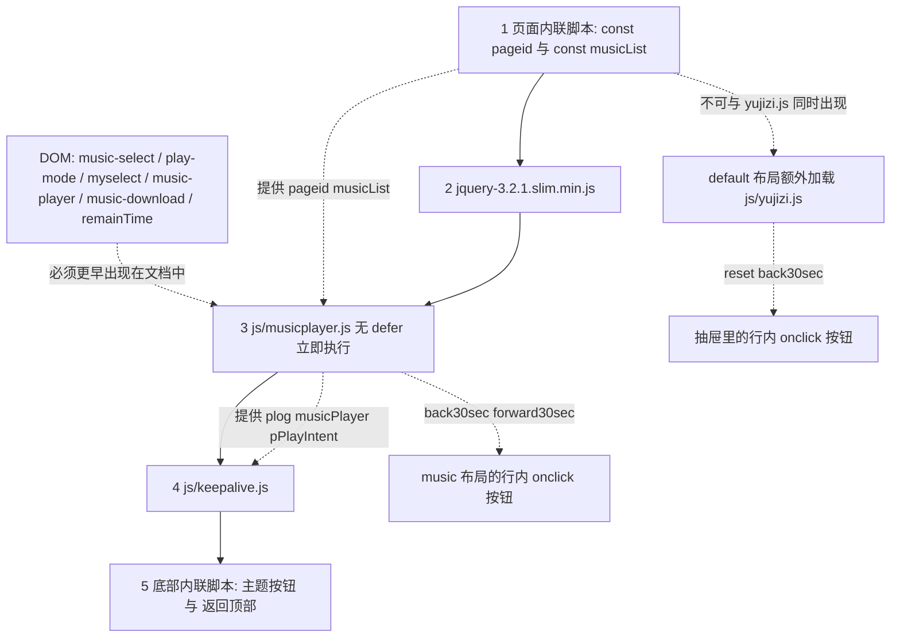

# 布局与前端 DOM/脚本契约

[_layouts/music.html](../../_layouts/music.html) 与 [_layouts/default.html](../../_layouts/default.html) 是纯外壳：它们只负责提供结构、主题与脚本标签。真正把外壳和 [js/musicplayer.js](../../js/musicplayer.js)、[js/keepalive.js](../../js/keepalive.js) 缝起来的是一份**没有任何机器校验**的契约 —— 元素的 `id` 拼写、页面内联脚本提供的全局名、以及脚本标签的先后顺序。没有类型检查、没有 lint、没有测试框架，也没有构建步骤会替你发现拼错。

这份契约最危险的性质是**失效不报警**：[js/musicplayer.js](../../js/musicplayer.js) 对 `getElementById` 的返回值不做任何判空，一个 id 改名就足以让整段播放逻辑在解析期抛错；而 [js/keepalive.js](../../js/keepalive.js) 恰好相反，它到处判空，顺序错了只会静默地什么都不做。两种坏法都不会在页面上留下可见痕迹。

music 布局源码里那行注释把这条约束写得最直白：「播放器:保留全部 JS 契约 ID,只换皮」（`_layouts/music.html` L54）。

## 三个面

| 面 | 提供方 | 消费方 | 违背后果 |
|---|---|---|---|
| DOM 元素 `id` | `_layouts/music.html` 的播放器区块 | `js/musicplayer.js` 顶层与事件处理器 | 解析期 TypeError / ReferenceError，整段播放逻辑失效 |
| 页面全局（`pageid`、`musicList`） | 每个讲经页自己的内联 `<script>` | `js/musicplayer.js` | 解析期 ReferenceError，后续代码全部不执行 |
| 脚本顺序 | 布局底部的 `<script>` 顺序 | `js/keepalive.js` 对 `js/musicplayer.js` 的依赖 | 屏幕长亮锁静默失效（无报错） |

## 脚本加载顺序



这张图说明：页面内容里的内联脚本必须先于布局底部的脚本执行，而 `js/keepalive.js` 必须排在 `js/musicplayer.js` 之后。

布局把这条顺序约束写在了脚本标签旁边的注释里：`_layouts/music.html` L120–L124 说明 `keepalive.js` 用到 `musicplayer.js` 定义的 `plog` / `pPlayIntent` / `musicPlayer`，「放在前面会 ReferenceError 静默失效」；[js/keepalive.js](../../js/keepalive.js) L17–L18 复述了同一条约束。

顺序颠倒的真实表现比注释描述得更隐蔽：[js/keepalive.js](../../js/keepalive.js) L25–L28 的 `pWakeReady()` 会检查 `typeof plog === 'function'`、`typeof musicPlayer !== 'undefined'`、`typeof pPlayIntent !== 'undefined'`，L102 又用 `typeof musicPlayer !== 'undefined'` 包住事件绑定。若它先执行，这些守卫会全部返回假值，于是 `playing` / `pause` 监听与 3 秒轮询根本不会绑定，只剩 L121 那次「载入后 1.5 秒同步一次」还在，长亮锁从此不会持续维持。整条链路上没有一行抛出到控制台。

## music 布局必须提供的元素 id

下表逐个列出 `id`、提供位置与全部消费点（行号级证据）。除 `player` 外，每一个都在 [js/musicplayer.js](../../js/musicplayer.js) 顶层或事件回调里被读取。

| id | 布局提供位置 | 消费点 |
|---|---|---|
| `music-select` | `_layouts/music.html` L59 | `musicplayer.js` L2（`const musicSelect`）、L26（填充 `<option>`）、L82 与 L117–L121（下一首序号）、L350（日志记 `idx`）、L502、L538、L625（自救时反查当前曲目 url） |
| `play-mode` | `_layouts/music.html` L65 | `musicplayer.js` L146（`const playModeSelect`）、L150–L155（change → `isLoopMode`）、L166（`stop-after` 分支）、L206、L510、L647（续播守卫） |
| `myselect` | `_layouts/music.html` L73；另在 `_layouts/default.html` L58 | `musicplayer.js` L246（停止时复位为 `-1`）、L269（读毫秒值）、L282（顶层直接赋 `onchange`）；default 布局由 `yujizi.js` L87、L117 消费 |
| `music-player` | `_layouts/music.html` L84（`<audio controls preload="metadata">`） | `musicplayer.js` L3（`const musicPlayer`），随后是全部媒体事件监听：L66（`timeupdate`）、L90（`loadedmetadata`）、L158（`ended`）、L577、L593、L598、L613、L631 与 L635 起的生命周期联动 |
| `music-download` | `_layouts/music.html` L92（初始 `display:none`） | `musicplayer.js` L4（`const musicDownload`）、L47–L49（选曲后设 `href`/`download` 并显示）、L59（清空选择时隐藏）、L109–L111（恢复上次曲目）、L131–L132（换曲时更新） |
| `remainTime` | `_layouts/music.html` L93；另在 `_layouts/default.html` L66 | `musicplayer.js` L213（`getElementById` 后写 `innerText`）；default 布局由 `yujizi.js` L43 写入 |
| `theme-btn` | `_layouts/music.html` L37；`_layouts/default.html` L38 | 布局底部内联脚本（`music.html` L129、`default.html` L105） |
| `totop` | `_layouts/music.html` L110；`_layouts/default.html` L98 | 布局底部内联脚本（`music.html` L137–L138、`default.html` L118–L119） |
| `drawer-btn` / `drawer` | 仅 `_layouts/default.html` L37、L43 | 仅 `default.html` L113–L117 的内联脚本 |
| `player`（容器） | `_layouts/music.html` L55 | **没有脚本消费这个 id**；样式全部挂在 `.player` 类上（`style.css` L252–L265）。改这个 id 不影响 JS，改类名才会丢样式 |

`id` 是两套布局共用的词汇表：`myselect` 与 `remainTime` 在 default 与 music 两个布局里同时存在，只是消费方换成了 [js/yujizi.js](../../js/yujizi.js)（L43、L87、L117）。想看这两套消费方的实际差异，见 [遗留多音频播放器](../concepts/legacy-multi-audio-player.md)。

## 页面必须提供的全局

`js/musicplayer.js` 依赖两个由**页面内容**（而不是布局）定义的内联脚本全局，二者都写成顶层 `const`：

```html
<!-- 每个讲经页的正文里，见 阴符经.html L6-L16 -->
<script type="text/javascript">
    const pageid = "yfj";
    const musicList = [
        { name: '阴符经第一讲', url: '/玉机子/玉机子讲阴符经/28416276.m4a' },
        ...
    ];
</script>
```

| 全局 | 消费点 | 含义 |
|---|---|---|
| `pageid` | `musicplayer.js` L33–L34（`localStorage.removeItem` 记忆键）、L71、L91、L102（读取）、L135–L136（写入）、L314–L316（日志/统计/转场键前缀 `pageid + '_plog'` 等） | 播放记忆与黑匣子日志的命名空间 |
| `musicList` | `musicplayer.js` L22（`initSelect` 逐个生成 `<option>`）、L39、L83、L104、L118、L122、L168、L517、L538、L625 | 曲目数组，元素形如 `{ name, url }`；下拉框的 `value` 就是它的下标 |

三个必须记住的性质：

1. **顺序敏感。** 内联脚本位于布局的 `{{ content }}` 里（`_layouts/music.html` L51），因此它在底部脚本之前执行 —— 这是它能工作的全部原因。
2. **缺失即致命。** 少了 `musicList` 会在解析期的 L98（`initSelect()` → L22 `musicList.forEach`）抛 ReferenceError；少了 `pageid` 会在 L314 抛 ReferenceError。两种情况都会中断脚本剩余部分，而 `[music-select]` 停在「请选择音频」这一初始态，看起来像「只是没选曲」。
3. **`window.pageid` 是 `undefined`。** 顶层 `const` 属于全局词法环境，不挂到 `window` 上；`musicplayer.js` L2–L4、L146 与 [js/keepalive.js](../../js/keepalive.js) 全部使用裸标识符，所以能读到，但任何新写的 `window.musicList` / `window.pageid` 都会静默拿到 `undefined`。

各页实际的 `pageid` 取值、音频目录对应关系与新增讲经页的最小步骤，见 [讲经页内容模型](../concepts/audio-page-model.md)。

## 行内 onclick 依赖的全局函数

两个布局都用行内 `onclick` 绑按钮，这意味着被调用的函数必须是**全局函数声明**（不能改成 `const`、箭头函数或搬进 IIFE，否则点击时抛 ReferenceError）：

| 按钮 | 位置 | 函数定义 |
|---|---|---|
| `back30sec()` / `forward30sec()` | `_layouts/music.html` L88–L89 | `musicplayer.js` L285–L289 / L292–L296；同一对函数还被 MediaSession 的 `seekbackward` / `seekforward` 复用（L571–L572） |
| `reset()`（清除播放记忆） | `_layouts/default.html` L51 | `yujizi.js` L6–L14 |
| `back30sec()`（抽屉版） | `_layouts/default.html` L52 | `yujizi.js` L16–L24 —— 与 `musicplayer.js` 的同名函数是两份不同实现 |

`reset()` 的语义要小心：它遍历 `audioArray` 并按 `<audio>` 的 id 清 localStorage（`yujizi.js` L6–L14），而 `musicplayer.js` 用的是 `<pageid>_currentMusic` / `<pageid>_currentTime`（L33–L34、L135–L136）—— 两套键并不一致。

### 不要把两套脚本加载到同一页

`yujizi.js` 与 `musicplayer.js` 在顶层重名声明：`var stopAudioTimeOut` / `var theTime`（`yujizi.js` L3–L4 对 `musicplayer.js` L179–L180），以及函数 `stopAudio`（`yujizi.js` L82 对 `musicplayer.js` L227）、`timingChange`（L103 对 L267）、`back30sec`（L16 对 L285）、`Date.dateAdd`（L90 对 L251）。同时加载会以后加载者覆盖先加载者，且 `var theTime;`（无初始值）会把播放器已设的定时停止点清成 `undefined`。当前布局是安全的：`music.html` 只加载 `musicplayer.js`（L119），`default.html` 只加载 `yujizi.js`（L101）。

## 因为顺序/命名而必然失效的几种改法

| 改动 | 后果 |
|---|---|
| 把底部 `<script>` 加 `defer` 或移进 `<head>` | `musicplayer.js` L2–L4、L146 拿到 `null`，L282 的 `document.getElementById("myselect").onchange = ...` 抛 TypeError；`keepalive.js` L103 会在 `null` 上调用 `addEventListener` 抛错 |
| 把播放器区块移到脚本标签之后 | 同上（脚本没有 `defer`，按文档顺序立即执行） |
| 把某个 id 改名（如 `music-select` → `track-select`） | `const musicSelect` 为 `null`，L26 首次 `appendChild` 时抛错 |
| 给 `back30sec` 改成 `const back30sec = () => …` | 行内 `onclick` 找不到全局函数，点击无反应且报 ReferenceError |
| 交换 `musicplayer.js` 与 `keepalive.js` 的标签顺序 | 长亮锁静默失效，见上文 |
| 在没有 `musicList` 的新页面上套 `layout: music` | 页面渲染正常，播放器永远为空 |

## jQuery slim 与 Bootstrap 的实际作用

- **jQuery slim** 由两个布局都加载（`_layouts/music.html` L112、`_layouts/default.html` L100），但 `musicplayer.js` 与 `keepalive.js` 都是零依赖原生 JS。仓库里真正的 `$` 使用只有 `yujizi.js` L114 的 `$(function(){ … loadState(); document.getElementById("myselect").onchange = timingChange; })`。也就是说 `music.html` 上的 jQuery 当前没有任何消费方（`js/js.cookie.js` 虽然依赖 jQuery，但没有任何页面引用它）。改动时不要误以为可以在 `musicplayer.js` 里用 `$` 而不必考虑加载顺序 —— 它确实可用，但这是巧合而非契约。
- **Bootstrap 只引 CSS，不引 JS**：两个布局都只有 `bootstrap.min.css` 的 `<link>`（`_layouts/music.html` L22、`_layouts/default.html` L23），仓库里没有任何页面引用 `bootstrap.bundle.js`。Bootstrap 的实际作用是被 [style.css](../../style.css) 显式中和：
  - `.player .row` 需要归零 Bootstrap `.row` 的负边距（`style.css` L261，注释明说）；
  - `.card` / `.card-body` / `.jumbotron` / `.text-muted` / `.bg-light` 被重映射到水墨主题令牌（`style.css` L291–L299），因为内容页（如 `体真山人语录原文.html` 使用 `col-md-4` 栅格、多个讲经页用 `class="card-body"`）仍在用这些类。
  - 结论：删掉 Bootstrap CSS 会改变内容页排版，而不是「删掉一个没用上的依赖」。

Bootstrap 与 jQuery 属于被引入但仍存在的第三方 vendor 代码（[.openwikiignore](../../.openwikiignore) L31–L33 已把它们排除在 wiki 之外），详见 [遗留多音频播放器](../concepts/legacy-multi-audio-player.md)。[jsconfig.json](../../jsconfig.json) 只有一条 `typeAcquisition.include: ["jquery"]`，作用是让编辑器认识 jQuery 全局，对运行时与部署无影响。

## 布局内联脚本：主题、抽屉、返回顶部

两个布局各带两段内联脚本，它们与 `musicplayer.js` 互不依赖：

1. **`<head>` 里的主题防闪脚本**（`_layouts/music.html` L12–L20、`_layouts/default.html` L13–L21）：同步读取 `localStorage['yjz-theme']`，缺失则回退 `matchMedia('(prefers-color-scheme: dark)')`，在首屏渲染前把 `data-theme` 写到 `<html>` 上。整体包在 `try/catch` 里，隐私模式下静默降级为默认亮色（`<html data-theme="light">`，L2）。
2. **底部行为脚本**（`_layouts/music.html` L126–L140、`_layouts/default.html` L102–L121）：
   - `#theme-btn` 点击 → 翻转 `data-theme`、写回 `localStorage['yjz-theme']`、同步更新 `<meta name="theme-color">`；
   - `#totop` → 滚动超过 500px 时切换 `.show`（`passive: true`）；
   - 仅 default 布局：`#drawer-btn` 切换 `#drawer` 的 `.open` 类并维护 `aria-expanded`（`default.html` L113–L117，样式见 `style.css` L126–L132）。music 布局没有抽屉，只在页眉放了一个「经目」链接（`music.html` L36）。

关键差别：这些内联脚本**每一步都用 `if (el)` 判空**，所以元素缺失时无害；[js/musicplayer.js](../../js/musicplayer.js) 则完全没有判空。写新代码时应遵循同一模式（要么像内联脚本那样守卫，要么保证 id 存在），不要两边取折中。

主题令牌、暗色覆盖与「新样式只允许用 `var(--*)`」的约束属于设计系统范畴，见 [水墨清静设计系统与主题机制](../concepts/design-system.md)。

## 诊断面板的扩展点

播放器在 URL 带 `?debug` 时才注入统计面板（`musicplayer.js` L679–L735）：它把 `window.plogCopy`（L693）与 `window.plogReset`（L700）挂到全局，因为面板按钮用的是行内 `onclick="plogCopy()"` / `onclick="plogReset()"`（L725–L726）—— 与布局里 `onclick` 依赖全局函数是同一套约定。`?fast=N` 复现台同理，只在 `?fast` 存在时生效（L312–L313）。这些入口的用途与证据标准见 [验证与复现手册](../testing/verification-playbook.md)。

## local-test.html：同一契约的手工副本

[local-test.html](../../local-test.html) 是本地验证装置，**被 [.gitignore](../../.gitignore) L8 排除、不入版本控制，但仍存在于工作区**（`.openwikiignore` 没有排除它，所以 wiki 能读到）。它复制了同一套契约：

- 内联脚本定义 `const pageid = "localtest"` 与一份 `musicList`（L21–L27，指向 `/经典读诵/*.mp3`）；
- 播放器结构与 `_layouts/music.html` 几乎逐字相同（L30–L71），注释自称「与 _layouts/music.html 完全相同的播放器结构,外加 15 秒定时选项(仅本测试页)」（L29）：`#myselect` 多一个 `<option value="15000">15 秒(测试)</option>`（L50）；
- 脚本只有 `jquery-3.2.1.slim.min.js` 与 `musicplayer.js`（L76–L77）—— **不加载 `keepalive.js`，也不带 `?v=` 缓存版本号**，所以它验证不到长亮锁，且改了 `musicplayer.js` 后本地副本永远拿最新文件（没有缓存击穿问题，但也就无法复现回访用户的旧缓存行为）。

因为它是手工副本且不在版本控制里，任何 id 或全局的改动都必须在 `_layouts/music.html` 与 `local-test.html` 两处同步，否则验证装置会悄悄偏离生产结构。

## 改这一层之前的检查清单

1. 改 id 前，先把 `musicplayer.js` L2–L4、L146、L213、L246、L269、L282 全部读完；这七处是仅有的 DOM 依赖入口。
2. 新增任何 `getElementById` 到 `musicplayer.js`，要么同时改布局，要么加判空 —— 目前该文件一处判空都没有。
3. 改 `musicplayer.js` / `keepalive.js` 的内容后，同步 bump `_layouts/music.html` L119 / L125 的 `?v=`（布局持有版本号），否则回访用户最多 10 分钟仍在跑旧代码；细节见 [静态资源、音频资产与缓存击穿约定](../operations/assets-and-cache-busting.md)。
4. 顺序约束不可放松：`keepalive.js` 永远排在 `musicplayer.js` 之后，且两者都必须在播放器 DOM 之后。
5. 改完在 `local-test.html` 与真机上各跑一次；本仓库没有测试框架，验证方法见 [验证与复现手册](../testing/verification-playbook.md)。
6. 页面装配路径（front matter → 布局 → include → 浏览器脚本）本身由 [站点构建、布局装配与部署形态](./site-build-and-deploy.md) 说明，本页只覆盖「装配完成后 DOM 与脚本之间那层约定」。

## 相关页面

- [讲经页内容模型（pageid / musicList）](../concepts/audio-page-model.md)
- [遗留层：jQuery、yujizi.js 与失效的旧播放器假设](../concepts/legacy-multi-audio-player.md)
- [播放器状态机：播放意图、转场与暂停归因](../concepts/player-state-machine.md)
- [播放记忆与黑匣子日志（localStorage 键）](../concepts/player-persistence-and-diagnostics.md)
- [连续播放转场全流程](../workflows/continuous-playback-transition.md)
- [息屏连续播放与屏幕长亮锁](../workflows/screen-off-continuous-playback.md)
- [定时关闭与「剩余」时间显示](../workflows/timed-stop-and-remaining-time.md)
- [验证与复现手册](../testing/verification-playbook.md)
