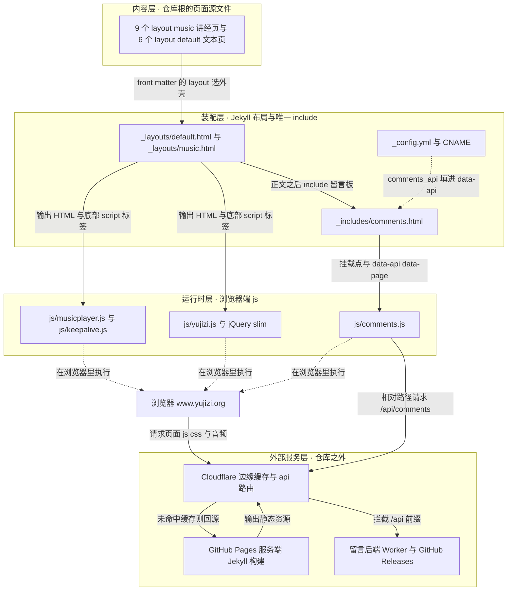

# 系统全景与仓库边界

这个仓库是**一台 Jekyll 静态站的全部源代码**：15 个走进 Jekyll 管线的页面源文件、两个布局、一个 include、4 个自写前端脚本（外加一份零引用的第三方 `js.cookie.js` 拷贝），以及约 3GB 的讲经音频。它没有构建脚本、没有依赖清单、没有测试、没有 lint —— 改文件即生效，服务端构建由 GitHub Pages 完成（详见 [站点构建、布局装配与部署形态](./site-build-and-deploy.md) 与 [验证与复现手册](../testing/verification-playbook.md)）。

本页只做一件事：把仓库切成**四个可独立改动的边界层**，说清每层拥有哪些文件与目录、哪些路径被两份忽略清单挡在外面及为什么，最后给一张「想改 X 该动哪些文件」的落点索引。每层的深层机制都有专题页，本页**不重复**它们的内容。

上图是四个边界层与它们之间仅有的几条接缝：`layout` 值、include 注入、`data-*` 属性，以及仓库外的 Pages 与 Cloudflare 分工。

## 四层边界

| 层 | 拥有什么 | 仓库内落点 | 专题页 |
|---|---|---|---|
| **内容页** | 每个页面的 front matter（`title` / `layout` / `permalink` / `hide_title`）与正文，含正文里的 `pageid` / `musicList` 内联脚本 | 仓库根的 `*.html` 与 `太乙金华宗旨原文和译文.md` | [讲经页内容模型（pageid / musicList）](../concepts/audio-page-model.md) |
| **Jekyll 布局与 include** | 站点外壳、主题切换、播放器 DOM、留言板挂载点、构建配置与域名声明 | [_layouts/default.html](../../_layouts/default.html)、[_layouts/music.html](../../_layouts/music.html)、[_includes/comments.html](../../_includes/comments.html)、[_config.yml](../../_config.yml)、[CNAME](../../CNAME)、[style.css](../../style.css) | [布局与前端 DOM/脚本契约](./layout-and-frontend-contract.md)、[站点构建、布局装配与部署形态](./site-build-and-deploy.md)、[水墨清静设计系统与主题机制](../concepts/design-system.md) |
| **浏览器端运行时** | 播放状态机、长亮锁、留言板读写、黑匣子日志，以及遗留的旧多音频实现 | [js/musicplayer.js](../../js/musicplayer.js)、[js/keepalive.js](../../js/keepalive.js)、[js/comments.js](../../js/comments.js)、[js/yujizi.js](../../js/yujizi.js) | [播放器状态机](../concepts/player-state-machine.md)、[息屏连续播放与屏幕长亮锁](../workflows/screen-off-continuous-playback.md)、[留言板读写往返与失败分支](../workflows/comments-roundtrip.md)、[遗留层：jQuery、yujizi.js 与失效的旧播放器假设](../concepts/legacy-multi-audio-player.md) |
| **仓库外服务** | 托管与服务端 Jekyll 构建、边缘缓存与 `/api/*` 路由、留言后端、APK 分发、wiki 自动更新 | 仓库内只有声明与注释：[CNAME](../../CNAME) L1、[_config.yml](../../_config.yml) L1–L8、[.github/workflows/openwiki-update.yml](../../.github/workflows/openwiki-update.yml) | [外部依赖与服务耦合](../integrations/external-services.md)、[OpenWiki 与仓库自动化](../operations/openwiki-and-repo-automation.md) |

**层与层之间只有四个接缝**，改动一旦跨过它们就必须在两侧同时动手：

1. **内容层 → 装配层**：front matter 的 `layout` 值决定套哪个外壳（[阴符经.html](../../阴符经.html) L3 的 `layout: music` 对 [玉师聊修行.html](../../玉师聊修行.html) L3 的 `layout: default`），没有 `_config.yml` 默认值兜底，漏写就是裸正文。
2. **装配层 → 运行时层**：布局底部的 `<script src>` 标签、播放器 DOM 的 id，以及页面自己提供的 `pageid` / `musicList` 全局名。这层约定**没有任何构建期校验**，id 拼错或顺序颠倒都不会在页面上留下可见痕迹 —— 完整清点见 [布局与前端 DOM/脚本契约](./layout-and-frontend-contract.md)。
3. **仓库内 → 仓库外（配置侧）**：`CNAME` 声明域名，`_config.yml` 的 `comments_api` 决定留言后端是同源还是跨域（当前留空 = 同源，[_config.yml](../../_config.yml) L4–L8）。
4. **仓库内 → 仓库外（缓存侧）**：`?v=` 版本号是唯一能击穿缓存的仓库内手段，它只存在于布局与 include 的三个 `<script src>` 上（[_layouts/music.html](../../_layouts/music.html) L119、L125、[_includes/comments.html](../../_includes/comments.html) L64）。约定与当前版本号快照见 [静态资源、音频资产与缓存击穿约定](../operations/assets-and-cache-busting.md)。

## 仓库根的目录清单

| 目录 | 层 | 内容 | wiki 生成能看到吗 |
|---|---|---|---|
| `_layouts/` | 装配层 | 只有 2 个文件：`default.html`（124 行）、`music.html`（143 行） | 能，两个文件都是本页与专题页的主要证据来源 |
| `_includes/` | 装配层 | 只有 1 个文件 `comments.html`（65 行），被两个布局各 include 一次（`default.html` L85、`music.html` L97） | 能 |
| `js/` | 运行时层 | wiki 可见的 5 个脚本：本项目写的 `musicplayer.js`、`keepalive.js`、`comments.js`、`yujizi.js`（最后一个是遗留层），外加第三方库 js-cookie v1.5.1 的完整拷贝 `js.cookie.js`（零引用）。同目录下还有被排除的 `jquery-3.2.1.slim.min.js` 等第三方件 | 能读到这 5 个，但 `js/jquery-3.2.1.slim.min.js`、`js/bootstrap*`、`js/vendor/` 被排除 |
| `css/` | 第三方 vendor | 仓库里唯一的引用点是两个布局的 `<link href="/css/bootstrap.min.css">`（`music.html` L22、`default.html` L23，顺序在 `/style.css` 之前）；本项目的样式全部在根目录的 `style.css` 里 | **不能**：`css/bootstrap*` 与 `*.map` 被排除了，读 `css/bootstrap.min.css` 会被直接拒绝。它仍会随页面加载，并被 `style.css` 的「Bootstrap 中和层」显式重映射 —— 即被排除 ≠ 不生效 |
| `docs/` | 项目文档 | 只有 1 个文件：[播放器息屏播放-已验证版本.md](../../docs/播放器息屏播放-已验证版本.md)，人工维护的真机验证基线与结论（含 5 个 commit 的关键性判定） | 能。它是[验证与复现手册](../testing/verification-playbook.md)的证据来源 |
| `.github/` | 自动化 | `workflows/openwiki-update.yml`（唯一 workflow，只做 wiki 更新）与 `openwiki/opencode-go-fetch.mjs`（给 OpenWiki 调用外部网关补请求头的进程级 shim） | 能 |
| `openwiki/` | 生成物 | 本 wiki 的页面与三类状态文件（`.page-manifest.json`、`.last-update.json`、`.run.json`） | 是生成目标本身；分工见 [OpenWiki 与仓库自动化](../operations/openwiki-and-repo-automation.md) |

仓库根的页面文件按层归类：

- **`layout: music` 的 9 个讲经页**：`阴符经.html`、`道德经.html`、`白玉蟾.html`、`下手法.html`、`丹阳真人语录.html`、`体真山人语录.html`、`吕祖太乙金华宗旨.html`、`翠虚吟.html`、`经典读诵.html`（各自 L3）。每页正文里的内联脚本定义自己的 `pageid` 与 `musicList`（样例见 [阴符经.html](../../阴符经.html) L6–L16）。
- **`layout: default` 的 6 个文本页**：`index.html`（首页，唯一使用 `hide_title: true`，L4；经目格列 11 条链接，L19–L62）、`test.html`、`体真山人语录原文.html`、`玉师聊修行.html`、`玉师聊阴符经.html`、`太乙金华宗旨原文和译文.md`（Markdown 走同一条管线，L1–L5）。
- **两个特殊文件**：`local-test.html` 没有 front matter、不经过任何布局（L1 直接是 `<!doctype html>`），是手工复刻播放器结构的本地测量装置，且被 [.gitignore](../../.gitignore) L8 排除、**不入版本控制**；`album.css` 是**孤儿文件**，全仓库没有任何 `<link>` 指向它（布局只链 `/css/bootstrap.min.css` 与 `/style.css`），对线上渲染零影响。
- **其余根文件**：`AGENTS.md`（OpenWiki 约定区块）、`.gitignore` 与 `.openwikiignore`（两份忽略清单，见下节）、`style.css`（设计系统）、`_config.yml`、`CNAME`、`favicon.ico`、`jsconfig.json`。

## 没有构建脚本、依赖清单、测试与 lint

这是阅读任何一页之前必须先立住的事实，因为它决定了每一处「约定」为什么只能靠注释维持：

- 仓库根没有 `package.json`、`Gemfile`、`Makefile`，也没有 `_plugins/`；[jsconfig.json](../../jsconfig.json) 全文只有一条 `typeAcquisition.include: ["jquery"]`（L1–L7），作用是让编辑器认识 jQuery 全局，与运行时、校验、部署都无关。页面源文件就是发布集合，没有中间产物需要维护。
- **唯一的自动化与站点构建无关**：[.github/workflows/openwiki-update.yml](../../.github/workflows/openwiki-update.yml) 由 `workflow_dispatch` + 每日 08:00 的 cron 触发（L3–L6），跑 `openwiki code --update --print`（L36），再按白名单开一个 `openwiki/update` PR（L61–L79）。它里面确实出现 `npm install --global openwiki@0.6.1 …`（L31），但那是在 CI 里安装 OpenWiki CLI 这个工具本身，**不是仓库的依赖清单，也不跑任何针对站点或播放器的检查**。
- 因此没有 `npm test`、没有 lint、没有 CI 会在 push 前拦住回归；验证只能靠真机 + 保留证据，方法见 [验证与复现手册](../testing/verification-playbook.md)。
- 生成页不可手改：[AGENTS.md](../../AGENTS.md) L14 明确要求改源码/文档让 OpenWiki 重新生成，下一次流水线运行会覆盖 `openwiki/` 下的一切。

## 两份忽略清单：谁能进 git、谁能进 wiki

仓库根有两个名字接近、语义完全不相干的清单文件。**最容易搞错的一点写在 [.openwikiignore](../../.openwikiignore) L3–L4**：OpenWiki **不读 `.gitignore`**，只读 `.openwikiignore`。所以「这个文件在不在 git 里」与「这个文件会不会被写进 wiki」是两件互不相干的事，永远不要用一份清单去解决另一份的问题（逐条对照表见 [静态资源、音频资产与缓存击穿约定](../operations/assets-and-cache-busting.md)）。

### `.openwikiignore`：wiki 生成能看见什么

匹配语义按 gitignore 风格但**大小写不敏感**（L9–L11：last-match-wins、`!` 取反、前导 `/` 锚定仓库根、尾随 `/` 仅匹配目录；大小写不敏感是有意为之，防止在大小写不敏感的 APFS 上换种拼写绕过排除）。排除项与一行理由：

| 条目 | 行 | 为什么排除 |
|---|---|---|
| `*.m4a`、`*.mp3`、`*.apk`、`*.doc`、`*.docx` | L13–L18 | 媒体与二进制：内容不是文本，读了也是乱码 |
| `玉机子/`、`经典读诵/`、`体真山人语录/`、`downloads/` | L20–L28 | 大体积媒体目录（已被上面的通配覆盖，显式列出便于阅读） |
| `css/bootstrap*`、`js/bootstrap*`、`js/jquery-3.2.1.slim.min.js`、`js/vendor/` | L30–L34 | 第三方 vendor 代码：不是本项目写的，读它只会稀释 wiki |
| `*.map` | L36–L37 | source map，纯机器产物 |
| `_site/`、`.jekyll-cache/` | L39–L41 | Jekyll 构建产物 |
| `.DS_Store`、`.vscode/` | L43–L45 | 编辑器 / 系统文件 |

两条由清单直接推导出来的阅读约束：

- **音频目录既不能读也不能枚举**（L6–L7 给出理由：不排除的话生成会去读一堆二进制，既慢又产出乱码）。因此本 wiki 里关于音频的一切只能来自**页面源码里的 URL 字符串**：`/玉机子/玉机子讲阴符经/28416276.m4a`（[阴符经.html](../../阴符经.html) L9–L14）、`/经典读诵/阴符经.mp3`（[经典读诵.html](../../经典读诵.html) L9–L21）、`/经典读诵/养生主.mp3`（[local-test.html](../../local-test.html) L20–L27）。
- **体积数字是从注释里抄下来的，不是量出来的**：工作区 3.0G，其中约 2.9G 是录音、APK 与 vendor（L6–L7）；`玉机子/` 1.3G、`经典读诵/` 110M、`体真山人语录/` 53M、`downloads/` 6.9M（L20–L28）。

### `.gitignore`：什么不进版本控制

[.gitignore](../../.gitignore) 只有五条实际规则，其余全是警告性注释：

| 条目 | 行 | 为什么排除 |
|---|---|---|
| `.DS_Store`、`_site/`、`.jekyll-cache/` | L5–L7 | 系统文件与 Jekyll 构建产物，产出从不入库 |
| `local-test.html` | L8 | 本地测量装置，不入库（但 `.openwikiignore` **没有**排它，所以 wiki 仍能读到它——这是两份清单唯一的不对称处） |
| `downloads/*.apk` | L10–L12 | APK 发布走 GitHub Releases；每次出新版都提交 7MB 二进制会持续膨胀 `.git`（注释给出当时数字：`.git` 已 1.5GB，主要是音频） |

顶部注释（L1–L4）记录了一次真实事故：2026-09-27 之前本地单独把 `*.mp3` / `*.m4a` / `玉机子/` / `经典读诵/` 排除在版本控制之外，而远端 `main` 一直带着这些文件，导致**本地与远端分叉成两条平行历史**，同日合并（分支 `backup-before-unify-20260927`）。结论是一句祈使句：**别再把音频加回忽略列表，否则会再次分叉。**

两份清单的关系可以归纳成三句话：

1. **音频必须在 git 里**（否则再次分叉），**必须在 wiki 之外**（否则生成读 1.3G 二进制）。同一份文件同时属于两个相反的集合，这不是矛盾，而是两份清单各管一段。
2. **处理体积问题改 `.gitignore`，处理 wiki 生成范围改 `.openwikiignore`**；想「让 wiki 看见某目录」去改 `.gitignore` 是无效的。
3. **被排除 ≠ 不存在**。`css/bootstrap.min.css` 被同步加载但读不到，`js/jquery-3.2.1.slim.min.js` 与 `js/vendor/` 同样如此：提到它们的地方都要理解为「由别处加载进来的第三方件」，不是本项目代码。

## 想改 X 该动哪些文件

| 想改的东西 | 该动的文件 | 权威说明 |
|---|---|---|
| 新增一页讲经、改 `pageid` / `musicList` | 页面自身的 front matter 与内联脚本；顺手在 [index.html](../../index.html) L19–L62 的经目格加一条链接 | [讲经页内容模型](../concepts/audio-page-model.md) |
| 播放行为（转场、失败恢复、定时关闭） | [js/musicplayer.js](../../js/musicplayer.js)，并在 [_layouts/music.html](../../_layouts/music.html) L119 把 `?v=4` 加一 | [连续播放转场全流程](../workflows/continuous-playback-transition.md)、[失败恢复与自愈路径](../workflows/playback-recovery-and-selfhealing.md) |
| 息屏 / 屏幕长亮 | [js/keepalive.js](../../js/keepalive.js)，并在 `music.html` L125 把 `?v=3` 加一；**不要**把已删的静音导频加回来 | [息屏连续播放与屏幕长亮锁](../workflows/screen-off-continuous-playback.md) |
| 留言板（前端、失败分支、后端模式） | [_includes/comments.html](../../_includes/comments.html)、[js/comments.js](../../js/comments.js)（bump `comments.html` L64 的 `?v=4`）、[_config.yml](../../_config.yml) L8 的 `comments_api` | [留言板读写往返与失败分支](../workflows/comments-roundtrip.md) |
| 样式与昼夜主题 | [style.css](../../style.css)（新增颜色要同时改 `:root` 与 `[data-theme="dark"]`）；改 `--paper` 的值还要同步两个布局的 `meta theme-color` 与内联脚本 | [水墨清静设计系统与主题机制](../concepts/design-system.md) |
| 页面外壳、播放器 DOM、脚本标签顺序 | [_layouts/default.html](../../_layouts/default.html)、[_layouts/music.html](../../_layouts/music.html)；**不要**把两个布局的脚本合并加载 | [布局与前端 DOM/脚本契约](./layout-and-frontend-contract.md) |
| URL / front matter / 部署形态 | 页面的 `permalink`、[_config.yml](../../_config.yml)、[CNAME](../../CNAME) | [站点构建、布局装配与部署形态](./site-build-and-deploy.md) |
| 音频资产、缓存击穿、两份忽略清单 | 音频文件本身、[.gitignore](../../.gitignore)、[.openwikiignore](../../.openwikiignore)、三处 `?v=` | [静态资源、音频资产与缓存击穿约定](../operations/assets-and-cache-busting.md) |
| wiki 生成范围与自动化 | [.openwikiignore](../../.openwikiignore)、[AGENTS.md](../../AGENTS.md)、[.github/workflows/openwiki-update.yml](../../.github/workflows/openwiki-update.yml) | [OpenWiki 与仓库自动化](../operations/openwiki-and-repo-automation.md) |
| 跑真机验证 | [local-test.html](../../local-test.html)、`?debug` 面板、`?fast=N`；结论写进 [docs/](../../docs/播放器息屏播放-已验证版本.md) | [验证与复现手册](../testing/verification-playbook.md) |

三条跨层的硬约束，改任何一层前都要先看：

1. **改了 `js/*.js` 就 bump 引用处的 `?v=`**（三处引用：`music.html` L119 / L125、`comments.html` L64）。版本号不存在于任何 manifest 或哈希流水线，它只存在于这几个 `<script>` 标签上；音频 URL、`style.css`、jQuery slim 与 `js/yujizi.js` 是裸路径，**没有可 bump 的版本号**。
2. **音频永远不加回 `.gitignore`**，也永远不从 `.openwikiignore` 移出音频目录。
3. **没有任何校验会替你发现上面两条没做**：仓库里唯一的 workflow 只更新文档，站点没有测试与 lint，失效方式一律是静默的（旧缓存继续生效、本地与远端再次分叉）。

## 相关页面

- [站点构建、布局装配与部署形态](./site-build-and-deploy.md) —— 一个页面从 front matter 到 URL 的装配路径，以及 GitHub Pages + CNAME 的部署事实
- [布局与前端 DOM/脚本契约](./layout-and-frontend-contract.md) —— 装配完成后 DOM id、页面全局与脚本顺序那层没有机器校验的约定
- [讲经页内容模型（pageid / musicList）](../concepts/audio-page-model.md) —— 内容层的最小骨架与新增讲经页的步骤
- [静态资源、音频资产与缓存击穿约定](../operations/assets-and-cache-busting.md) —— 两份忽略清单的逐条对照、体积账与 `?v=` 约定
- [外部依赖与服务耦合](../integrations/external-services.md) —— 仓库外那一层的耦合点与需外部协调的改动
- [OpenWiki 与仓库自动化](../operations/openwiki-and-repo-automation.md) —— 仓库里唯一的 workflow 与生成物的用法
- [验证与复现手册](../testing/verification-playbook.md) —— 没有测试框架时怎么证明改动生效
- [快速上手 · 玉机子站点 wiki 任务路由](../quickstart.md) —— 按「我想做什么」进入本 wiki 的入口页
