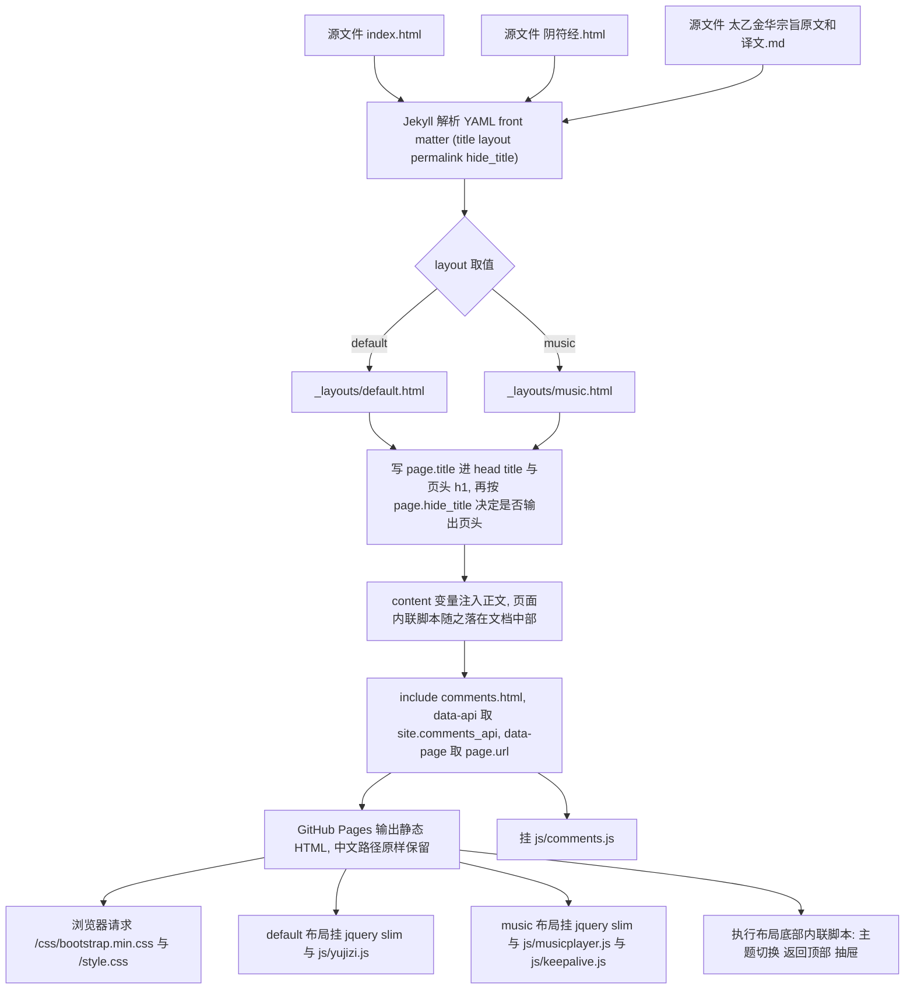
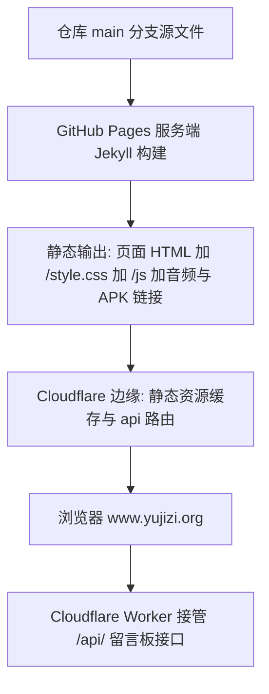

# 站点构建、布局装配与部署形态

这个仓库是一个 **Jekyll 静态站**：页面是仓库里的源文件，构建由 GitHub Pages 在服务端完成，仓库内部**没有任何构建脚本、依赖清单或测试命令**（没有 `Gemfile`、`package.json`、`Makefile`、`_plugins/`，也没有 Pages 构建 workflow），唯一的 workflow 只做 OpenWiki 更新（[.github/workflows/openwiki-update.yml](../../.github/workflows/openwiki-update.yml) L1–L11）。因此「改页面」就等于「改仓库里的文件然后 push」——没有中间产物需要维护，也没有任何机器校验会在本地拦住你。

本页讲清三件事：**页面怎么被装配出来**（front matter → 布局 → include → 浏览器脚本）、**两套布局各管什么**、**它最终以什么形态对外发布**。「装配完成后 DOM 与脚本之间那层无类型约定」是另一页的主题，见 [布局与前端 DOM/脚本契约](./layout-and-frontend-contract.md)。

## 装配路径

一个页面从源文件到浏览器要经过五个阶段：Jekyll 解析 front matter → 按 `layout` 选模板 → 用 `{{ content }}` 注入正文（正文里的内联脚本随之进入文档中部）→ `` 追加留言板 → 输出静态 HTML，由浏览器请求 CSS 与 JS。



上图是页面的装配顺序：front matter 决定套哪个布局，布局决定正文插在哪、脚本标签排在后面、留言板挂在哪里。

装配路径有一个**顺序后果**必须记住：`{{ content }}` 位于布局中部（[_layouts/music.html](../../_layouts/music.html) L50–L52、[_layouts/default.html](../../_layouts/default.html) L81–L83），而所有 `<script src>` 标签位于布局末尾（`music.html` L112–L125、`default.html` L100–L101）。所以页面正文里的内联 `<script>`（例如定义 `pageid` 与 `musicList` 的那段，见 [阴符经.html](../../阴符经.html) L6–L16）**必然**先于播放器脚本执行 —— 这不是约定俗成，而是装配位置的直接结果。想改这个顺序就等于改布局结构，代价见 [布局与前端 DOM/脚本契约](./layout-and-frontend-contract.md)。

## 两套布局的分工

`_layouts/` 下只有两个文件，它们的区别是「有没有播放器」而不是「外观」：

| 布局 | 用途 | 当前使用者 | 独有内容 | 尾部脚本 |
|---|---|---|---|---|
| `default.html` | 纯文本页、聊天记录转写页、原文/译文页 | [index.html](../../index.html) L3、[test.html](../../test.html) L3、[体真山人语录原文.html](../../体真山人语录原文.html) L4、[玉师聊修行.html](../../玉师聊修行.html) L3、[玉师聊阴符经.html](../../玉师聊阴符经.html) L3、[太乙金华宗旨原文和译文.md](../../太乙金华宗旨原文和译文.md) L4 | 页眉里的「须知 · 设置」抽屉（`#drawer-btn` / `#drawer`，L37、L43）、抽屉内的定时关闭 `<select id="myselect">` 与 `#remainTime`（L58、L66） | `/js/jquery-3.2.1.slim.min.js`、`/js/yujizi.js`（L100–L101） |
| `music.html` | 带单曲播放器的讲经页 | [阴符经.html](../../阴符经.html) L3、[道德经.html](../../道德经.html) L3、[白玉蟾.html](../../白玉蟾.html) L3、[下手法.html](../../下手法.html) L3、[丹阳真人语录.html](../../丹阳真人语录.html) L3、[体真山人语录.html](../../体真山人语录.html) L3、[吕祖太乙金华宗旨.html](../../吕祖太乙金华宗旨.html) L3、[翠虚吟.html](../../翠虚吟.html) L3、[经典读诵.html](../../经典读诵.html) L3 | 播放器区块：`#music-select`、`#play-mode`、`#myselect`、`#music-player`、`#music-download`、`#remainTime`（L55–L95）；页眉只有一个「经目」链接而没有抽屉（L36） | `/js/jquery-3.2.1.slim.min.js`、`/js/musicplayer.js?v=4`、`/js/keepalive.js?v=3`（L112–L125） |

两条布局共有的部分才是「站点外壳」：`<head>` 里的主题防闪内联脚本、品牌栏、`<footer>`、返回顶部按钮，以及**正文之后的 ``**（`default.html` L85、`music.html` L97）。也就是说留言板是全站每页统一的尾部区块；两处 include 的标记完全一致，只有 `page.url` 在各页取到的值不同。

顺带的硬约束：**不要试图把两个布局的尾部脚本合并**。`js/yujizi.js` 与 `js/musicplayer.js` 在顶层重名声明多处符号（`stopAudio`、`timingChange`、`back30sec` 等），同时加载会互相覆盖；当前布局安全的原因只是它们各挂各的。细节与清单见 [布局与前端 DOM/脚本契约](./layout-and-frontend-contract.md)。

## front matter：layout / permalink / hide_title

仓库里的页面只用到四个 front matter 键：`title`、`layout`、`permalink`、`hide_title`。没有 `date`、`categories`、`tags`、`author`、`excerpt` 之类——没有博客式集合（collections）配置，也没有 `_posts/`。`title` 的消费点很直接：两个布局把它写进 `<title>`（`default.html` L10、`music.html` L10）和页头 `<h1>`（`default.html` L78、`music.html` L47），`music` 布局还用它拼 `<meta name="description">`（L7）。下面三个键则各自改变装配或寻址行为。

### `layout`：选哪个外壳

取值只有 `default` 与 `music` 两个，且**走进 Jekyll 管线的页面无一例外都显式写了 `layout`**（见上表链接的行号）。没有 `_config.yml` 的 `defaults` 兜底配置（[_config.yml](../../_config.yml) 全文只有 L1–L8），所以漏写 `layout` 的页面会以裸正文输出——没有 CSS、没有脚本、没有留言板。这个键决定的是「页面属于哪种内容类型」，不只是外观。

### `permalink`：决定输出 URL

`permalink` 把页面发布成**目录式干净路径**，而不是保留源文件扩展名：

- [体真山人语录原文.html](../../体真山人语录原文.html) L2 写 `permalink: /体真山人语录原文/`，站内链接就写成不带扩展名的 `/体真山人语录原文`（[体真山人语录.html](../../体真山人语录.html) L30）；
- [太乙金华宗旨原文和译文.md](../../太乙金华宗旨原文和译文.md) L2 写 `permalink: /太乙金华宗旨原文和译文/`，同样被链接为 `/太乙金华宗旨原文和译文`（[吕祖太乙金华宗旨.html](../../吕祖太乙金华宗旨.html) L23）。

**没写 `permalink` 的页面按源文件路径发布**：`index.html` → `/index.html`（品牌栏链接就写 `/index.html`，`default.html` L32），`玉师聊修行.html` → `/玉师聊修行.html`，经目格里的十一条链接也全部是这种形式（`index.html` L19–L62）。

这带来两条容易踩的规则：

1. **中文文件名/目录名就是 URL 路径**，原样保留——页面路径是 `/阴符经.html`，音频路径是 `/玉机子/玉机子讲阴符经/28416276.m4a`（[阴符经.html](../../阴符经.html) L10–L13），原文页路径是 `/体真山人语录原文/`。仓库里没有任何 slug 化或转拼音的步骤。
2. **`permalink` 与文件位置解耦**：改了 `permalink` 就换了 URL，页面之间的互链（`体真山人语录.html` L30、`吕祖太乙金华宗旨.html` L23）必须同步改，否则是死链；反之，即使源文件挪位置，只要 `permalink` 不变，URL 就不变。

### `hide_title`：只关掉页头

`hide_title` **只被 `default` 布局读取**：`` 包住了 `.page-head` 区块（[_layouts/default.html](../../_layouts/default.html) L75–L80），因此为真时不输出 kicker + `<h1>{{ page.title }}</h1>`，正文直接开始。`music` 布局里没有这个判断——页头是无条件的（[_layouts/music.html](../../_layouts/music.html) L45–L48），所以在讲经页上写 `hide_title: true` 没有任何效果。

当前唯一的用户是首页 [index.html](../../index.html) L4：它自带一段「屈原 · 离骚」题词与经目格（L7–L63），页头会重复标题，所以关掉。注意 `hide_title` 只影响 `<h1>`，`head` 里的 `<title>{{ page.title }} · 玉机子道长</title>`（`default.html` L10）和 `music` 布局的 `<meta name="description">`（`music.html` L7）仍然照常输出——也就是说首页在浏览器标签页上依然有标题。

### Markdown 页走同一条管线

[太乙金华宗旨原文和译文.md](../../太乙金华宗旨原文和译文.md) 是一个 364 行的 Markdown 文件（`#` 章节标题 + `##` 原文/译文小节），它的 front matter 与 HTML 页完全同构：`title`、`layout: default`、`permalink`（L1–L5）。Jekyll 先把它转成 HTML 再套 `default` 布局，所以它同样拿到品牌栏、主题脚本、留言板。想加长文内容时，Markdown 与 HTML 页面是可互换的两种写法，唯一差别是正文的标记语法。

## 留言板的注入点：唯一的 include

`_includes/` 下只有 `comments.html` 一个文件，它被两个布局各 include 一次（`default.html` L85、`music.html` L97）。它做的事只有两件：输出 `#talk` 挂载点的 DOM 结构，并把配置**作为 `data-*` 属性交给 JS**，而不是写死在脚本里：

```html
<section class="talk" id="talk"
         data-api="{{ site.comments_api }}"
         data-page="{{ page.url | default: '/' }}"
         aria-label="留言">
```

（[_includes/comments.html](../../_includes/comments.html) L14–L17；消费方是 [js/comments.js](../../js/comments.js) L10–L18，它读 `data-api` 去掉尾部斜杠作为 `API`、读 `data-page` 作为 `PAGE`。）

- `data-api` 来自 `site.comments_api`，即 [_config.yml](../../_config.yml) L8 的那个键。**它当前留空 —— 这就是生产配置**：站点在 `www.yujizi.org`，Cloudflare Worker 用路由 `www.yujizi.org/api/*` 接管 `/api/*`，前端只走相对路径，同源不触发 OPTIONS 预检、不需要 CORS 头（`_config.yml` L4–L7、`comments.html` L5–L10、`comments.js` L13–L17 三处注释说的是同一件事）。**改动这一个键就等于切换留言后端模式**：填绝对地址（如 `https://comments.yujizi.org`）会回退到跨域模式，靠后端白名单放行。
- `data-page` 来自 `page.url`，也就是该页的最终 URL（`permalink` 生效后的值）。留言按页隔离，键就是它；取不到时回退 `'/'`。

`comments.html` 还硬编码了 `/js/comments.js?v=4`（L64），并带一段注释说明这个 `?v=` 是缓存击穿用的。同样的约定也写在 `music.html` L113–L119 上（`musicplayer.js?v=4`、`keepalive.js?v=3`）：**版本号不存在于任何 manifest 或哈希流水线里，它只存在于布局与 include 的 `<script>` 标签上**，改 JS 就得手工加一。完整约定（GitHub Pages 的 `Cache-Control: max-age=600`、Cloudflare 约 4 小时静态缓存、部署后要清缓存）见 [静态资源、音频资产与缓存击穿约定](../operations/assets-and-cache-busting.md)。

## 发布形态



上图是当前的对外形态：仓库 push 后由 GitHub Pages 构建发布，Cloudflare 挡在前面。

- **域名**：[CNAME](../../CNAME) 只有一行 `www.yujizi.org`，是 GitHub Pages 自定义域名的标准落点。仓库里没有任何别的地方重复这个域名——所有注释与截图引用都写 `www.yujizi.org`（`_config.yml` L5、`comments.html` L5）。
- **没有 `.nojekyll`，构建必须由 Jekyll 完成**：仓库根没有 `.nojekyll` 文件，所以 GitHub Pages 会对整个仓库跑 Jekyll。这不是可选项，而是**必需的**——`_layouts/`、`_includes/`、`_config.yml` 这些以下划线开头的路径只有在 Jekyll 参与时才不会被当作普通目录发布，反而是模板来源。加一个 `.nojekyll`（Pages 会跳过构建、只把仓库文件直出）会让 `_layouts/`、`_includes/` 不再是模板，每个页面都丢掉外壳、脚本与留言板。
- **没有站点 URL 配置**：`_config.yml` 里既没有 `url` 也没有 `baseurl`（L1–L8 全文），页面内的站内链接一律是**根绝对路径**（`/index.html`、`/阴符经.html`、`/体真山人语录原文`）。因此这个站点**只能部署在域名根目录**：一旦挪到子路径（如 `example.com/site/`），全站链接与 `/js/*`、`/style.css` 引用会同时失效，而修补它意味着改所有页面与两个布局——这是当前形态下最硬的部署约束。
- **仓库里没有构建/部署流水线**：唯一的 workflow 是 OpenWiki 文档更新（`.github/workflows/openwiki-update.yml` L1–L11，只做 checkout → openwiki --update → 开 PR），与站点构建无关。Jekyll 的构建产物 `_site/` 与 `.jekyll-cache/` 只出现在两份忽略清单里（[.gitignore](../../.gitignore) L6–L7、[.openwikiignore](../../.openwikiignore) L39–L41）——它们存在意味着构建大概率在本地跑过（[_config.yml](../../_config.yml) L2 的 `host: 0.0.0.0` 是 `jekyll serve` 的绑定地址，配合真机验证的需求），但**产出从不入库，也没有需要入库的步骤**。
- **发布集合 = 仓库文件**：没有页面清单、路由表或 `exclude` 配置，任何带 front matter 的源文件都会被发布。[test.html](../../test.html) 就是一个只剩下 `title` 与 `layout` 的占位页（L1–L6），它照样会出现在 `/test.html`。新增页面的成本因此极低，漏掉「加入首页经目格」也照样能通过 URL 直接访问。
- **一个例外**：[local-test.html](../../local-test.html) 不经过任何布局——它是一整份手写的 HTML（L1 直接是 `<!doctype html>`，没有 front matter），复制了 `music.html` 的播放器结构与 `pageid`/`musicList` 内联脚本（L20–L27、L29–L71），只用 `jquery` + `musicplayer.js`（L76–L77）。它被 [.gitignore](../../.gitignore) L8 排除、不入版本控制，所以不会推到 Pages；即便提交，Jekyll 也只会把它当静态文件原样拷贝，不会注入外壳。它是本地测量装置，改布局时不会跟着变。

## 改这一层时的失效模式

| 改动 | 后果 |
|---|---|
| 漏写 `layout` | 页面以裸正文输出：没有 CSS、没有脚本、没有留言板。没有 `_config.yml` 默认值兜底 |
| 改 `permalink` 却不同步互链 | 死链。`体真山人语录.html` L30 与 `吕祖太乙金华宗旨.html` L23 依赖原文页的 permalink 值 |
| 在 `music` 布局的页面上写 `hide_title: true` | 无效果：`music.html` 的页头是无条件的 |
| 把站点挪到子路径部署 | 全站根绝对链接与 `/js/*`、`/style.css` 引用失效；`baseurl` 从未被设置 |
| 加一个 `.nojekyll` | Pages 停用 Jekyll，`_layouts/`、`_includes/` 全部失效：每页只剩裸正文 |
| 改 `_config.yml` 的 `comments_api` | 切换留言后端模式（留空 = 同源生产；绝对地址 = 跨域）。后端需要相应白名单配合 |
| 改了 `js/comments.js`、`js/musicplayer.js`、`js/keepalive.js` 却没 bump `?v=` | 回访用户最长约 10 分钟仍在跑旧代码，Cloudflare 上可能更久；版本号在 `comments.html` L64、`music.html` L119/L125 三处 |
| 把 `{{ content }}` 移到布局末尾或把脚本标签移到前面 | 破坏「页内内联脚本先执行」这一顺序保证，播放器契约随之失效 |

## 相关页面

- [布局与前端 DOM/脚本契约](./layout-and-frontend-contract.md) —— 装配完成后 DOM id、页面全局与脚本顺序那层约定
- [讲经页内容模型（pageid / musicList）](../concepts/audio-page-model.md) —— `layout: music` 页面必须提供的两个全局与新增讲经页的步骤
- [外部依赖与服务耦合](../integrations/external-services.md) —— GitHub Pages、CNAME、Cloudflare 与留言后端的边界
- [静态资源、音频资产与缓存击穿约定](../operations/assets-and-cache-busting.md) —— `?v=` 版本号与 CDN 缓存的运维含义
- [留言板读写往返与失败分支](../workflows/comments-roundtrip.md) —— `data-api` / `data-page` 的下游消费者
- [水墨清静设计系统与主题机制](../concepts/design-system.md) —— 布局里主题防闪内联脚本与 `style.css` 的关系
- [OpenWiki 与仓库自动化](../operations/openwiki-and-repo-automation.md) —— 仓库里唯一的 workflow
