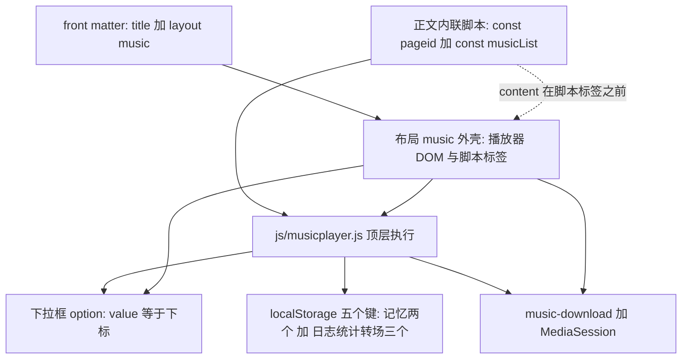

# 讲经页内容模型（pageid / musicList）

一块讲经页（`layout: music` 的页面）不是「一个音频文件加一个播放器」，而是**四层拼起来的一份声明**：front matter 上的 `title` 与 `layout`、正文里那段定义 `pageid` 与 `musicList` 的内联脚本、布局提供的播放器外壳、以及 [js/musicplayer.js](../../js/musicplayer.js) 在载入时对这些声明的消费。这四层之间没有类型、没有 schema、没有校验；唯一把它们缝在一起的是命名与顺序。DOM 与脚本那一侧的细节见 [布局与前端 DOM/脚本契约](../architecture/layout-and-frontend-contract.md)，本页讲的是**内容**那一侧：一块讲经页由哪些值构成、这些值去哪里了、以及新增一块要动哪几个地方。



上图是一块讲经页的装配与消费链：front matter 选外壳，正文内联脚本提供数据，`musicplayer.js` 把数据展开成下拉框、记忆键、下载链接与锁屏元数据。

## 一块讲经页的最小骨架

[阴符经.html](../../阴符经.html) 是这份骨架最干净的样例：

```html
---
title: 阴符经
layout: music
---

<script type="text/javascript">

    const pageid = "yfj";
    const musicList = [
        { name: '阴符经第一讲', url: '/玉机子/玉机子讲阴符经/28416276.m4a' },
        ...
    ];

</script>

<div class="card-body">

</div>
```

（[阴符经.html](../../阴符经.html) L1–L16、L18–L20。）

四个要点：

1. **front matter 只用到两个键**（`title`、`layout`）。没有 `permalink`，所以输出 URL 就是 `/阴符经.html` —— 文件名就是 URL，中文原样保留（这条规则的整体后果见 [站点构建、布局装配与部署形态](../architecture/site-build-and-deploy.md)）。
2. **`pageid` 与 `musicList` 必须是正文里的顶层 `const`**，写在 `{{ content }}` 注入点里。布局把 `{{ content }}` 放在中部（[_layouts/music.html](../../_layouts/music.html) L50–L52），把 `<script src>` 放在末尾（L112–L125），因此这段内联脚本**必然**先于 `musicplayer.js` 执行 —— 这是它能工作的全部原因，不是约定俗成。
3. **`musicList` 元素只有 `name` 与 `url` 两个字段**，都是字面量字符串。没有 id、没有时长、没有封面。
4. **`<div class="card-body">` 是留给互链和补充说明的空壳**，绝大多数讲经页留着空（[阴符经.html](../../阴符经.html) L18–L20），只有两个页面用它挂原文页链接。

## pageid：localStorage 命名空间，唯一性由人保证

`pageid` 不做路由、不做埋点、不出现在 URL 里。它唯一的作用是当 **localStorage 键前缀**，把「这一页的播放状态」和「这一页的黑匣子」隔离到自己的命名空间下：

| 键 | 用途 | 写入点 |
|---|---|---|
| `<pageid>_currentMusic` | 当前曲目在 `musicList` 中的**下标** | [js/musicplayer.js](../../js/musicplayer.js) L51（选曲）、L135（换曲） |
| `<pageid>_currentTime` | 播放头秒数 | L71（`timeupdate`，每秒数次）、L136（换曲后清零） |
| `<pageid>_plog` | 事件黑匣子（最多保留最近 500 条） | L343–L357 |
| `<pageid>_pstats` | 转场成功/失败、失败原因计数 | L360–L366 |
| `<pageid>_ptrans` | 进行中的转场（进程被杀后靠它记账） | L362–L364 |

（键名拼接见 L314–L316：`var PKEY_LOG = pageid + '_plog';` 等。每个键的读取/清理时机与诊断面板用法见 [播放记忆与黑匣子日志](./player-persistence-and-diagnostics.md)。）

由此得到本页最重要的一条硬约束：

> **`pageid` 必须在全站唯一。** 两个页面共用同一个 `pageid`，就共用这五个键：播放记忆互相踩、转场统计被混在一起、`_ptrans` 里未完成的转场会被另一页的「载入时检查」当成自己的失败记一笔（L663–L674）。没有任何机制会发现这件事——页面看起来完全正常。

当前在用的 9 个 `pageid` 全是手工取的语义缩写，与文件名、标题之间**没有生成关系**，也不可能从任何地方推导出来（`yfj` / `byczs` / `ddj` / `xsf` / `tyjhzz` / `dyzr` / `cxy` / `tzsr` / `jdds`）。此外 [local-test.html](../../local-test.html) 用了第十个 `pageid = "localtest"`（L21）。

两个直接后果：

- **改 `pageid` 等于清空这块页面的记忆与统计**，不会影响音频文件本身。
- 反过来，[local-test.html](../../local-test.html) 用 `localtest` 引用了一批与 [经典读诵.html](../../经典读诵.html) 完全相同的音频 URL（[local-test.html](../../local-test.html) L22–L26 的三首对 [经典读诵.html](../../经典读诵.html) L10、L11、L17），两边的播放位置互不相干。同理，同一部经典可以既是讲经页也是读诵页（[阴符经.html](../../阴符经.html) 的 `yfj` 与 [经典读诵.html](../../经典读诵.html) 里的「阴符经」条目），记忆也互不相干：**`pageid` 标识的是「页」，不是「内容」。**

## musicList：下标就是契约

`musicList` 是曲目数组，但真正被持久化下来的不是它的内容，而是**数组下标**：

- 载入时 `initSelect()` 按顺序为每个元素生成一个 `<option>`，`option.value = index`（L20–L28）。布局里那个 `<option value="">请选择音频</option>` 留在首位，是唯一的非数字选项（[_layouts/music.html](../../_layouts/music.html) L59–L61）。于是 `change` 处理器用**真值判断**分流：`if (selectedIndex)` 为真表示选中了某一首（注意下标 `0` 的字符串 `"0"` 是真值），为假只可能是占位项，也就是「清空选择」（L31–L62）。
- 记忆写的是 `selectedIndex`（字符串形式的下标，L51）或 `nextIndex`（数字，L135），**从不写曲名或 URL**。

这带来一条容易被低估的失效模式：**重排或删减 `musicList` 会让老用户的记忆指向别的曲目**，而且是静默的——下标还在，只是含义变了。更糟的是下标**越界**的情形：

```js
function restoreMusic() {
  const currentMusic = localStorage.getItem(`${pageid}_currentMusic`);
  if (currentMusic !== null) {
    const selectedMusic = musicList[currentMusic];
    musicSelect.value = currentMusic;
    musicPlayer.src = selectedMusic.url;   // ← 下标越界时这里抛 TypeError
```

（[js/musicplayer.js](../../js/musicplayer.js) L100–L106。）

`restoreMusic()` 是顶层语句（L177），`musicList` 里已经没有那个下标时 `selectedMusic` 为 `undefined` → 读 `.url` 抛 `TypeError` → **脚本剩余部分全部不执行**：10 秒一次的「剩余」刷新 `setInterval`（L182）、`#myselect` 的 `onchange` 绑定（L282）、`visibilitychange` 续播分支（L635–L659）、黑匣子启动与未完成转场检查（L663–L676）一起消失。在此之前注册好的 select/`timeupdate`/`ended` 处理器仍然有效，所以故障表现是「能选曲、能播，但定时关闭没反应、剩余时间永远是 —、诊断面板进不去」——很难联想到是「有人删掉了一集音频」。

**因此：给 `musicList` 增删条目时，要么只追加在末尾，要么接受老用户的续播位置会漂移；删到比任何已存下标还短，就会让部分用户直接进入上面这个半死状态。**

### 记忆恢复只做「预置」，不自动播放

`restoreMusic()` 恢复的是「上次是哪一首」：设置下拉框选中项与 `musicPlayer.src`、显示下载链接（L100–L113）。真正的秒数恢复发生在 `loadedmetadata`：

```js
musicPlayer.addEventListener('loadedmetadata', () => {
  const savedTime = localStorage.getItem(`${pageid}_currentTime`);
  if (savedTime) {
    musicPlayer.currentTime = parseFloat(savedTime);
  }
});
```

（[js/musicplayer.js](../../js/musicplayer.js) L89–L95。）它不调用 `play()`——是否出声交给用户的播放意图（自动播放策略、`pPlayIntent` 与重试层的细节见 [播放器状态机](./player-state-machine.md) 与 [连续播放转场全流程](../workflows/continuous-playback-transition.md)）。

## musicList 与 title 一起派生出三处 UI

`musicList` 的每个条目被消费三次，`title` 被额外用在一个地方：

| 产物 | 取值来源 | 代码位置 |
|---|---|---|
| 下拉框选项文本 | `music.name` | L25 |
| 「↓ 下载此音频」链接 | `href = music.url`、`download = music.name`（**显示名，不是文件名**）、`display: inline` | L47–L49、L109–L111、L131–L132；锚点见 [_layouts/music.html](../../_layouts/music.html) L92 |
| 锁屏/通知栏元数据 | `title = music.name`、`artist` 硬编码「玉机子道长」、`album = document.title` | L548–L557（`pSetSessionMeta`，在选曲/换曲时调用） |
| 标签页标题 / 页头 / MediaSession 的 `album` | front matter 的 `title` | [_layouts/music.html](../../_layouts/music.html) L10（`{{ page.title }} · 玉机子道长`）、L47、L7（`<meta name="description">`） |

注意 `download` 写的是 `music.name`（例如「阴符经第一讲」，不含扩展名），扩展名由浏览器从 URL 推。曲目改名会同时改下拉框、锁屏标题和建议文件名——这三处必须一起接受。

## 当前的讲经页清单（经目格顺序）

[index.html](../../index.html) L18–L62 的经目格是**手工维护**的 11 条静态链接，`<span class="idx">` 用中文数字编号、每条带一个步进 0.04s 的 `animation-delay`。下表把格子顺序、页面文件、`pageid` 与音频目录对齐，便于查漏；曲目数由各页 `musicList` 条目数得出（**音频目录只能从 `url` 字符串推断**，理由见下一节）。

| 经目格序 | 经目格标题 | 页面文件 | `pageid` | 音频 URL 目录（由 `url` 字符串推断） | 曲目数 |
|---|---|---|---|---|---|
| 一 | 玉机子讲阴符经 | [阴符经.html](../../阴符经.html) | `yfj` | `/玉机子/玉机子讲阴符经/` | 4 |
| 二 | 白玉蟾祖师 | [白玉蟾.html](../../白玉蟾.html) | `byczs` | `/玉机子/玉机子解白玉蟾大道歌/`、`/玉机子/玉机子解白玉蟾修道真言/` | 7 |
| 三 | 道德经 | [道德经.html](../../道德经.html) | `ddj` | `/玉机子/玉机子讲道德经/` | 83 |
| 四 | 南宗下手法及解惑答疑 | [下手法.html](../../下手法.html) | `xsf` | `/玉机子/玉机子讲南宗下手法及解惑答疑/` | 9 |
| 五 | 吕祖太乙金华宗旨 | [吕祖太乙金华宗旨.html](../../吕祖太乙金华宗旨.html) | `tyjhzz` | `/玉机子/玉机子解吕祖太乙金华宗旨/` | 8 |
| 六 | 丹阳真人语录 | [丹阳真人语录.html](../../丹阳真人语录.html) | `dyzr` | `/玉机子/玉机子讲丹阳真人（马钰）语录/` | 7 |
| 七 | 翠虚吟 | [翠虚吟.html](../../翠虚吟.html) | `cxy` | `/玉机子/玉机子讲-陈泥丸《翠虚吟》/` | 1 |
| 八 | 体真山人语录 | [体真山人语录.html](../../体真山人语录.html) | `tzsr` | `/体真山人语录/` | 15 |
| 九 | 玉师聊阴符经 | [玉师聊阴符经.html](../../玉师聊阴符经.html) | 无 | 无 | — |
| 十 | 玉师聊修行 | [玉师聊修行.html](../../玉师聊修行.html) | 无 | 无 | — |
| 十一 | 经典读诵 | [经典读诵.html](../../经典读诵.html) | `jdds` | `/经典读诵/` | 12 |

表外还有一个：`pageid = "localtest"` 的 [local-test.html](../../local-test.html)，它不经过任何布局、不在经目格里、也不入版本控制（[.gitignore](../../.gitignore) L8）。

三条从表里读出来的事实：

1. **经目格与文件之间没有生成关系。** 漏加一条链接，页面照样能通过 URL 访问（[站点构建、布局装配与部署形态](../architecture/site-build-and-deploy.md) 说明了「发布集合 = 仓库文件」），只是没人找得到；反之删页面而不删格子就是死链。
2. **经目格的标题字符串可以任意，不必等于页面 `title`。** 第一条格子写「玉机子讲阴符经」而页面 `title` 是「阴符经」（[阴符经.html](../../阴符经.html) L2）；第四条写「南宗下手法及解惑答疑」而页面 `title` 是「下手法」（[下手法.html](../../下手法.html) L2）。
3. **经目格混进了非讲经页。** 第九、十两格指向 [玉师聊阴符经.html](../../玉师聊阴符经.html) 与 [玉师聊修行.html](../../玉师聊修行.html)，它们是 `layout: default` 的聊天记录转写页（[玉师聊阴符经.html](../../玉师聊阴符经.html) L1–L3、[玉师聊修行.html](../../玉师聊修行.html) L1–L3），没有 `pageid`、没有 `musicList`、没有播放器。「上经目」在这里只表示「值得从首页进」。

## 与原文页的互链模式

「原文/译文页」是 `layout: default` 的纯文本页，用 `permalink` 发布成不带扩展名的干净路径，它们是讲经页的**附属页**。当前只有两组，而且链接是**单向的**：

| 讲经页（`layout: music`） | 链接位置 | 原文页 | 原文页的 `permalink` |
|---|---|---|---|
| [体真山人语录.html](../../体真山人语录.html) L30 `<a href="/体真山人语录原文">` | `<div class="card-body">` 内的 `<h3>` | [体真山人语录原文.html](../../体真山人语录原文.html) | `/体真山人语录原文/`（L2） |
| [吕祖太乙金华宗旨.html](../../吕祖太乙金华宗旨.html) L23 `<a href="/太乙金华宗旨原文和译文">` | 同上 | [太乙金华宗旨原文和译文.md](../../太乙金华宗旨原文和译文.md) | `/太乙金华宗旨原文和译文/`（L2） |

模式要点：

- 链接写在**讲经页**正文的 `card-body` 里（其余七块讲经页的 `card-body` 是空的）；
- 目标写 `<permalink>` 的**值去掉尾部斜杠**形式（不是文件名）；
- **原文页不回链、也不在经目格里**——它们只能从对应讲经页（或直接输 URL）到达。删掉讲经页里那一行，原文页就成了孤儿；
- 原文页既可以是 HTML（[体真山人语录原文.html](../../体真山人语录原文.html)）也可以是 Markdown（[太乙金华宗旨原文和译文.md](../../太乙金华宗旨原文和译文.md)），内容格式对这条互链没有影响。

## 音频 URL：只能从字符串推断，文件本身读不到

`musicList` 里的 `url` 一律是**根绝对路径**，并且：

- 中文目录名与文件名原样保留，含全角括号与《》（`/玉机子/玉机子讲-陈泥丸《翠虚吟》/32111121.m4a`，[翠虚吟.html](../../翠虚吟.html) L12）；
- 玉机子讲经类音频集中在 `/玉机子/<专题目录>/` 下，容器多为 `.m4a`，但同一目录内可以混 `.mp3`（[下手法.html](../../下手法.html) L11–L19 同时引用 `28415754.m4a` 与 `玉机子师父聊修行2013-05-07.mp3`）；
- 读诵类音频都在 `/经典读诵/` 下、扩展名 `.mp3`（[经典读诵.html](../../经典读诵.html) L10–L21）；
- 体真山人语录自成顶层目录 `/体真山人语录/`（[体真山人语录.html](../../体真山人语录.html) L9–L23）；
- 一页可以跨目录：白玉蟾祖师一页同时引用「大道歌」与「修道真言」两个目录（[白玉蟾.html](../../白玉蟾.html) L12–L18），所以「一块讲经页 = 一个音频目录」只是惯例，不是约束。

**这些目录结构是从 URL 字符串推断的，不是从文件系统读出来的。** [.openwikiignore](../../.openwikiignore) 用通配符排除 `*.m4a`、`*.mp3`（L14–L18），又显式排除 `玉机子/`、`经典读诵/`、`体真山人语录/`、`downloads/`（L25–L28），所以 wiki 生成既不能读取也不能枚举这些音频；音频却**必须在版本控制里**（[.gitignore](../../.gitignore) L1–L4 专门记录了曾经因为本地忽略音频而与远端分叉的教训）。两者互不矛盾：`.openwikiignore` 只管 wiki，`.gitignore` 只管 git。

音频的 `?v=` 缓存击穿、CDN 行为与 `Range` 预取对服务端的要求见 [静态资源、音频资产与缓存击穿约定](../operations/assets-and-cache-busting.md)。

## 新增一块讲经页的最小步骤

1. **建文件**：仓库根新建 `<名称>.html`，front matter 只写 `title` 与 `layout: music`。**不要写 `permalink`**——不写时输出 URL 就是 `/<名称>.html`，与经目格链接的写法一致；文件名（含中文）即 URL，改名等于换地址。
2. **定义两个全局**：在正文里写内联 `<script>`，给出顶层 `const pageid = "<唯一缩写>"` 与 `const musicList = [{ name, url }, …]`。这段脚本必须留在 `{{ content }}` 里（页面正文），不能挪到页尾或抽到外部文件，否则布局脚本先执行、解析期抛 `ReferenceError`。
3. **选一个没人用过的 `pageid`**：与已有 9 个（`yfj` / `byczs` / `ddj` / `xsf` / `tyjhzz` / `dyzr` / `cxy` / `tzsr` / `jdds`）以及 `localtest` 都不冲突。重复即共享记忆与日志（见上文）。
4. **放音频并写 `url`**：新建或复用音频目录，`url` 用根绝对路径、中文原样；音频文件与页面一起提交。
5. **加经目格**：在 [index.html](../../index.html) 的 `.scrolls` 里追加一条 `<a class="scroll" href="/<名称>.html">`，给出下一个中文序号与递增的 `animation-delay`。
6. **（可选）挂原文页**：新建 `layout: default` + `permalink` 的原文页，并在本页 `card-body` 里加一条指向该 `permalink`（去掉尾斜杠）的链接。原文页当前不回链，必须手工加这一条。
7. **动了 `js/musicplayer.js` 就 bump `?v=`**：版本号写在布局的脚本标签上（[_layouts/music.html](../../_layouts/music.html) L113–L119），不在任何 manifest 里。
8. **验证**：本仓库没有测试框架；`local-test.html` 用的是自己的 `pageid`，验证不了新页的 `musicList`。检查方式是打开新页确认下拉框被填满、选中后能播、下载链接出现、刷新后能恢复曲目与位置。清单见 [验证与复现手册](../testing/verification-playbook.md)。

### 漏掉某一步会怎样

| 遗漏 | 表现 |
|---|---|
| 漏写 `layout: music` | 页面输出裸正文：没有 CSS、没有外壳、没有播放器、没有留言板 |
| 内联脚本里少了 `musicList` 或 `pageid` | 解析期 `ReferenceError`，下拉框停在「请选择音频」；看起来像「只是没选曲」 |
| `pageid` 与别页重复 | 两页共享记忆与统计；旧下标可能指向另一页的曲目，且 `_ptrans` 会互相污染 |
| `musicList` 里删条目（尤其删到比已存下标短） | 老用户续播位置漂移；下标越界时 `restoreMusic()` 抛 `TypeError`，定时关闭与诊断层静默失效 |
| `url` 拼错（中文、全角括号、《》任一字符不同） | 选定后拿不到元数据，该曲目不出声；预取的 `Range` 请求同样失败 |
| 没加经目格条目 | 页面不是不可访问，而是不可发现；只能靠 URL 传播 |
| 原文页加了却没回链 | 原文页成为孤儿，只能直接输 URL 到达 |

## 相关页面

- [布局与前端 DOM/脚本契约](../architecture/layout-and-frontend-contract.md) —— `music` 布局必须提供的元素 id、`pageid`/`musicList` 两个全局的消费点、脚本顺序硬约束
- [站点构建、布局装配与部署形态](../architecture/site-build-and-deploy.md) —— front matter 四个键、`permalink` 与 URL、中文路径、发布形态
- [播放记忆与黑匣子日志（localStorage 键）](./player-persistence-and-diagnostics.md) —— 这五个键各自的读写时机与诊断面板
- [播放器状态机：播放意图、转场与暂停归因](./player-state-machine.md) —— `pPlayIntent`、转场与自愈层的状态语义
- [连续播放转场全流程](../workflows/continuous-playback-transition.md) —— 曲目切换与下标推进的下游行为
- [静态资源、音频资产与缓存击穿约定](../operations/assets-and-cache-busting.md) —— 音频资产、`?v=` 与 CDN 缓存
- [验证与复现手册](../testing/verification-playbook.md) —— 新增或改动讲经页后的验证方法
