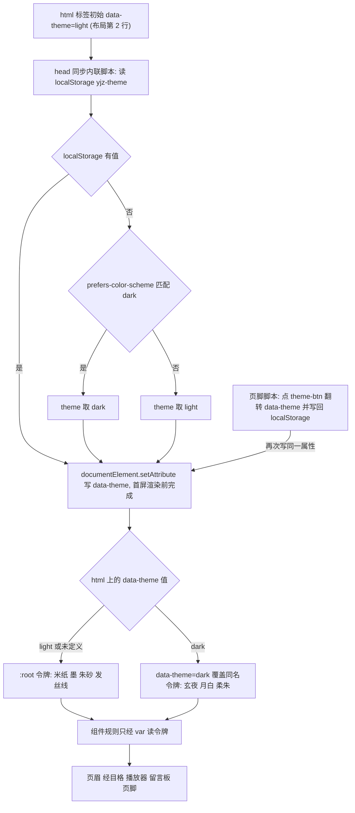

# 水墨清静设计系统与主题机制

全站的视觉只有**一个来源**：[style.css](../../style.css)（390 行，纯 CSS，没有预处理器、没有构建步骤、没有 lint）。两个布局和 [local-test.html](../../local-test.html) 都用根绝对路径 `/style.css` 直接引入它（[_layouts/default.html](../../_layouts/default.html) L24、[_layouts/music.html](../../_layouts/music.html) L23、[local-test.html](../../local-test.html) L9），Jekyll 原样把文件发出去。文件头注释把设计目标写得很清楚：米纸/墨/朱砂三色、系统中文衬线、「零外部字体依赖,墙内秒开」、光（水墨清静）暗（玄夜）双主题（`style.css` L1–L5）。

它的结构是三层：**:root 令牌 → `[data-theme="dark"]` 同名覆盖 → 组件规则全部通过 `var(--*)` 读令牌**。三层之间的耦合只有一种形式（CSS 自定义属性继承），所以「暗色主题失效」几乎总是同一类错误：某条规则写死了颜色。

## 令牌层

`:root` 一次性声明全部令牌（`style.css` L8–L26），可以分成四类：

| 类别 | 令牌 | 语义 |
|---|---|---|
| 颜色 | `--paper` `--paper-2` `--ink` `--ink-soft` `--ink-faint` `--cinnabar` `--cinnabar-2` `--line` `--line-soft` `--sel-bg` | 米纸、面板底、墨、次级墨、弱墨（注释标注达 WCAG AA 4.5:1）、朱砂、暗夜柔朱、发丝线、浅发丝线、选中底色 |
| 透明强度 | `--grain-op` | 纸纹噪声叠加强度（亮 `.035`、暗 `.05`） |
| 字体 | `--serif`、`--kai` | 正文衬线栈、楷体栈 |
| 几何/时间 | `--maxw`（62rem）、`--ease`（`cubic-bezier(.22,.61,.36,1)`） | 内容宽度与统一缓动 |

`[data-theme="dark"]` 块（`style.css` L28–L40）**只覆盖颜色与 `--grain-op`**，不重新声明 `--serif` / `--kai` / `--maxw` / `--ease`。这是一条有意的分工：

- 字体栈、宽度、缓动是**主题无关**的，只存在于 `:root`，因此暗色下不可能被改错；
- 暗色需要的每个颜色令牌都在覆盖块里出现一次，`--paper` 从 `#f4efe3` 变 `#15171b`、`--ink` 从 `#2b2722` 变 `#cfc8b6`、`--cinnabar` 从 `#a8322d` 变 `#d07065`（更柔，避免暗底上的高饱和红）。

新增令牌时必须显式选择归属：放 `:root`（两种主题共用）还是同时放两个块（需要按主题取值）。只放一个块会让另一种主题拿到空值。

## 主题初始化 → `data-theme` → 令牌 → 组件

主题的取值只有一个载体：`<html>` 上的 `data-theme` 属性。两条链路写它 —— `<head>` 里的同步防闪脚本，和页脚的行为脚本（点击切换）。

上图是主题取值的完整链路：`localStorage` 或系统偏好决定 `data-theme`，属性选择器决定哪一套令牌生效，组件规则因为只读令牌而自动跟随。

### 防闪脚本：为什么必须同步、必须放在 `<head>`

两个布局的 `<head>` 里各有一段逐字相同的脚本（[_layouts/music.html](../../_layouts/music.html) L12–L20、[_layouts/default.html](../../_layouts/default.html) L13–L21）：读 `localStorage.getItem('yjz-theme')`，缺失则 `matchMedia('(prefers-color-scheme: dark)')`，然后 `document.documentElement.setAttribute('data-theme', t)`。注释写明目的：「尽早定主题,避免昼夜闪烁」。

三个性质值得记住：

1. **同步、无 `defer`、在 `<link rel=stylesheet>` 之前。** 它必须在首屏绘制前改掉 `<html>` 属性，否则暗色用户会看到一帧亮色。把它改成 `defer` 或挪到页脚就等于放弃防闪。
2. **整体包在 `try/catch` 里，静默降级。** 隐私模式/禁用存储时读 `localStorage` 会抛错，此时属性保持标记里的初值 `data-theme="light"`（`music.html` L2、`default.html` L2）——**亮色是默认主题，且不依赖 JS 也能成立**。
3. **CSS 自身从不读 `prefers-color-scheme`。** `style.css` 里唯一的 `prefers-*` 媒体查询是动效降级用的 `prefers-reduced-motion`（L308）；主题分支全部由属性选择器承担，例如日/月图标的显隐（`[data-theme="dark"] .theme-toggle .sun { display: none }` / `.moon { display: inline }`，L121–L123）。系统偏好只在 JS 里被读一次，用来决定初始 `data-theme`。

### 持久化与浏览器 chrome 的同步

页脚脚本挂在 `#theme-btn` 上（[_layouts/music.html](../../_layouts/music.html) L126–L140、[_layouts/default.html](../../_layouts/default.html) L102–L121）：按当前 `data-theme` 取反 → `setAttribute` → `localStorage.setItem('yjz-theme', n)`（同样包在 `try/catch` 里）→ 再更新 `<meta name="theme-color">`，值在 `'#15171b'` 与 `'#f4efe3'` 之间切换（`default.html` L110–L111、`music.html` L134–L135）。

这里有一个**令牌值重复**的坑：`<meta name="theme-color" content="#f4efe3">`（`default.html` L8、`music.html` L8）和 JS 里的 `#15171b` 是 `--paper` 两个取值的**字面量副本**，读不到 CSS 变量。改 `--paper` 的十六进制值，必须同步改两个布局各两处（共四处）的 `meta`/JS，否则手机地址栏与暗色页面会不一致。

同一段脚本还负责 `#totop` 的 `.show`（滚动超过 500px）与 default 布局独有的抽屉 `#drawer` 的 `.open` 类 —— 它们只切类名，样式仍在样式表里（`style.css` L279–L284、L126–L132）。

## 铁律：新样式只允许用 `var(--*)`

`style.css` 在「留言板」一节的注释里把这条规则写在代码旁边，是全仓库最直白的一处表述（`style.css` L313–L318）：

> 与全站同一套令牌:米纸/墨/朱砂 + 发丝线。这里**不写死任何颜色**,只用 var(--*),所以昼夜主题自动跟随,不需要第二套样式。

「留言板」一节（`style.css` L319–L390）确实遵守了这条规则，因此它是验证「令牌化样式正确写法」的最佳范本：结构由 [_includes/comments.html](../../_includes/comments.html) 提供（L14–L64），布局在正文后 include 它，样式自动拿到暗色版本，前端只有一份 [js/comments.js](../../js/comments.js)。

失效方式很单调但很难自查：在组件规则里写 `color: #2b2722` 而不是 `color: var(--ink)`。亮色下完全正常，只有切到暗色（或系统偏好为暗色的用户第一次访问）才出现黑字压黑底，而且因为没有第二套样式，问题只在暗色复现 —— **任何新的 CSS 都必须在暗色下过一遍**。

### 已知的写死颜色（例外清单）

规则有三处合法例外，都是「无法用变量表达」的情形，改动时不要照着它们扩大例外：

| 位置 | 写法 | 为什么不能令牌化 |
|---|---|---|
| `.seal` / `.foot-seal`（`style.css` L92–L102、L274–L275） | `color: #fff` 压在 `background: var(--cinnabar)` 上 | 白字是为了在朱砂块上取得对比，底色本身仍是令牌，所以暗色下朱砂变柔、白字仍可读 |
| `.seal` 的内描边（`style.css` L99） | `color-mix(in srgb, var(--cinnabar) 60%, #000)` | `#000` 只是混色的一端，结果仍随 `--cinnabar` 变化 |
| `.field` 的下拉箭头（`style.css` L158–L163） | `background-image` 里内嵌 data-URI SVG，`stroke='%23918979'` | **data URI 内部不能引用 CSS 变量** —— 这是真实的主题盲区：箭头灰是硬编码的，暗色下不会变成 `--ink-faint`。要修必须为暗色另写一条 `.field` 规则或用 `mask`，成本明显高于收益，所以现状被接受 |

## 纸纹与几何：不属于主题的部分

- **纸纹噪声**：`body::before` 铺一层 `position: fixed; inset: 0` 的 data-URI SVG（`feTurbulence` 分形噪声，两倍频、`stitchTiles`），`opacity: var(--grain-op)`、`pointer-events: none`、`z-index: 0`（`style.css` L57–L64）。它是全站唯一的纹理资源，**内嵌在 CSS 里而不是图片文件**，因此没有额外请求。代价是要靠层叠把内容托起来：`.shell` 与 `main` 都是 `position: relative; z-index: 1`（L72、L174），页眉 `z-index: 30`、播放器 `z-index: 20`、`.totop` `z-index: 25`。新加 `position: fixed` 的全屏装饰层会踩到这套层级，动它之前先读这三条。
- **宽度与响应式**：`--maxw: 62rem` + `.wrap` 的 `padding-inline: clamp(1.2rem, 4vw, 2.5rem)`（L71）是唯一的容器约定；字号与页头尺寸用 `clamp()` 连续缩放（如 `.proem .epigraph` L185–L190、`.page-head h1` L245）。断点只有两个，都是 `max-width: 600px`：L301–L305 缩正文字号、缩品牌名、**把播放器从 `position: sticky` 改成 `static`**（否则手机上吸底卡片会盖住正文），L387–L390 处理留言表单的行内换行。
- **动效**：统一用 `--ease`。入场动画是 `.scroll` 的 `rise`（`style.css` L209–L225），起始态为 `opacity: 0; transform: translateY(10px)`，靠 `animation: rise .7s forwards` 到位；**错开节奏由页面负责** —— [index.html](../../index.html) L19–L62 给 11 个格子写了步进 0.04s 的 `style="animation-delay:…"`，所以「经目格逐格浮起」这条效果跨越了 `style.css` 与 `index.html` 两个文件。
- **动效降级**：`@media (prefers-reduced-motion: reduce)` 里 `* { animation: none !important; transition: none !important; }`，**并且单独把 `.scroll` 复位成 `opacity: 1; transform: none`**（`style.css` L307–L311）。第二句不是冗余：`.scroll` 的可见状态完全由动画的 `forwards` 填充产生，只关动画会让整张经目格留在 `opacity: 0`，页面看起来是空的。改入场动画时（例如把 `forwards` 去掉，或改成 transition），必须同步检查这条降级规则。

## Bootstrap 中和层：为旧页面保留的兼容面

两个布局都 `<link>` 了第三方 `/css/bootstrap.min.css`，且顺序在 `/style.css` **之前**（`music.html` L22–L23、`default.html` L23–L24）。仓库里没有任何页面引用 `bootstrap.bundle.js`，所以 Bootstrap 在这套系统里的角色只剩两件事，都在 `style.css` 里被显式处理：

1. **归零它的布局副作用**：`.player .row { margin-left: 0; margin-right: 0; }`，注释直说是「归零 Bootstrap .row 的负边距」（`style.css` L261）。
2. **重映射它的语义类**（`style.css` L290–L299，注释标题即「Bootstrap 中和层」）：`.reader .card` / `.card-body` / `.card-text` 被改写成以 `--paper-2` 为底、`--line` 为边框的墨色卡片，`.text-muted` 改为 `var(--ink-soft)`，`.bg-light` / `.bg-dark` 改为 `transparent` + `var(--ink)`，`.jumbotron` 改为 `var(--paper-2)`，并在三处加 `!important`。注释把动机写得最直白：「内容页仍用 .card / .card-body / .text-muted 等,统一并入水墨主题(暗色下不再白卡)」。

这一层**不能删**，因为旧页面还在用这些类：[阴符经.html](../../阴符经.html) L18、[道德经.html](../../道德经.html) L95、[白玉蟾.html](../../白玉蟾.html) L23 等 11 个页面保留了 `
`，[体真山人语录原文.html](../../体真山人语录原文.html) L6–L8 还在用 Bootstrap 栅格（`container` / `row` / `col-xs-6 col-sm-6 col-md-4`）。删掉 Bootstrap CSS 不是「清理一个没用的依赖」，而是让这些页面的排版散掉；删掉中和层则会直接看到「暗色下白卡」。

中和层里的 `!important`（L297–L299）是必要的，不是风格偏好：Bootstrap 的类选择器与 `style.css` 的组件选择器特异性常常相同，靠的是**加载顺序**取胜，而顺序依赖布局里两个 `<link>` 的排版。加 `!important` 是为了让中和结果不再依赖这个顺序。

> 关于 vendor 文件本身：[css/bootstrap*.css](../../.openwikiignore) 属于引入的第三方代码，已被 [.openwikiignore](../../.openwikiignore) L30–L34 的 `css/bootstrap*` 排除在 wiki 之外，不必（也不应该）逐文件归纳。

## 归属不明的样式：album.css

仓库根目录的 [album.css](../../album.css)（39 行）是**孤儿文件**：全仓库没有任何布局或页面 `<link>` 它（链接目标只有 `/css/bootstrap.min.css` 与 `/style.css`，见 `default.html` L23–L24、`music.html` L22–L23、[local-test.html](../../local-test.html) L8–L9），因此它对线上渲染没有任何作用。内容看起来是从 Bootstrap 的 album 示例页整段搬来的：`--jumbotron-padding-y`、`.jumbotron` 上下 padding、`.jumbotron-heading`、`.box-shadow`，其中 `.jumbotron { background-color: #fff; }`（L9）是写死的白色。

它对设计的唯一意义是**反面教材**：这正是 `style.css` L290–L299 要中和的那种旧写法。如果将来有人把它加进 `<link>` 列表，它会引入一个主题无关的白底 jumbotron（即便被中和层的 `!important` 压住，也只会增加无谓的层叠竞争）。删掉它不影响任何页面；保留它就要接受「读了会被误导」。

## 约束：零外部字体、零 CDN

设计系统最硬的两条外部约束写在文件头与注释里，共同目标是「墙内秒开」：

- **字体只用本地系统字体**：`--serif` 是 `"Songti SC","STSong","Noto Serif CJK SC","Source Han Serif SC","SimSun",serif`，`--kai` 是 `"STKaiti","KaiTi","Kaiti SC","楷体",var(--serif)`（`style.css` L21–L22）。**`style.css` 里没有任何 `@font-face`、没有任何字体文件请求**；`--kai` 的末位回退是 `var(--serif)`，所以缺少楷体的系统（例如部分 Android）会稳定退到衬线栈而不是落到浏览器默认无衬线。楷体承担了品牌名、印章、题词、页脚偈语与留言者昵称等「手写感」位置（L96、L104、L187、L272、L332）。
- **样式层不引任何外部资源**：这一层只有两个同源请求 —— 根目录下的 `/css/bootstrap.min.css` 与 `/style.css`；纸纹与下拉箭头都是内嵌 data-URI SVG（L63、L160），没有任何图片、字体或 CDN 域名。[js/comments.js](../../js/comments.js) L1–L6 的注释复述了同一条原则（「零依赖，不引任何外部 CDN —— 与 style.css 的『墙内秒开』原则一致」）。

推论：**引入一个 webfont 或 CSS CDN（如 Google Fonts、字体分包）会同时违反这两条约束**，并且在墙内会变成首屏阻塞请求。要换字体，正确做法是扩充 `--serif` / `--kai` 里的系统字体名列表。

与此相关的另一处耦合是 `/style.css` 本身用**根绝对路径**引入：因为 `_config.yml` 从未设置 `baseurl`，站点只能部署在域名根目录，`/style.css` 与 `/js/*` 会一起在子路径部署下失效 —— 部署含义见 [站点构建、布局装配与部署形态](../architecture/site-build-and-deploy.md)。

## 唯一在 JS 里写样式的地方

设计系统之外有一处刻意的例外：`?debug` 诊断面板由 [js/musicplayer.js](../../js/musicplayer.js) L679–L686 用 `style.cssText` 现场注入（`rgba(10,12,10,.88)` 底 + `#9fdf9f` 等宽字），面板按钮还带行内 `style`（L725–L726）。它是**固定深色的调试界面，有意不跟随主题**，因为它的用途是在真机上截日志。除此之外 JS 只切换类名与属性，从不写颜色。

## 改样式前的检查清单

1. **只写 `var(--*)`。** 需要新颜色就加令牌，并在 `:root` 与 `[data-theme="dark"]` 两处都给出取值；不要为暗色写第二套组件规则。
2. **在暗色下过一遍**（点 `#theme-btn` 或把系统偏好改成暗色刷新），亮色正确不代表样式正确。
3. **改 `--paper` 的十六进制值**时，同步 `default.html` L8/L111 与 `music.html` L8/L135 的 `meta theme-color` 与 JS 字面量（共四处），否则手机地址栏会与页面不同色。
4. **动 `.scroll` 的入场动画**时，同步维护 `style.css` L310 的 `prefers-reduced-motion` 复位规则，以及 [index.html](../../index.html) 里逐格递增的 `animation-delay`。
5. **不要新增依赖 Bootstrap 语义类的新样式。** 中和层只是历史兼容面，新组件应直接写水墨类。
6. **加全屏固定层前**先读纸纹那套 `z-index` 约定（`body::before` 0 / `.shell` `main` 1 / 播放器 20 / `.totop` 25 / 页眉 30）。
7. **布局里的主题脚本与样式表无关但必须一致**：两段脚本目前逐字相同，改主题键名或 `meta theme-color` 逻辑要改两处（DOM 与脚本契约见 [布局与前端 DOM/脚本契约](../architecture/layout-and-frontend-contract.md)）。
8. **留言板样式只在 `style.css` 的「留言板」一节**（`style.css` L313–L390），结构与行为分别在 [_includes/comments.html](../../_includes/comments.html) 与 [js/comments.js](../../js/comments.js)；三者的分工见 [留言板读写往返与失败分支](../workflows/comments-roundtrip.md)。

## 相关页面

- [布局与前端 DOM/脚本契约](../architecture/layout-and-frontend-contract.md) —— 主题防闪脚本、`#theme-btn` 与 `style.css` 类名的交界
- [站点构建、布局装配与部署形态](../architecture/site-build-and-deploy.md) —— `/style.css` 为什么必须是根绝对路径
- [讲经页内容模型（pageid / musicList）](audio-page-model.md) —— 经目格与 `.card-body` 空壳的来源
- [遗留层：jQuery、yujizi.js 与失效的旧播放器假设](legacy-multi-audio-player.md) —— Bootstrap/jQuery 作为引入但未被真正使用的第三方层
- [留言板读写往返与失败分支](../workflows/comments-roundtrip.md) —— 令牌化样式所服务的留言板组件
