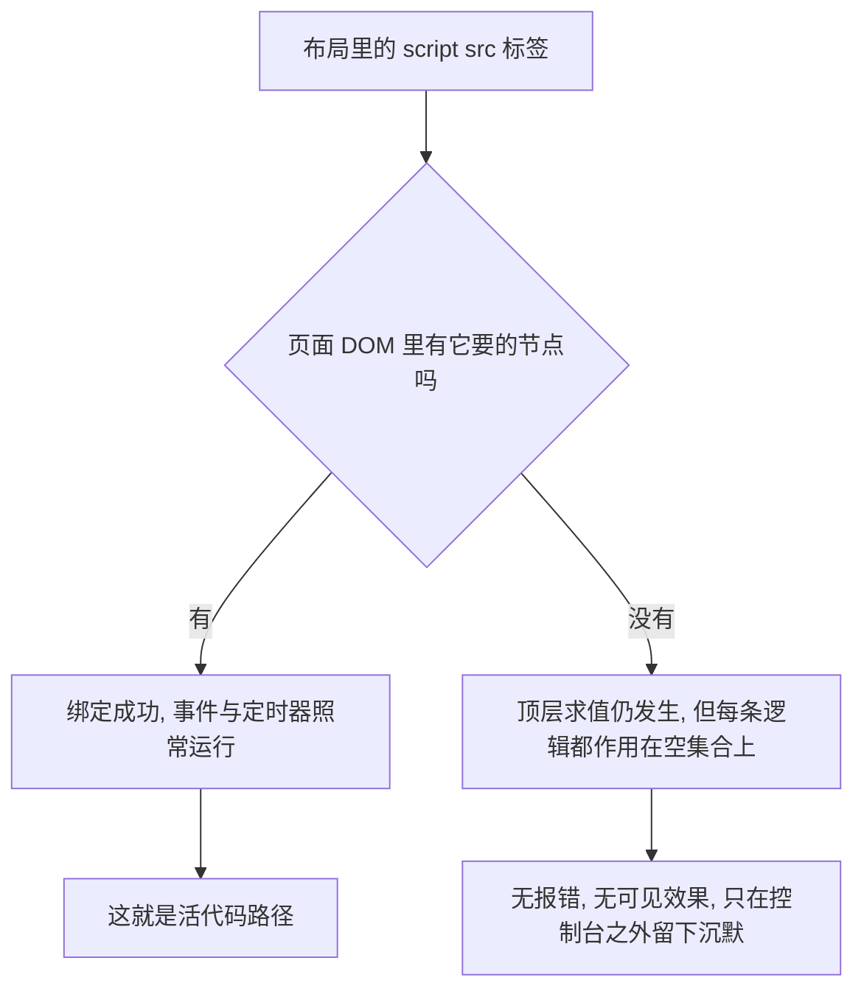

# 遗留层：jQuery、yujizi.js 与失效的旧播放器假设

当前播放器是 [js/musicplayer.js](../../js/musicplayer.js) 的单 `<audio>` + `musicList` 模型（见 [讲经页内容模型](./audio-page-model.md)）。但仓库里还留着一层**为「一页多个 `<audio>`」写的旧实现** —— [js/yujizi.js](../../js/yujizi.js)，以及它带来的两个依赖（jQuery slim、Bootstrap CSS）和几个已经没人引用的文件。

这一层最容易造成的两种误判是：

1. 以为 [js/yujizi.js](../../js/yujizi.js) 还在干活（它在 `default` 布局上被加载，看上去是活代码）；
2. 把抽屉里的「清除播放记忆」按钮（`reset()`）当成清播放位置的正确入口。

本页只做记录与定性结论，不改代码。

## 判据：被加载 ≠ 有效执行

`_layouts` 里的 `<script src>` 只能证明文件被下载并求值，不能证明它做了什么。要判断一段遗留脚本是否仍然有效，需要三步证据：



上图是本页使用的判据：先看标签，再看匹配 DOM，最后才判断是否真的执行。

## js/yujizi.js：一套为「多个 `<audio>` 标签」写的实现

它只有一个加载方：[`_layouts/default.html`](../../_layouts/default.html) L100–L101，紧跟在 jQuery slim 之后。它的假设可以完整复述为四条：

| 假设 | 代码位置 |
|---|---|
| 页面加载时扫描**全部** `<audio>` 元素，把它们的 `id` 收集成轮播顺序 | L63–L68（`document.getElementsByTagName("audio")` → `audioArray.push(audios[i].id)`） |
| 每首播完自动播下一首，顺序就是 `audioArray` 的 `id` 顺序，播完绕回第一首 | L48–L56（`getNextId`）、L58–L61（`next`）、L66（`ended` 监听） |
| 播放位置按 **`<audio>` 的 `id` 当 localStorage 键**存，每 10 秒一次 | L26–L46（`saveState`）、L2（`setInterval("saveState()",10000)`） |
| 恢复位置也按同一套 `id` 键，且恢复时机是 jQuery ready | L63–L72（`loadState`）、L114–L118 |

这四条假设在当前站点上**全部落空**，但落空的方式不同。关键前提是：**`default` 布局渲染出的页面里没有任何 `<audio>` 元素**。全仓库唯二的 `<audio>` 标签在 [`_layouts/music.html`](../../_layouts/music.html) L84 与 [local-test.html](../../local-test.html) L60，而这两个页面都不加载 `yujizi.js`（前者只挂 `musicplayer.js` / `keepalive.js`，见 `music.html` L119、L125；后者只挂 `musicplayer.js`，见 `local-test.html` L76–L77）。

于是 `loadState()` 的循环一次也不进，全局 `audioArray`（L1）**永远是空数组**。这是本页最重要的一条事实，因为 `reset()`、`back30sec()`、`saveState()` 的位置循环、`stopAudio()` 全都以 `audioArray.length` 作循环上界：

- `reset()`（L6–L14）空转一圈 → 调一次 `saveState()` → `alert("已复位")`；
- `back30sec()`（L16–L24）空转一圈；
- `saveState()`（L26–L35）不会写任何位置键；
- `stopAudio()`（L82–L88）不暂停任何东西，只把 `#myselect` 复位成 `-1`。

**结论：`js/yujizi.js` 里所有与音频有关的部分在当前站点上是死代码，而且它死得很安静 —— 不抛错、不写日志，只是什么都不做。** 它假设的「页面上有一堆 `<audio>`」这种结构，今天只存在于 `music` 布局，而 `music` 布局不加载它。

### 它并非整份失效：三处仍然接线的副作用

只看「有没有音频」会漏掉三处**在当前页面上确实运行**的逻辑，它们都由 L114–L118 的 jQuery ready 回调或 L2 的定时器启动：

```js
$(function(){
    loadState();                                    // 空转
    document.getElementById("myselect").onchange = timingChange;   // ← 真的绑上了
});
```

| 仍然生效的行为 | 证据 | 在页面上的表现 |
|---|---|---|
| `#myselect` 的 `change` 处理器被绑定为 `timingChange` | L114–L118 消费 [`_layouts/default.html`](../../_layouts/default.html) L58 的 `<select id="myselect">` | 抽屉里的「定时关闭」下拉框真的能选中、真的会启动 `setTimeout`（L103–L111） |
| 每 10 秒把倒计时写进 `#remainTime` | L2 的 `setInterval("saveState()",10000)` → L36–L45 写 `document.getElementById("remainTime").innerText` | 文本页上也能看到「剩余 X 分钟 Y 秒」在走字 |
| 到点后 `stopAudio()` 把定时关闭复位成「不开启」 | L82–L88 | 倒计时走完，下拉框自己跳回「不开启」，没有任何音频被停止（因为没有任何音频） |

也就是说，在纯文本页（首页、原文页、聊天记录转写页）上，抽屉里的「睡前定时停止播放」**是一个看起来完全正常、实际无事可做的控件**。它并不报错 —— `stopAudio()` 只调 `myselect.value = -1`，`saveState()` 只在 `theTime` 有值时才碰 `#remainTime`，两者都不依赖 `audioArray` 非空。

顺带一个风格上的遗留痕迹：L2 用的是**字符串形式的 `setInterval`**（`setInterval("saveState()",10000)`），等价于定时 `eval`。这是它比仓库里任何其他脚本都更古老的一个标记，也意味着它在解析期就开始运行，早于任何 ready 回调。

### `reset()` 不是「清除播放记忆」，而且当前没有可用的替代入口

抽屉里那个按钮是 [`_layouts/default.html`](../../_layouts/default.html) L51 的 `onclick="reset()"`，实现是 L6–L14。它有**两重**失效，任一条都足以否掉它的说明文案：

1. **遍历对象为空**：如上所述，`default` 页面上 `audioArray` 是空数组，循环体一次都不执行，函数只剩 `saveState()` 与 `alert("已复位")`。
2. **键名体系根本不是当前播放器用的那套**。`reset()` 用 `<audio>` 元素的 `id` 作 localStorage 键（L31 `window.localStorage.setItem(id, a.currentTime)`）；而 [js/musicplayer.js](../../js/musicplayer.js) 的持久化键是 `<pageid>_currentMusic` / `<pageid>_currentTime`（L33–L34、L51、L71、L135–L136），外加三个日志/统计/转场键（L314–L316）。两套键没有任何交集 —— 即使页面上真有对应 `id` 的 `<audio>`，`reset()` 清掉的也是没人读的键。

因此 **[js/yujizi.js](../../js/yujizi.js) 的 `reset()` 无法清除任何一页的续播位置**，它只会弹一个「已复位」的对话框。而当前仓库里也没有替代入口：`musicplayer.js` 只在**用户主动选曲**时清掉这两个键（L33–L34，随后立即写入新值），`?debug` 面板的 `plogReset`（L700–L710）只删 `PKEY_LOG` / `PKEY_STATS` / `PKEY_TRANS`，**不删** `_currentMusic` / `_currentTime`。结论：站点目前没有「清空续播位置」的用户入口，抽屉里那个按钮是唯一的候选人，而它是坏的。播放记忆的键语义与读取时机见 [播放记忆与黑匣子日志](./player-persistence-and-diagnostics.md)。

### 为什么不能「顺手修好」：两份脚本不能同页共存

把 `musicplayer.js` 也挂到 `default` 布局、让 `reset()` 至少作用在真正的 `<audio>` 上，这条路走不通。[js/yujizi.js](../../js/yujizi.js) 与 [js/musicplayer.js](../../js/musicplayer.js) 在**顶层重名声明**了同一批符号：

| 符号 | `yujizi.js` | `musicplayer.js` |
|---|---|---|
| `var stopAudioTimeOut` / `var theTime` | L3–L4 | L179–L180 |
| `function stopAudio` | L82–L88 | L227 |
| `function timingChange` | L103–L111 | L267 |
| `function back30sec` | L16–L24 | L285 |
| `Date.dateAdd` | L90–L101 | L251 |

后加载者覆盖先加载者；更糟的是 `var theTime;`（无初始值）会把播放器已设的定时停止点直接清成 `undefined`，定时关闭随之失灵。当前布局之所以安全，只是因为它们各自只挂一个（`music.html` L119 挂播放器，`default.html` L101 挂遗留脚本）。任何合并尝试都要先解决这五组重名 —— 这是「迁移」方案的主要成本，也是它比「删除」更贵的原因。契约细节见 [布局与前端 DOM/脚本契约](../architecture/layout-and-frontend-contract.md)。

## js/js.cookie.js：没有任何引用方

[js/js.cookie.js](../../js/js.cookie.js) 是 js-cookie v1.5.1（文件头 L1–L7）的完整拷贝。它在本仓库里**一次也没有被引用**：两个布局、唯一的 include（[_includes/comments.html](../../_includes/comments.html)，只挂 `comments.js`）与全部页面里都不存在指向它的 `<script src>`；全仓库搜 `js.cookie` 只命中 git 索引本身。

它还有一个附带结论：这个库在浏览器环境下把自己挂成 `window.Cookies`，并且**只有当 jQuery 存在时才额外挂 `$.cookie` / `$.removeCookie`**（L19–L27 的浏览器分支取 `window.jQuery` 作参数，L141–L144 是那段挂载）。它当前既不执行，也没有页面需要在它前面放 jQuery。

**定性结论：纯死文件，可直接删除。** 删掉它不会影响任何页面，也不会影响 jQuery 的存在理由（jQuery 的理由是 `yujizi.js`，见下节）。

## jQuery slim：两个布局都加载，全仓库只有一个消费方

`/js/jquery-3.2.1.slim.min.js` 由两个布局都引入（[`_layouts/default.html`](../../_layouts/default.html) L100、[`_layouts/music.html`](../../_layouts/music.html) L112），但仓库里真正的 `$` 使用**只有一处**：[js/yujizi.js](../../js/yujizi.js) L114 的 `$(function(){ … })`。逐页判断：

| 页面类型 | jQuery 是否有消费方 | 依据 |
|---|---|---|
| `layout: music` 的 9 个讲经页 + `index.html` 等 `default` 页 | **没有**（`musicplayer.js`、`keepalive.js`、`comments.js` 都是零依赖原生 JS，代码里没有 `$`） | `music.html` L119、L125；[_includes/comments.html](../../_includes/comments.html) L64 |
| `layout: default` 的页面 | 有，且唯一：`yujizi.js` L114 的 ready 回调（同一文件里也是它唯一的 `$`） | `default.html` L100–L101 |

也就是说，**jQuery 在 `music` 布局上完全没有消费方**，它在那 9 个页面里是一份纯下载量；在 `default` 布局上，它只为一个回调而存在，而这个回调做的事情（`loadState()` + 绑定 `#myselect`）在空 `audioArray` 下只剩半件。

[jsconfig.json](../../jsconfig.json) 全文只有 `typeAcquisition.include: ["jquery"]`（L2–L6），作用是让编辑器认识 jQuery 全局，对运行时、构建与部署没有任何影响 —— 它不能作为「jQuery 是必需依赖」的证据。

**定性结论：`yujizi.js` 一旦按下面处理，jQuery 就是可删项**；顺序必须是「先删 `yujizi.js` 的 ready 回调（或整份文件），再删标签」，反过来会让 `$` 变成未定义而抛错。

## Bootstrap 与 album.css：不属于「遗留脚本」，不能照删

这两项性质与上面不同 —— 它们不是没人用的旧逻辑，而是**仍被页面标记消费的样式**：

- **只引 CSS，不引 JS。** 两个布局各有 `bootstrap.min.css` 的 `<link>`（[`_layouts/default.html`](../../_layouts/default.html) L23、[`_layouts/music.html`](../../_layouts/music.html) L22），但全仓库没有任何页面引用 `bootstrap.bundle.js`、`bootstrap.min.js` 或 Popper。[.openwikiignore](../../.openwikiignore) L30–L34 把 `css/bootstrap*`、`js/bootstrap*`、`js/jquery-3.2.1.slim.min.js`、`js/vendor/` 整体排除在 wiki 之外（`js/vendor/` 在 git 索引里还留着 `jquery-slim.min.js`、`popper.min.js`、`anchor.min.js`、`clipboard.min.js`、`holder.min.js` 几个文件，但没有任何页面加载它们）—— 这意味着这些文件既不被文档化，也不应被当作本项目的代码阅读。
- **它被 [style.css](../../style.css) 显式中和，而不是被忽略。** `style.css` L261 归零 `.player .row` 的负边距，L290–L299 把 `.card` / `.card-body` / `.card-text` / `.text-muted` / `.bg-light` / `.jumbotron` 重映射到水墨主题令牌。这两个动作的存在本身就是「旧类名仍在用」的证据。
- **删掉它会让内容页排版散掉**：[体真山人语录原文.html](../../体真山人语录原文.html) L6–L8 仍在用 `container` / `row` / `col-xs-6 col-sm-6 col-md-4` 栅格，11 个页面保留了 `<div class="card-body">`。

**定性结论：Bootstrap 应保留，直到内容页里的 Bootstrap 类名被换成站点自己的类为止** —— 这是一次内容层清点，不是删依赖。与之相比，根目录的 [album.css](../../album.css) 是**孤儿文件**：全仓库没有任何 `<link>` 指向它（链接目标只有 `/css/bootstrap.min.css` 与 `/style.css`，见 `default.html` L23–L24、`music.html` L22–L23、[local-test.html](../../local-test.html) L8–L9），因此它对线上渲染零影响，可直接删除。Bootstrap 中和层与 `album.css` 的样式侧细节见 [水墨清静设计系统与主题机制](./design-system.md)。

## 逐项定性结论

本页不改代码，只给改动方向。执行任何一条前请先读 [布局与前端 DOM/脚本契约](../architecture/layout-and-frontend-contract.md)，因为 `default` 布局的 id 与脚本标签是同一份契约。

| 对象 | 状态 | 建议 | 前置条件 / 风险 |
|---|---|---|---|
| [js/js.cookie.js](../../js/js.cookie.js) | 零引用，含 jQuery 依赖 | **删除** | 无。改前确认真全局搜不到引用方 |
| [album.css](../../album.css) | 孤儿，零 `<link>` | **删除** | 无。删后不影响渲染 |
| [js/yujizi.js](../../js/yujizi.js) | 被 `default` 布局加载，音频部分全空转 | **先停加载再删**，或按需拆出一个只有定时关闭的最小脚本 | 拆的话必须处理与 `musicplayer.js` 的五组顶层重名（上表）；不能两脚本同页 |
| 抽屉「清除播放记忆」按钮（`default.html` L51） | 文案与行为不符，且没有可用的替代入口 | **删除按钮或重写为清 `<pageid>_currentTime` / `<pageid>_currentMusic`** | 重写会引入「删哪些页的键」的问题：`pageid` 是 localStorage 前缀，页面本身可以枚举，但用户可见的正确语义需要先定义（清当前页 / 清全站） |
| `/js/jquery-3.2.1.slim.min.js` | `music` 布局零消费方；`default` 布局只服务 `yujizi.js` L114 | **跟随 `yujizi.js` 一起删**；中间态可只在 `default` 保留 | 删标签的顺序必须在删 `$` 使用之后，否则解析期 `ReferenceError` |
| `/css/bootstrap.min.css` | 只作 CSS，被 `style.css` 中和 | **暂留** | 依赖内容页清掉 `container` / `row` / `col-*` / `card-*` 类名 |
| [jsconfig.json](../../jsconfig.json) | 仅编辑器类型提示 | 随 jQuery 一起处理 | 无运行时影响，不构成阻塞项 |

一次典型的最小改动会是这样一条链：删 `js/js.cookie.js` 与 `album.css` → 处理 `yujizi.js`（有两条路：整体停加载，或把 `timingChange` / `stopAudio` / 倒计时显示拆成独立小脚本）→ 再删 jQuery 标签。每一步之间没有测试框架兜底（仓库没有测试与 lint，见 [验证与复现手册](../testing/verification-playbook.md)），验证只能靠手工对照「文本页、讲经页各打开一次，控制台无错、定时关闭下拉与剩余时间行为符合预期」。

## 相关页面

- [布局与前端 DOM/脚本契约](../architecture/layout-and-frontend-contract.md) —— 两套布局的 id 契约、行内 `onclick` 依赖的全局函数，以及 `reset()` / `back30sec()` 的位置
- [水墨清静设计系统与主题机制](./design-system.md) —— Bootstrap 中和层与 `album.css` 的样式侧证据
- [讲经页内容模型（pageid / musicList）](./audio-page-model.md) —— 当前播放器实际消费的全局与持久化键
- [播放记忆与黑匣子日志（localStorage 键）](./player-persistence-and-diagnostics.md) —— `_currentMusic` / `_currentTime` 的读写时机，以及为什么 `reset()` 清不掉它们
- [站点构建、布局装配与部署形态](../architecture/site-build-and-deploy.md) —— 哪些页面套哪个布局，决定了这份遗留脚本的可见范围
