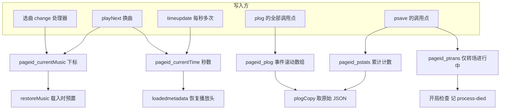
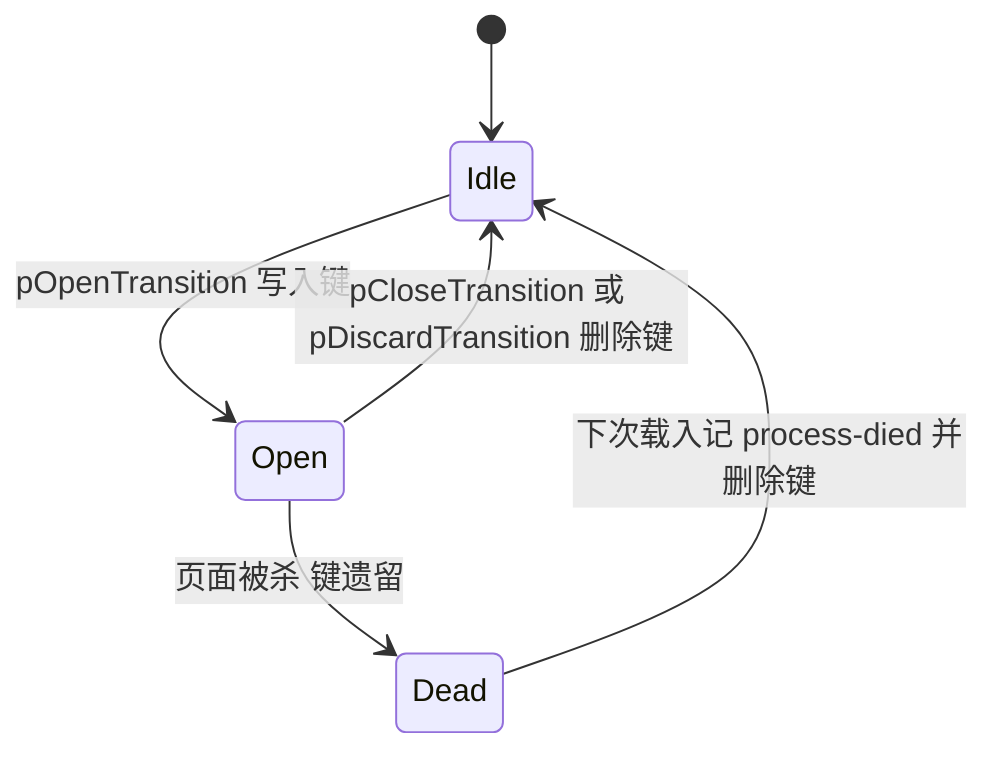

# 播放记忆与黑匣子日志（localStorage 键）

播放器跨会话留下的东西全在一个存储里：[js/musicplayer.js](../../js/musicplayer.js) 向 `localStorage` 写**五个带 `pageid` 前缀的键**，分成功能完全不同的两族 —— 两个「记忆」键决定你下次打开页面时停在哪一首的哪一秒，三个「黑匣子」键记录这次会话到底发生了什么。本页把这两族的语义、写入/读取时机、读取入口与失败边界集中记在一处。`pageid` 本身是怎么来的、为什么必须全站唯一，见 [讲经页内容模型（pageid / musicList）](./audio-page-model.md)。

## 键总表

| 键 | 内容形态 | 写入点 | 读取 / 清理点 |
|---|---|---|---|
| `<pageid>_currentMusic` | 当前曲目在 `musicList` 中的**下标**（选曲时是字符串，换曲时是数字） | [js/musicplayer.js](../../js/musicplayer.js) L51（选曲）、L135（`playNext` 换曲） | L102（`restoreMusic`，载入时预置下拉框与 `src`）；L33 在用户选曲前先删除 |
| `<pageid>_currentTime` | 播放头秒数（浮点） | L71（`timeupdate`，每秒数次）、L136（换曲后写 0） | L91（`loadedmetadata`，恢复播放头）；L34 在用户选曲前先删除 |
| `<pageid>_plog` | 事件数组，JSON；每条含 `ts/e/d/vis/idx/ct/rs/paused` | L356（`plog()` 的每次调用） | L337（载入时读回）、L700（`plogReset` 删除） |
| `<pageid>_pstats` | 单个对象，JSON；转场与异常计数 | L362（`psave()`） | L339（载入时合并进内存）、L700（`plogReset` 删除） |
| `<pageid>_ptrans` | 进行中的转场 `{start, from, to}`；**只在转场期间存在** | L363（`psave()`，仅当 `ptrans` 非空） | L665（载入时检查残留）、L671 与 L707（删除） |

键名拼接集中在 L312–L316：

```js
var PKEY_LOG   = pageid + '_plog';
var PKEY_STATS = pageid + '_pstats';
var PKEY_TRANS = pageid + '_ptrans';
```

（[js/musicplayer.js](../../js/musicplayer.js) L312–L316；两个记忆键在 L33–L34、L51、L71、L135–L136 用模板字符串就地拼出。）

## 前缀就是命名空间：跨页不共享，也不保护冲突

`pageid` 只做 `localStorage` 键前缀。因为前缀来自页面内的 `const pageid`，**两块不同 `pageid` 的页面之间没有任何共享的持久化状态**：同一首音频既出现在讲经页（`yfj`）也出现在读诵页（`jdds`）时，两边的续播位置互不相干。这条规则唯一的例外是主题键 `yjz-theme` —— 它由布局内联脚本读写、不带前缀，因此在全站共享（[_layouts/music.html](../../_layouts/music.html) L15、L133）。

前缀反过来也是一条**约束**：两页共用 `pageid` 就共用这五个键。最隐蔽的后果在 `_ptrans` 上 —— 载入时的残留检查（L663–L674）会把该前缀下任何残留的转场都记成**本页**的一次 `process-died` 失败，于是失败统计会凭空多出一笔。`pageid` 唯一性是**靠人手保证**的，没有校验、没有 manifest（清单见 [讲经页内容模型](./audio-page-model.md)）。

## 谁写谁读



上图是五个键的写入方与读取方：两个记忆键由事件处理器直接读写，黑匣子三键则统一经由 `plog()` / `psave()` 两个出口落盘，其中 `psave()` 是唯一同时写统计与转场键的函数，`_ptrans` 只在转场进行中存在。

## 记忆一族：`_currentMusic` 与 `_currentTime`

两条容易被忽略的语义：

1. **存的是下标与秒数，不是曲名、不是 URL。** 序列化下来的只有「第几首」和「多少秒」。重排或删减 `musicList` 会让老用户的记忆静默指向别的曲目；下标越界时 `restoreMusic()` 会抛 `TypeError` 并让脚本后半段（含诊断层与未完成转场检查）整体不执行——这条失效链的完整分析在 [讲经页内容模型](./audio-page-model.md)。
2. **写入频率不对称。** 换曲只写一次（L135–L136），而 `timeupdate` 每秒触发数次、每次都写一次 `_currentTime`（L71）。这条 `setItem` 是热路径上唯一的存储写入。

恢复分两步，且**恢复不等于播放**：

- `restoreMusic()`（L100–L113，顶层调用在 L177）只做「预置」：把下拉框选中项、`musicPlayer.src` 与下载链接按记忆的下标设好；
- 真正的秒数恢复在 `loadedmetadata` 里（L89–L95）：

```js
musicPlayer.addEventListener('loadedmetadata', () => {
  const savedTime = localStorage.getItem(`${pageid}_currentTime`);
  if (savedTime) {
    musicPlayer.currentTime = parseFloat(savedTime);
  }
});
```

（[js/musicplayer.js](../../js/musicplayer.js) L89–L95。）是否出声完全交给 `pPlayIntent` 与自动播放策略，见 [播放器状态机](./player-state-machine.md)。

**清理时机只有一处，而且不是「清空」**：用户在下拉框里主动改选时，L33–L34 先删掉这两个键，随后立刻写入新值。没有其他代码路径删除它们。

### 这两个键的读写没有 try/catch（与黑匣子不同）

黑匣子的每一次 `localStorage` 访问都包在 `try/catch` 里，两个记忆键都是**裸调用**（L33–L34、L51、L71、L91、L102、L135–L136）。这在存储被禁用或写入抛错的场景下有一个具体后果：`timeupdate` 处理器里 L71 位于 `updateRemainTime()`（L73）与预取判断（L80–L86）**之前**，一旦这次 `setItem` 抛错，同一次事件里的「剩余」刷新与预取都不会执行。改动这个处理器时值得先看 L66–L87 的顺序。

## 黑匣子一族：`_plog`、`_pstats`、`_ptrans`

黑匣子的设计目标是让**真机上的偶发问题留下可回传的证据**，而不是给本机调试用（证据标准见 [验证与复现手册](../testing/verification-playbook.md)）。

### `_plog`：每条记录都自带现场

`plog(ev, detail)` 在追加时把当时的播放器状态一起冻结下来（L343–L358）：

```js
plogBuf.push({
  ts: Date.now(),
  e: ev,
  d: String(detail || ''),
  vis: document.visibilityState,
  idx: musicSelect.value,
  ct: Math.round(musicPlayer.currentTime * 10) / 10,
  rs: musicPlayer.readyState,
  paused: musicPlayer.paused
});
if (plogBuf.length > 600) plogBuf = plogBuf.slice(-500);
```

（[js/musicplayer.js](../../js/musicplayer.js) L343–L358。）

字段算得上排障关键证据的原因很直接：**这些值事后无法重建**。

- `vis`（`visibilityState`）区分「事件发生在可见态还是后台/息屏态」。息屏连续播放那次定位就是靠它定性的：日志显示暂停发生在**可见**态（`pause-unattributed` 那条的 `[vis]`），而页面本身仍在运行（日志就是 JS 写的），因此根因是系统暂停音频而不是 JS 被冻结（[docs/播放器息屏播放-已验证版本.md](../../docs/播放器息屏播放-已验证版本.md) L14–L21）。
- `rs`（`readyState`）区分「没在播」与「在播但没拿到数据」。典型故障是 `paused=false` + `rs=0` + `duration` 为 `NaN`（L477–L486、L512–L516），光看 `paused` 会得出相反的结论。
- `ct` 用来判断「播放头有没有推进」——换曲后卡住的判据正是 `ct <= 0.5`。
- `idx` 是**写下这条日志那一刻下拉框的值**，不一定是事件描述的那一首；转场的 `from->to` 只出现在 `d` 里（例如 `trans-ok` 的 `1->2 3200ms`，L383）。读日志时要两者对照。
- `ts` 在面板里格式化为 `HH:MM:SS.mmm`（L688–L691），便于和用户截图的时间对齐。

容量策略是「到 600 条触发裁剪，留下最近 500 条」（L355），所以它是一份长度有界的滚动日志；载入时先读回旧内容（L337），因此 `_plog` **跨会话**滚动覆盖，而不是每次打开清空。开局还会写一条 `init`，内容含 `location.search` 与 UA 前 70 字符（L676）——回传的日志因此自带「哪台设备、带了什么查询参数（例如 `?debug` 本身）」。

日志只有一个出口函数，但**调用点分布在两个文件**：[js/keepalive.js](../../js/keepalive.js) 也往同一个 `_plog` 写 `wakelock-on` / `wakelock-off` / `wakelock-fail` / `wakelock-reacquire`（L42–L92）。这个文件依赖 `musicplayer.js` 定义的 `plog` / `pPlayIntent` / `musicPlayer`，布局把它排在 `musicplayer.js` 之后（[_layouts/music.html](../../_layouts/music.html) L119–L125）；顺序颠倒时 `typeof plog === 'function'` 守卫会让它**安静地什么都不做**（[js/keepalive.js](../../js/keepalive.js) L17–L28），长亮锁相关的日志随之一并消失 —— 排障时看到「日志里没有 wakelock 事件」未必等于没申请锁。

### `_pstats`：十来个计数器与一张失败原因表

内存初值在 L319：

```js
var pstats = { trans: 0, ok: 0, fail: 0, earlyTimer: 0, oddPause: 0, zeroDur: 0, reasons: {} };
```

（[js/musicplayer.js](../../js/musicplayer.js) L319。）

| 字段 | 含义 | 累加处 |
|---|---|---|
| `trans` | 开启过的转场数（用户主动换曲/停止会撤销，见 `pDiscardTransition`） | L372、L397 |
| `ok` / `fail` | 转场成功 / 失败次数 | L382、L385 |
| `reasons[r]` | 失败原因计数：`stuck-paused[:错误名]`、`stuck-loading`、`media-error-<code>`、`superseded`、`process-died` | 累加在 L386–L387；原因由调用方给出，见 L369、L533、L542、L618、L670 |
| `earlyTimer` | 定时器提前 60 秒以上触发（定时异常） | L232–L235 |
| `oddPause` | **定时关闭仍在生效期间**出现的无法归因暂停 | L610 |
| `zeroDur` | 「时长 0」看门狗实际重载自救的次数 | L520–L521 |

载入时是与旧值合并而不是覆盖：`pstats = Object.assign(pstats, pSaved)`（L339–L341），所以这些计数是**跨会话累计**的，只有 `plogReset()` 才会归零（L700–L710）。注意这是浅合并：`reasons` 整个被存下来的那个对象替换（而它本身也是累计结果），因此原因表同样跨会话累加。读统计时必须接受这一点：一个 `fail` 不一定是本次打开页面发生的。

### `_ptrans`：唯一能证明「上次是被杀掉的」的东西

`_ptrans` 不是计数器，而是**当前是否有一个转场没关掉**。它随 `psave()` 同步：转场打开时有值，关闭/撤销时被删除（L360–L366）。因此进程被系统杀掉（或不正常卸载）时，键会残留；下次载入的检查把它翻译成一次失败：

```js
var pLeft = localStorage.getItem(PKEY_TRANS);
if (pLeft) {
  var pLt = JSON.parse(pLeft);
  pstats.fail++;
  pstats.reasons['process-died'] = (pstats.reasons['process-died'] || 0) + 1;
  plog('trans-fail', (pLt && pLt.from !== undefined ? pLt.from + '->' + pLt.to + ' ' : '') + 'process-died(载入时发现未完成转场)');
  localStorage.removeItem(PKEY_TRANS);
  psave();
}
```

（[js/musicplayer.js](../../js/musicplayer.js) L663–L674。）



上图是 `_ptrans` 的生命周期：正常路径两个方向都会删键，只有进程被杀才留下残留。

注意它是**启发式**：正常关页面时若恰好在一次转场进行中（例如用户切走浏览器），同样会得到 `process-died`。它证明的是「上次没走完收尾」，不是「系统杀了进程」。

## 读取入口

诊断层全部挂在 `?debug` 上，且都在一个 IIFE 内部（L679–L735），所以**不加查询参数时它们统统不存在**：

| 入口 | 触发方式 | 行为 |
|---|---|---|
| 面板 | 页面 URL 加 `?debug` | 向 `body` 追加固定的 `#plog-panel`，每 2 秒重渲染：统计头 + 失败原因 + 进行中转场 + `plogBuf` 最后 12 条（L680–L686、L712–L733） |
| `plogCopy()` | 面板上的「复制日志」按钮，或控制台手调 | 把 `{stats, log}` 序列化成 JSON 写剪贴板；无剪贴板权限时退回 `prompt` 让用户手抄（L693–L699） |
| `plogReset()` | 面板上的「清零」按钮 | 清空内存里的 `plogBuf` / `pstats` / `ptrans`，删除 `_plog` / `_pstats` / `_ptrans` 三个键，然后立刻写一条 `stats-reset` 日志（因此 `_plog` 会以「只有这一条」的状态重新存在）（L700–L710） |
| `?fast=N` | 页面 URL 加 `?fast=20` 之类 | 复现台：`playing` 时每首只 seek 一次到「结尾前 N 秒」（默认 20），`loadstart` 复位标记，从而高频制造真实转场（L313、L584–L590） |

两个操作要点：

- **`rs` 只在 `plogCopy` 的原始 JSON 里。** 面板每行只渲染 `vis` 前三个字符、`idx`、`ct` 与 `paused`（L720–L722）。想用 `readyState` 判断「在播但没数据」这一类故障，必须复制原始 JSON，不能只看面板。
- **`plogReset` 清的不是播放记忆。** 它只删黑匣子三键，`_currentMusic` / `_currentTime` 原封不动（L700–L710）。这两件事在用户心里往往是同一件事，但它们分属两个族。

`?fast` 的解析是 `parseInt(PQS.get('fast')) || 20`（L313），因此**任何无法解析成非零数字的值都等于 20**（`?fast` 无值、`?fast=abc`、甚至 `?fast=0` 都一样）；只有不带 `fast` 参数时 `PFAST` 才是 `0`（关闭）。另外 seek 只在「剩余时间大于 N+2 秒」时发生（L585–L586），曲目本身比 N 还短就不会起跳。

## 失败与降级：写入静默，副作用不静默

黑匣子路径上的所有 `localStorage` 访问都包在 `try/catch` 里，且 catch 分支是空的：

| 位置 | 代码 | 被吞掉的情况 |
|---|---|---|
| 载入 `_plog` | L337 | JSON 损坏、存储不可读 |
| 载入 `_pstats` | L338–L341 | 同上 |
| 写 `_plog` | L356 | 配额满、隐私模式禁止写入 |
| 写 `_pstats` / `_ptrans` | L362–L364 | 同上 |
| 载入检查 `_ptrans` | L664–L674 | 同上 |
| `plogReset` 的删除 | L704–L708 | 同上 |

设计意图是**诊断层绝不影响播放**：存储写不进去时，`plog()` 静默失败，播放继续。代价有两个：

1. **日志可能静默停止落盘。** `plogBuf.push`（L345）发生在 `setItem`（L356）之前，所以写入失败时内存里仍有记录 —— 当前会话的 `?debug` 面板照常显示，但刷新后这一段就没了。看到「日志比预期短」时，先怀疑存储写入失败，而不是怀疑事件没发生。
2. **两个记忆键不受这层保护**（见上文「这两个键的读写没有 try/catch」），因此「诊断层静默降级」不等于「整个持久化层静默降级」。

## 「清空播放记忆」的用户入口与它清不掉的东西

抽屉里有一个按钮：[`_layouts/default.html`](../../_layouts/default.html) L51 的 `onclick="reset()"`，文案是「清除播放记忆」。它清不掉任何 `_currentMusic` / `_currentTime`，原因有两条，任一条都足以否掉这个文案：

1. **它操作的是另一套键。** `reset()` 遍历 `audioArray`、按 `<audio>` 元素的 **id** 读写键（[js/yujizi.js](../../js/yujizi.js) L6–L14、L26–L35、L63–L80）。`musicplayer.js` 的键是 `<pageid>_currentMusic` / `<pageid>_currentTime`，两套键没有任何交集。
2. **它的遍历对象是空的。** `yujizi.js` 只被 `layout: default` 加载，而 `default` 页面里没有任何 `<audio>` 元素，`audioArray` 永远为空数组，循环体一次都不执行。

所以这个按钮的实际效果是一个 `alert("已复位")`。而**当前仓库里没有替代入口**：`musicplayer.js` 只在用户主动选曲时清掉这两个键且立即写回新值（L33–L51），`plogReset` 明确不碰它们（L700–L710）。也就是说，「清空续播位置」这件事今天只能靠用户自己清站点数据。这是遗留脚本与当前播放器之间的一处真实不一致，处理方向（删按钮 / 重写为清 `<pageid>_currentTime` 与 `_currentMusic`，以及「清当前页还是清全站」的语义定义）在 [遗留层：jQuery、yujizi.js 与失效的旧播放器假设](./legacy-multi-audio-player.md) 中有更完整的分析。

## 读日志的纪律

`_plog` / `_pstats` 是**给真机排障用的原始材料，不是结论**：

- 桌面环境模拟不出手机行为。文档里明确写了 CDP 的 `Page.setWebLifecycleState('frozen')` 与 headless 多标签的 `visibilityState` 都**不构成证据**（实测两个标签页都报 `visible`，`visibilitychange` 根本不派发），决定性证据来自用户截图的 `vis` 序列（[docs/播放器息屏播放-已验证版本.md](../../docs/播放器息屏播放-已验证版本.md) L45–L47、L50–L51）。
- 计数是跨会话累计的（L339–L341），所以 `fail` 与 `reasons` 不能直接归因到本次复现；要复现就用 `plogReset()` 先清零，再用 `?fast=N` 在真机上有节奏地制造转场。
- 日志里的字段会随代码演进增减（例如 `keepalive.js` 已经没有了曾经的静音导频相关事件）。**以源码为准**，读到旧截图里的字段名时先核对当前版本。

## 相关页面

- [讲经页内容模型（pageid / musicList）](./audio-page-model.md) —— `pageid` 作为键前缀的唯一性约束、下标越界导致 `restoreMusic()` 抛错并连累诊断层的失效链
- [播放器状态机：播放意图、转场与暂停归因](./player-state-machine.md) —— 这些键背后的状态语义（`pPlayIntent`、`pExpectedPause`、转场成败判定）
- [连续播放转场全流程](../workflows/continuous-playback-transition.md) —— `_ptrans` / `_pstats.reasons` 那些原因值各自是在哪一步产生的
- [失败恢复与自愈路径](../workflows/playback-recovery-and-selfhealing.md) —— `zero-dur-heal`、`watchdog-heal`、`error-heal` 等日志事件对应的救援通道
- [验证与复现手册](../testing/verification-playbook.md) —— `?debug` 与 `?fast=N` 的使用方式、证据标准、需保留的失败输出形态
- [遗留层：jQuery、yujizi.js 与失效的旧播放器假设](./legacy-multi-audio-player.md) —— `reset()` 为什么清不掉这些键，以及两套脚本不能同页的原因
