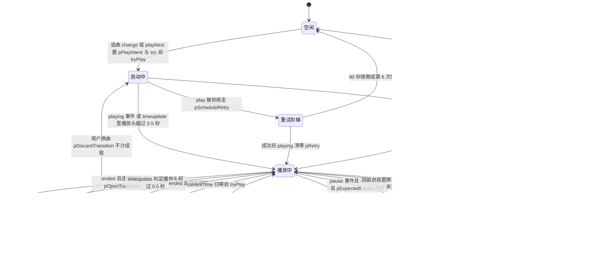

# 播放器状态机：播放意图、转场与暂停归因

[js/musicplayer.js](../../js/musicplayer.js) 里没有 `class Player`，没有状态枚举，也没有一张状态迁移表。整台播放器的「当前处于什么状态」是**十几个模块级变量的值联合出来的**，而所有这些迁移都由 `<audio>` 元素事件（`ended` / `pause` / `playing` / `timeupdate` / `error`）、页面生命周期事件（`visibilitychange`）和几个定时器（10 秒 interval、45 秒看门狗、10 秒元数据看门狗、重试阶梯）驱动。本页要讲的是这些变量各自的语义、它们之间的优先级，以及**改代码时最容易踩坏的几条隐式契约**——因为这台状态机一旦坏了，坏法通常是「完全不报错地少做一件事」：不该播的时候播了、该接上的时候不接。

一条贯穿全页的总规则，先放在最前面：

> **`musicPlayer.paused` 不是「是否应该在播放」的答案。** 它可以被系统（息屏、来电、其他 App 抢音频焦点）改动而不通知任何 JS 代码。回答「此刻应当播放吗」的唯一变量是 `pPlayIntent`；回答「声音在流吗」才轮到 `paused` / `readyState` / `currentTime`。

三种事实必须分开看，混起来就是这类 bug 的全部来源：

| 层面 | 变量 / 属性 | 谁在改它 |
|---|---|---|
| 用户意图 | `pPlayIntent`、`pExpectedPause`、`pUserPausedUntil` | 只有本仓库的 JS（选曲、`stopAudio`、MediaSession 处理器、`visibilitychange`） |
| 元素事实 | `musicPlayer.paused`、`readyState`、`currentTime`、`duration`、`ended`、`error` | 浏览器 / 操作系统，**JS 无法阻止，也无法即时得知** |
| 计时与派生 | `theTime`、`stopAudioTimeOut`、`isLoopMode`、`playModeSelect.value`、`ptrans`、`pZeroDur` | JS，但含义是「倒计时/开关」，不是「播放状态」 |

## 状态变量总览

| 变量 | 语义 | 声明与主要写入点 | 主要读取点 |
|---|---|---|---|
| `pPlayIntent` | **唯一权威的「用户意图：此刻应当在播放」** | 声明 L324；`true`：选曲 L40、`playNext` L123、`ended`+loop L162、回前台续播 L648、MediaSession play L561；`false`：清空选择 L53、`stopAudio` L237、MediaSession pause L565 | L422、L432、L508、L535、L620、L623、L654；**另有 [js/keepalive.js](../../js/keepalive.js) L34、L78、L113 决定长亮锁** |
| `ptrans` | 进行中的转场 `{start, from, to}`；`null` = 没有转场 | 开 L368–L376；关 L378–L392；撤销 L395–L400 | L68（成功判定）、L363（持久化）、L530（看门狗）、L618（媒体错误）、L242（停止时撤销） |
| `pExpectedPause` | 预期内的 pause 原因，**一次性令牌** | 清空选择 L54、`stopAudio` L243、MediaSession pause L566 | L600–L603 的 `pause` 处理器（读出即清空） |
| `pUserPausedUntil` | **「用户主动暂停的到期时刻戳」**，不是布尔标记 | 声明 L18（`0` = 当前不存在）；L55、L567、L608 三处赋 `Date.now() + P_USER_PAUSE_GRACE` | L647（唯一的判据：`pUserPausedUntil <= Date.now()`） |
| `P_USER_PAUSE_GRACE` | 宽限窗口，8 秒 | L13 | L55、L567、L608、L609 |
| `pRetry` | `{timer, count, deadline}` 重试阶梯 | L326；推进 L421–L434；清零 L580–L582；撤销 L238–L239 | L424、L432 |
| `pPlayId` | `play()` 尝试序号，用于作废被换曲淘汰的旧拒绝 | L325；自增 L406 | L411 |
| `pFailedAt` | 最近一次 `play()` 失败时刻（回前台续播的 10 分钟窗口） | L327；写 L413；清 L583 | L655 |
| `pErrHeal` | 当前曲目的媒体错误自救次数（上限 2） | L329；清零 L41、L124；自增 L621 | L620 |
| `pHealDone` | 本次转场是否已做过看门狗自救 | L328；复位 L373；置位 L536 | L535 |
| `pZeroDur` | 「时长 0」看门狗 `{timer, idx, at}` | L335；`pArmZeroDur` L491–L499；`stopAudio` 复位 L240–L241 | L502–L520 |
| `theTime` | 定时关闭的**绝对停止时刻**（`Date` 对象），`null` = 未开启 | L180；设 L273；清 L245、L276 | L193、L509、L646，以及 `stopAudio` 的剩余时间记账 L229 |
| `isLoopMode` | 播放模式里「是否单曲循环」的**缓存位** | L147（初始 `false`）；只在 `change` 处理器里同步 L151 | 仅 L160（`ended`） |
| `playModeSelect.value` | 播放模式的**真值来源**（`continuous`/`loop`/`stop-after`） | 由 [_layouts/music.html](../../_layouts/music.html) L65–L69 渲染，用户改选时触发 `change` | L139、L166、L206、L510、L647 |

## 状态图



上图是这台隐式状态机的全部状态与迁移。`空闲` 是每次载入的初始态（`restoreMusic()` 只设 `src`、不置意图），机器不会回到 `[*]` —— 页面一直在跑，只有 localStorage 里的残留会被下一次载入读到。

### 迁移与守卫逐条对照

| 迁移 | 触发 | 守卫（必须全部成立） | 代码 |
|---|---|---|---|
| `[*]` → 空闲 | 脚本载入 | `restoreMusic()` 预置下拉框与 `src`，**不调用 `play()`、不置 `pPlayIntent`** | L100–L113、顶层调用 L177 |
| 空闲 → 启动中 | 选曲 `change` 或 `playNext` | `if (selectedIndex)` 真值判断分流（占位项的 `""` 为假，下标 `"0"` 为真） | L31–L62、L116–L144 |
| 启动中 → 播放中 | `playing` 事件 | 无 | L577–L583 |
| 启动中 → 播放中 | `timeupdate` | `!musicPlayer.paused && currentTime > 0.5` | L66–L70 |
| 启动中 → 重试阶梯 | `play()` 的 Promise 被拒绝 | `myId === pPlayId`（否则记 `play-rejected-stale` 直接返回） | L403–L419 |
| 重试阶梯 → 播放中 | 某次重试成功 | 回调里再查 `pPlayIntent && musicPlayer.paused` | L421–L434 |
| 重试阶梯 → 空闲 | 放弃 | `Date.now() > pRetry.deadline`（首次失败 +90 秒）或 `count >= 6` | L422–L427 |
| 启动中 → 零时长自救 | `pArmZeroDur` 的 10 秒定时器到期 | `pZeroDur.idx === parseInt(musicSelect.value)`、`duration` 无效、`currentTime <= 0.5`、`pPlayIntent`、定时未到、模式为 `continuous` | L491–L525 |
| 播放中 → 转场中 | `ended` 且非 loop 且非 `stop-after` | `playModeSelect.value !== 'stop-after'`，且 `isLoopMode` 为假 | L157–L173 |
| 转场中 → 播放中 | `timeupdate` 的**成功判定** | `ptrans && !musicPlayer.paused && currentTime > 0.5` | L68–L70 |
| 转场中 → 看门狗自救 | `pWatchdog()` 被调用时已超过 45 秒 | `ptrans && Date.now() - ptrans.start > 45000 && musicPlayer.paused` | L528–L544 |
| 转场中 → 看门狗自救（只记账不救） | 同上，但 `paused` 为假 | `musicPlayer.readyState < 3` → `pCloseTransition(false, 'stuck-loading')` | L541–L543 |
| 播放中 → 单曲重播 | `ended` 且 `isLoopMode` | 无 | L159–L163 |
| 播放中 → 用户暂停 | MediaSession `pause` 或清空选择 | 无 | L564–L569、L52–L61 |
| 用户暂停 → 播放中 | MediaSession `play` | 无（只置 `pPlayIntent = true` 后 `tryPlay`） | L560–L563 |
| 播放中 → 待归因暂停 | `pause` 事件 | `!musicPlayer.ended` 且 `pExpectedPause` 为空 | L598–L611 |
| 待归因暂停 → 播放中 | `visibilitychange` 回到 `visible` | `paused && theTime && theTime > now && pUserPausedUntil <= now && value !== 'stop-after'` | L646–L651 |
| 待归因暂停 → 播放中（第二条通道） | 同上 | `pPlayIntent && paused && pFailedAt && now - pFailedAt < 600000` | L653–L658 |
| 待归因暂停 → 停止 | 10 秒 interval 触发 `updateRemainTime` | `theTime - now <= 0` → `stopAudio('timer-sweep')` | L197–L201、L182 |
| 播放中 → 停止 | `stopAudio(reason)` | 无（终态） | L226–L248 |
| 转场中 → 停止 | `stopAudio` 内联撤销 | `if (ptrans) pDiscardTransition(...)` | L242 |

## 暂停归因：整台机器里唯一被允许「猜」的地方

`pause` 是唯一一个**无法从事件本身判断是谁按的**的迁移。系统在息屏、来电、其他 App 抢焦点时会暂停音频；用户在锁屏面板上按暂停也是同一个事件、同一个 `paused === true`。代码的处理方式是：不猜，但留下证据。

`pause` 处理器的分流顺序是硬编码的，而且**顺序本身就是契约**（L598–L611）：

1. `updateRemainTime()` 先跑 —— 一暂停就不再倒计时，「剩余」立刻复位（不等 10 秒 interval）；
2. 读出并**立刻清空** `pExpectedPause`；
3. `if (musicPlayer.ended)` → 记 `pause ended` 并 **return**：`ended` 之后浏览器补发的 pause 属于正常生命周期，不进入归因；
4. `if (why)` → 记 `pause <原因>` 并 return：这是预期内的暂停（`select-clear` / `stopped-by-<reason>` / `ms-pause`）；
5. 剩下的都算「无法归因」：写 `pause-unattributed`，并按 `pUserPausedUntil = Date.now() + 8000` 布下 8 秒宽限 —— 即**默认假设这可能是一次用户主动暂停**；
6. 只有定时关闭生效期间（`theTime` 非空）才 `pstats.oddPause++`。

这段设计有四个必须一起读的后果：

- **宽限是保守假设，不是用户标记。** 系统暂停也会走到第 5 步并布下宽限，所以「息屏被系统暂停后 8 秒内回到前台」不会自动接上（[docs/播放器息屏播放-已验证版本.md](../../docs/播放器息屏播放-已验证版本.md) 里的 17:52:37 → 17:55:22 间隔远大于 8 秒，正是靠这一点收到了续播）。
- **「绝不复活」只成立 8 秒。** 用户主动暂停留下的唯一证据是 `pUserPausedUntil` 这个**到期时刻戳**（L567），而判据是「已过期」（L647）。超过 8 秒之后，一次锁屏面板上的用户暂停与一次系统暂停在状态上完全一致，于是只要定时还在生效，回前台就会被 `visible-resume` 接上。代码注释写的「真正的用户主动暂停由 `pUserPaused 标记`，绝不复活」，严格来讲只在 `P_USER_PAUSE_GRACE` 之内成立 —— 改宽限常量或改判据前必须知道这一点。
- **`pUserPausedUntil` 只被赋值，从不被显式清零。** 它没有「用户按了播放就撤销」的路径（`tryPlay('ms-play')` 只置 `pPlayIntent`，L560–L563），所以一次早先的用户暂停可以在随后 8 秒内挡住一次合法的系统暂停续播。它的影响窗口永远是「距最后一次赋值多少毫秒」，而不是「距现在多久」。
- **`pExpectedPause` 是一次性令牌，且没有过期时间。** 它只被 `pause` 处理器读出清空。如果设置令牌的那次 `pause()` 是空操作（例如元素本来就已经暂停，清空选择时就会出现这种情况），令牌会一直挂着，被**下一次无关的暂停**消费掉：那一次真正的异常暂停会被记成 `select-clear` 之类的预期原因，并且不会布下宽限。改这几处顺序时这是最容易漏掉的一条。

## 转场：开、成、败、撤四种结局

`ptrans` 只描述一件事：**「我刚刚换了曲目，现在正等着确认它真的播起来了」**。它不是转场历史（那是 `pstats`，见 [播放记忆与黑匣子日志](./player-persistence-and-diagnostics.md)）。

```js
function pOpenTransition(from, to) {
  if (ptrans) pCloseTransition(false, 'superseded');
  ptrans = { start: Date.now(), from: from, to: to };
  pstats.trans++;  plastErr = '';  pHealDone = false;
  plog('trans-open', from + '->' + to);  psave();
}
```

（[js/musicplayer.js](../../js/musicplayer.js) L368–L376。注意第一行：**开新转场会把旧转场按失败关掉**，原因是 `superseded`。）

四个结局：

| 结局 | 判据 | 记账 | 位置 |
|---|---|---|---|
| 成功 | `timeupdate` 里 `!musicPlayer.paused && currentTime > 0.5` | `pstats.ok++` | L68–L70、L378–L392 |
| 失败 · 卡在暂停 | 45 秒后 `musicPlayer.paused` 为真 | `stuck-paused[:plastErr]` | L530–L534 |
| 失败 · 卡在加载 | 45 秒后 `paused` 为假但 `readyState < 3` | `stuck-loading`，**不自救** | L541–L543 |
| 失败 · 媒体错误 | `error` 事件且 `currentSrc` 非空 | `media-error-<code>` | L613–L618 |
| 失败 · 被顶替 | 新转场覆盖旧转场 | `superseded` | L369 |
| 撤销（不计成败） | 用户主动换曲、或 `stopAudio` | `pstats.trans--`，**不写 ok/fail** | L395–L400、L37、L242 |

三条与状态机强相关的契约：

1. **成功判据不是 `playing` 事件，也不是 `paused === false`。** `play()` 的 Promise 在「元素接受了播放请求」时就 resolve，此时可能一个字节都还没到（`readyState 0`、`duration` 为 `NaN`）。唯一被信任的证据是**播放头真的往前走了**（`currentTime > 0.5`）。这也是为什么 `playing` 事件只做另一件事：清零重试阶梯（L577–L583）。
2. **成功判据之所以成立，依赖 `playNext` 把续播位置清零。** `loadedmetadata` 会从 localStorage 恢复播放头（L89–L95），如果换曲时残留了上一首的秒数，一次并没有真正出声的加载会被 `currentTime > 0.5` 误判为成功。换曲路径正是靠 L135–L136 把 `_currentTime` 写成 `0` 来避免这一点（`playNext` 的整个函数体是同步执行的，因此写入必早于浏览器任何后续事件）。**改 `playNext` 里这两行的顺序、或把 `_currentTime` 的写入挪到异步回调里，都会破坏这条判据。**
3. **`pWatchdog()` 没有自己的定时器。** 它被 `updateRemainTime()` 的最后一行调用（L223），而 `updateRemainTime()` 的调用方是 `timeupdate`、`pause` 处理器、10 秒 interval 和播放模式 `change`。也就是说：播放正常时看门狗每 250ms 左右被叫一次；播放完全卡死时（`timeupdate` 不再派发）只剩 10 秒 interval 这条命脉。**把 `pWatchdog()` 从 `updateRemainTime()` 里摘出来，或者删掉那个 10 秒 interval，45 秒看门狗在真实故障里就会失去触发机会。**

## 自愈通道与它们各自的守卫

| 通道 | 触发 | 守卫（不成立就不救） | 次数上限 | 位置 |
|---|---|---|---|---|
| 拒绝重试阶梯 | `play()` Promise 被拒绝 | `pPlayIntent`；非 stale（`myId === pPlayId`）；`Date.now() <= pRetry.deadline`；`count < 6`；回调时仍 `pPlayIntent && paused` | 6 次 / 90 秒 | L403–L434 |
| 媒体错误自救 | `error` 事件 | `currentSrc` 非空；`pPlayIntent`；`pErrHeal < 2`；3 秒后的回调里再查一次 `pPlayIntent` | 每曲 2 次 | L613–L629 |
| 45 秒看门狗自救 | 转场超时 | `paused` 为真；`pPlayIntent`；`!pHealDone` | 每次转场 1 次 | L528–L544 |
| 10 秒「时长 0」看门狗 | `pArmZeroDur` 定时器 | 见上表「启动中 → 零时长自救」六个条件 | 每次换曲 1 次 | L491–L525 |
| 回前台续播 · 系统暂停 | `visibilitychange` | `paused && theTime 未到 && pUserPausedUntil <= now && 模式非 stop-after` | 无计数 | L646–L651 |
| 回前台续播 · 失败窗口 | `visibilitychange` | `pPlayIntent && paused && pFailedAt` 在 10 分钟内 | 无计数 | L653–L658 |
| 载入时未完成转场 | 脚本载入 | 存在 `<pageid>_ptrans` | 每次载入 1 次（只记账） | L663–L674 |

两条不写在表里但必须记住的：

- **重试阶梯的计数是会话级的，不是曲目级的。** `pRetry.count` 与 `pRetry.deadline` 只在 `playing` 时清零（L577–L583），`pErrHeal` 才在选曲/换曲时清零（L41、L124）。所以连续几次换曲都失败时，阶梯会从更靠后的档位起步（`[600, 2000, 5000, 10000, 20000, 30000]` 的索引是 `count - 1`），并且更早撞上 90 秒限期。
- **「系统暂停续播」这条通道要求定时关闭处于生效状态。** 第一个分支的守卫里有 `theTime && theTime.getTime() > Date.now()`；没开定时关闭、或定时已经到点（`stopAudio` 会把 `theTime` 置 `null`，L245），这条通道永远不成立；而第二个分支需要 `pFailedAt`，它在 `play()` resolve 的情况下是 `0`。因此「没开定时 + 系统暂停」在今天的代码里**没有恢复路径**——这正是 [docs/播放器息屏播放-已验证版本.md](../../docs/播放器息屏播放-已验证版本.md) 那份真机验证的配置是「连续播放 + 定时 1 小时」的原因。

`stopAudio(reason)` 是所有自愈通道的总闸门，它的顺序本身就是「先把意图和定时器全部拆掉，再暂停」：

```js
pPlayIntent = false;
window.clearTimeout(pRetry.timer);   pRetry.deadline = 0;
window.clearTimeout(pZeroDur.timer); pZeroDur.idx = -1;
if (ptrans) pDiscardTransition('stopped-by-' + reason);
pExpectedPause = reason;
musicPlayer.pause();
theTime = null
document.getElementById("myselect").value = -1;
updateRemainTime();
```

（[js/musicplayer.js](../../js/musicplayer.js) L236–L247。）这条链的三点用意：① 所有自愈通道的第一步守卫都是 `pPlayIntent`，置假即等于一次断电；② 显式 clear 定时器是为了让「已经排上队但还没跑」的回调彻底消失（那些回调内部还会再查一次意图，属于双保险）；③ `pExpectedPause = reason` 让紧随其后的 `pause` 事件被记成预期暂停，`updateRemainTime()` 则把「剩余」复位成 `—`，避免停播后界面挂着旧数字。

## 播放模式如何选分支

`playModeSelect.value` 有三个取值，`isLoopMode` 只是它的一个缓存位，**并且两者并不总是同步**：

| 模式 | `ended` 时的分支 | 其它受影响处 |
|---|---|---|
| `continuous`（布局默认选中） | `isLoopMode` 为假、`value !== 'stop-after'` → `pOpenTransition(from, to)` 后 `playNext()` | 允许「时长 0」看门狗（L510）；允许系统暂停续播 |
| `loop` | `isLoopMode` 为真 → `currentTime = 0` + `pPlayIntent = true` + `tryPlay('loop')` | 「时长 0」看门狗跳过；系统暂停续播仍允许（守卫只排除 `stop-after`） |
| `stop-after` | `isLoopMode` 为假但不转场 → 直接 `playNext()` | `updateRemainTime` 多出一个「本曲剩余」源（L206–L212）；禁止系统暂停续播；「时长 0」看门狗跳过 |

三个陷阱：

1. **`isLoopMode` 只在 `change` 处理器里同步（L151），代码里的初值是 `false`。** 也就是说 `[_layouts/music.html](../../_layouts/music.html)` L65–L69 里那个 `selected` 属性**必须留在 `continuous`**：若把默认选中项改成 `loop`，载入后既没有 `change` 事件、`isLoopMode` 又是 `false`，于是 `ended` 会走连续播放分支 —— 用户看到的是「单曲循环模式下它自己换曲了」。
2. **`stop-after` 的那条分支是「先起播、立刻停」。** `playNext()` 里 `pPlayIntent = true`（L123）与 `tryPlay('next')`（L126）先执行，随后才 `if (playModeSelect.value === 'stop-after') stopAudio('stop-after')`（L139–L141）。所以这个模式的终态是：**`src` 已经指向下一首、播放头在开头、`pPlayIntent` 为假**。下一次用户按播放，接到的是下一首而不是刚播完的那一首 —— 这是有意的，但任何人重构 `playNext` 的顺序都会把它改成「回到当前曲目重播」。
3. **模式切换要立刻重算「剩余」**（L150–L155），因为 `#remainTime` 的语义随模式改变；历史上这里漏掉过一次，导致 `stop-after` 模式下永远显示 `—`。

## 四处已记录的反向判断（改回去就会静默失效）

这四条都是「测试逐条代入才发现」的类型：代码看起来合理，真实故障恰好落在被跳过的分支里。

1. **`paused` 不能当「已经正常播放」的判据。** 2026-09-29 生产实测的卡死形态是 `paused = false`（`play()` 早已 resolve）+ `readyState 0` + `duration NaN`。早先「时长 0」守卫写成 `if (!musicPlayer.paused) return;`，真实故障正好落进「已在播放」的分支被整个跳过，一次自救都不触发（注释在 L512–L516）。**正确的判据是「有没有拿到元数据」与「播放头有没有动过」**，这两条在 L504–L506 已经查完。
2. **同一个 `paused` 反转也解释了 45 秒看门狗为什么治不了这个故障。** `pWatchdog()` 只在 `musicPlayer.paused` 为真时才自救（L531–L540）；`paused` 为假时它只走 `else if (readyState < 3)` 记一笔 `stuck-loading` 并把 `ptrans` 关成 `null`——**之后 `ptrans` 条件不再成立，再没有任何代码会回头看它**（L479–L484）。所以 L476–L499 那个独立的「时长 0」看门狗必须存在，且必须不看 `ptrans`、不看 `paused`。
3. **`pUserPausedUntil` 必须按时间戳比较，不能按真假判断。** `!pUserPausedUntil` 一旦被设过就恒为假，守卫永远不成立，系统暂停后再也接不上（L14–L17）。正确写法是 `pUserPausedUntil <= Date.now()`（L647）。
4. **`pZeroDur.idx` 必须归一成数字。** 选曲 `change` 处理器传进来的是 `e.target.value`（字符串 `"1"`），而 `pCheckZeroDur` 用的是 `pZeroDur.idx !== parseInt(musicSelect.value)`（数字）。类型不一致时 `!==` 恒为真，第一次守卫就返回，**自救一次都不会触发，而且日志是空的**（L493–L496、L502）。

还有两条历史守卫同样属于「条件写得比现实更窄」：`visibilitychange` 里早先要求 `&& pFailedAt`，把「系统暂停、`play()` 早已 resolve、`pFailedAt 为 0`」这种最常见的形态整个挡在门外（L639–L645）；以及 45 秒看门狗只在 `ptrans` 存在时才工作。

## 声明顺序与类型：几条纯语法层面的隐式契约

- **`timeupdate` 处理器读的常量必须声明在文件最前面。** `P_PREFETCH_MAX` / `P_PREFETCH_LEAD` / `pUserPausedUntil` 都在 L9–L18，注释说明了原因：`const`/`let` 不提升，把它们挪到文件末尾会让首次 `timeupdate` 抛 `ReferenceError`。后果不在于「预取不工作」，而在于**同一个处理器里排在抛错点后面的东西一起消失**：`updateRemainTime()`（「剩余」走字）与预取判断都在 `setItem` 之后（L71 → L73 → L80–L86），而这个处理器自己没有任何 try/catch。顺带一提，`localStorage.setItem`（L71）是裸调用，也会以同样方式中断后面两件事。
- **`pZeroDur` 对象必须在任何可能调用 `stopAudio()` 的路径之前就初始化好。** `var pZeroDur = { timer: null, idx: -1, at: 0 }` 放在 L335，也就是 `stopAudio`（L227）之后、但所有触发路径之前；注释（L332–L335）记录了原因：`var` 会提升但值是 `undefined`，如果 `stopAudio()` 早于赋值被调用，`pZeroDur.timer` 会抛 `TypeError`，**打断 `stopAudio` 本身**（于是暂停、`theTime` 复位、`#myselect` 复位全部不执行）。同理，任何新增到 `stopAudio` 里清理的状态对象都要满足「声明位置早于任意外部调用点」。
- **`pPlayIntent` 是跨文件契约。** [js/keepalive.js](../../js/keepalive.js) 的 `pWakeLockSync()` 用 `pPlayIntent && !musicPlayer.paused` 决定要不要持有 `navigator.wakeLock('screen')`（L32–L34、L78、L113）。把它改名、改成对象、或改成只在 `playing` 时才为真，长亮锁会**静默**失效（那个文件的守卫都是 `typeof … !== 'undefined'`，不报错），连带 `?debug` 面板里的 `wakelock-*` 事件一起消失。

## 改这一层之前的检查清单

1. 新增任何「要不要动手」的自愈行为，先问第一步守卫是什么。守卫几乎总是 `pPlayIntent`，而不是 `paused`。
2. 只有两条路径被允许回答「谁暂停了」：`pExpectedPause`（一次性令牌）与 `pUserPausedUntil`（8 秒到期戳）。新增第三条之前先想清楚它与 8 秒宽限的关系。
3. 新增开转场的地方，必须同时想好谁来关它（`timeupdate` 成功、看门狗失败、媒体错误失败、用户操作撤销），否则 `<pageid>_ptrans` 会残留，下次载入被记成一次 `process-died`。
4. 新增停止路径要照抄 `stopAudio` 的收尾顺序：先清意图与所有定时器，再设 `pExpectedPause`，最后 `pause()`。
5. 别把「剩余时间」和「看门狗」的调用关系解开 —— `pWatchdog()` 是搭在 `updateRemainTime()` 上的，而 10 秒 interval 是它唯一的兜底命脉。
6. 动了状态判断之后，验证只能靠真机日志（`?debug` 面板 / `plogCopy`）与 `?fast=N` 高频转场，本仓库没有测试框架。方法见 [验证与复现手册](../testing/verification-playbook.md)。

## 相关页面

- [播放记忆与黑匣子日志（localStorage 键）](./player-persistence-and-diagnostics.md) —— `_plog` / `_pstats` / `_ptrans` 三个键怎么承载本页这些状态的现场证据
- [连续播放转场全流程](../workflows/continuous-playback-transition.md) —— 一次 `ended` 到下一首出声的端到端流程、预取与「时长 0」看门狗的因果链
- [失败恢复与自愈路径](../workflows/playback-recovery-and-selfhealing.md) —— 本页「自愈通道」一节的完整救援分派决策图
- [定时关闭与「剩余」时间显示](../workflows/timed-stop-and-remaining-time.md) —— `theTime`、`stopAudio(reason)` 与两种停止源如何合成一个读数
- [布局与前端 DOM/脚本契约](../architecture/layout-and-frontend-contract.md) —— `play-mode` / `myselect` / `music-player` 这些 id 与脚本顺序的硬约束
