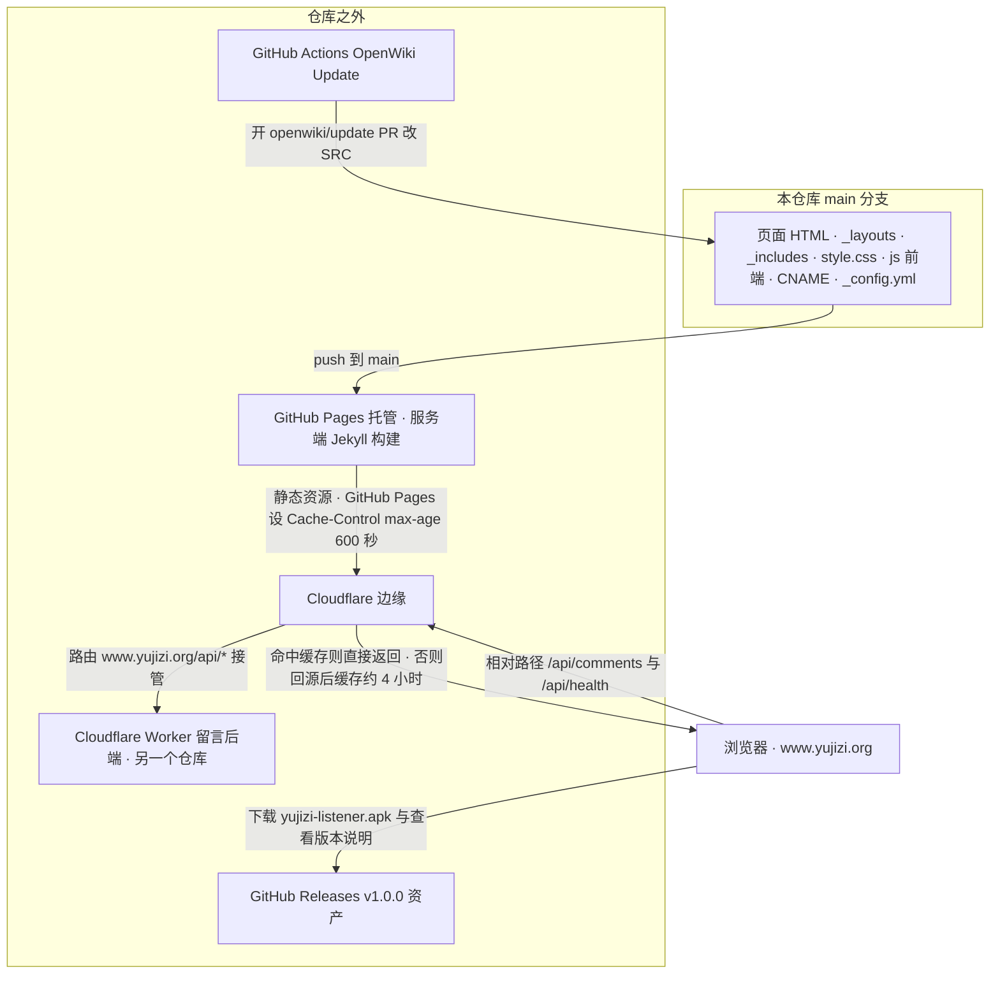
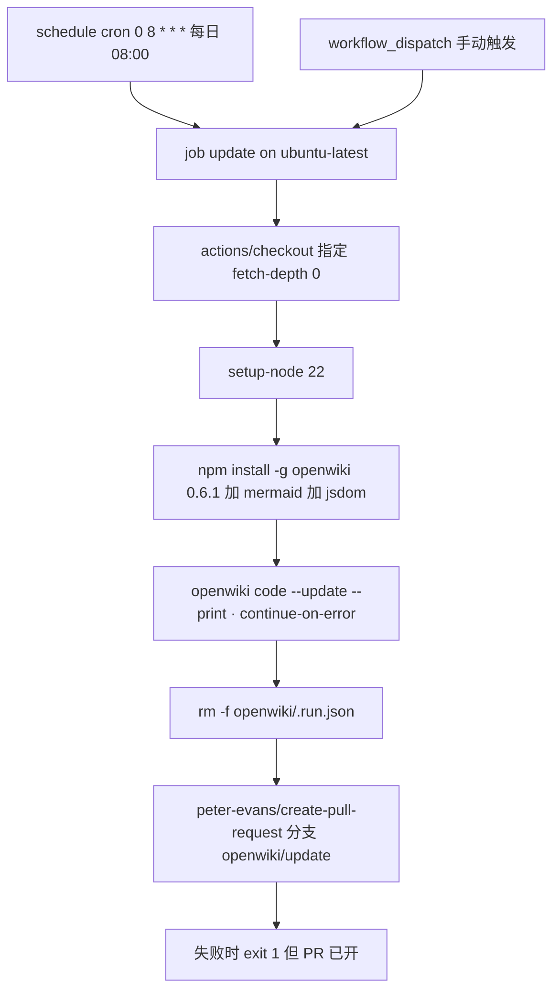

# 外部依赖与服务耦合

这个仓库是**一台静态站的全部源代码**，但它对外露出的每一项能力（托管、边缘、留言、APK 下载、自动文档更新）都由**仓库外面的东西**提供。本页把这些外部面集中列出来，目的只有一个：改动之前先知道哪些部分改完就生效、哪些部分改完还需要在仓库去协调另一个系统。

一个必须先立住的边界：**留言后端仓库（`~/work/yujizi-comments`）、APK 的源码、Cloudflare 的账号级配置（路由、缓存规则、CORS 白名单）都不在本仓库内**。仓库里能看到的只有三样东西——**域名与开关的声明**（[CNAME](../../CNAME)、[_config.yml](../../_config.yml)）、**前端发出的请求契约**（[js/comments.js](../../js/comments.js)）、以及**注释里写下的运维事实**（部署后要清缓存、后端在另一个目录）。本页只记录这些证据能支撑的契约与引用点；后端内部实现、Cloudflare 控制台里的配置细节，本仓库无从验证，因此不做任何描述。

## 两条路径的全景

站点对外只有两条请求路径，都在 Cloudflare 边缘分叉：静态资源走 Pages 源站 + 边缘缓存，`/api/*` 被 Worker 接管。

这张图说明外部的两条路径如何在 Cloudflare 边缘分叉：静态资源由 Pages 源站提供并被边缘缓存，`/api/*` 则完全不经过 Pages 而落到 Worker 上。

## 耦合点总览

| 外部面 | 仓库内的耦合点 | 可以安全改动的部分 | 需要外部协调的部分 |
|---|---|---|---|
| GitHub Pages 托管 + 自定义域名 | [CNAME](../../CNAME)（一行域名）；无 `url`/`baseurl`、无 `.nojekyll` | 改仓库里的源文件；新增页面 | 绑域名、TLS、Pages 构建开关（都在 GitHub 设置侧）；换域名要同步 CNAME 与所有注释里的 `www.yujizi.org` |
| Cloudflare 边缘：静态缓存 | [_includes/comments.html](../../_includes/comments.html) L56–L63、[_layouts/music.html](../../_layouts/music.html) L113–L119 的注释与 `?v=` 版本号 | 提高 `?v=`（纯前端手段，立即生效） | 4 小时缓存的实际 TTL、清缓存本身（仓库外的部署脚本） |
| Cloudflare 边缘：`/api/*` 路由 | [_config.yml](../../_config.yml) L4–L7、[js/comments.js](../../js/comments.js) L13–L17 的注释 | 无（路由不在仓库里） | 路由规则 `www.yujizi.org/api/*`、Worker 绑定 |
| 留言后端 Worker | [_config.yml](../../_config.yml) L8 的 `comments_api`；[js/comments.js](../../js/comments.js) 的 GET/POST 契约 | 留空保持同源；改前端文案与失败处理 | 后端接口/字段/上限的变更、跨域白名单、部署与清缓存脚本 |
| GitHub Releases（APK） | [index.html](../../index.html) L12（下载链接）、L13（版本说明链接）；[.gitignore](../../.gitignore) L10–L12 | 链接文本、`apk-note` 说明文案、指向的版本号 | 打 tag、上传 7MB 资产、写 release notes（都在 GitHub 上手工做） |
| GitHub Actions OpenWiki 更新 | [.github/workflows/openwiki-update.yml](../../.github/workflows/openwiki-update.yml) | 触发时间、OpenWiki 版本、模型 ID、`add-paths` 列表 | 仓库 secrets/vars（API key、base URL）、PR 评审与合并 |

## GitHub Pages 托管与 CNAME

[CNAME](../../CNAME) 全文只有一行：`www.yujizi.org`。它是 GitHub Pages 自定义域名的标准落点，也是这个仓库里**唯一**声明域名的可执行配置——其余出现 `www.yujizi.org` 的地方全是注释（[_config.yml](../../_config.yml) L5、[_includes/comments.html](../../_includes/comments.html) L5）。

这条耦合的性质是：**域名归 GitHub Pages 管，仓库只负责声明；但站点的所有链接都写成了根绝对路径**。`_config.yml` 里没有 `url` 也没有 `baseurl`，页面内链接一律是 `/index.html`、`/阴符经.html`、`/js/comments.js?v=4` 这种形式。因此域名一换、或站点被挪到子路径，静态资源与站内链接会同时失效——改 CNAME 从来不是「改一行域名」这么便宜。部署形态本身的完整说明见 [站点构建、布局装配与部署形态](../architecture/site-build-and-deploy.md)。

可以安全改：仓库里的一切源文件。需要外部协调：域名解析、Pages 构建配置、以及任何会让 URL 变形的决定（这些都不在仓库里，没有配置文件可以对照）。

## Cloudflare 边缘：静态资源缓存与 `/api/*` 路由

Cloudflare 在这条链路上做两件互不相干的事，容易被混为一谈：

1. **缓存静态资源约 4 小时**。[_includes/comments.html](../../_includes/comments.html) L59–L60 写着「Cloudflare 会把静态资源缓存 4 小时，部署后要清一次缓存（见 ~/work/yujizi-comments/deploy.sh），否则新版本可能被旧缓存盖住」；[_layouts/music.html](../../_layouts/music.html) L113–L115 从另一个角度复述同一件事（「Cloudflare 还可能缓存更久」）。注意这里的关键点：**清缓存的动作不在本仓库**，它落在另一个目录的部署脚本里，本仓库只能通过 `?v=` 版本号绕开缓存。
2. **用路由 `www.yujizi.org/api/*` 接管 `/api/*`**。这条路由使 `/api/` 下的请求根本不到 GitHub Pages，而是落到留言后端的 Worker 上（[_config.yml](../../_config.yml) L5、[_includes/comments.html](../../_includes/comments.html) L5–L6、[js/comments.js](../../js/comments.js) L13–L15 三处说的是同一件事）。仓库里**没有**任何 Cloudflare 配置文件（没有 `wrangler.toml`、没有页面规则、没有 `_headers`），路由是账号侧配置。

这两条叠加出一个运维后果：**同一个域名上，静态资源受两层缓存约束（Pages 的 `max-age=600` 秒 + 边缘约 4 小时），而 `/api/*` 不受静态缓存影响**。所以「改了前端没生效」和「改了后端没生效」是两类完全不同的排查方向。缓存击穿的完整约定与当前版本号快照见 [静态资源、音频资产与缓存击穿约定](../operations/assets-and-cache-busting.md)。

## 留言后端 Cloudflare Worker

后端是另一个仓库里的 Cloudflare Worker（[_config.yml](../../_config.yml) L4 记为 `~/work/yujizi-comments`）。本仓库与它的耦合全部体现在**前端发出的请求形状**上，分两种模式。

### 两种模式：留空 = 同源，填绝对地址 = 跨域

模式由 [_config.yml](../../_config.yml) 的 `comments_api` **一个键**决定，当前**留空**——这就是生产配置：

- **留空 = 同源**：Worker 用路由 `www.yujizi.org/api/*` 接管 `/api/*`，前端只走相对路径。同源不触发 OPTIONS 预检、不需要 CORS 头，中间代理也剥不掉跨域头（[_config.yml](../../_config.yml) L5–L6、[_includes/comments.html](../../_includes/comments.html) L5–L8、[js/comments.js](../../js/comments.js) L13–L16）。
- **填绝对地址**（例如 `https://comments.yujizi.org`）= 回退**跨域模式**，靠后端白名单放行。注释明确说这条路径是「调试或换后端时可用」（[_config.yml](../../_config.yml) L7、[js/comments.js](../../js/comments.js) L16）。

传播链很短：`site.comments_api` → `<section id="talk" data-api="…">`（[_includes/comments.html](../../_includes/comments.html) L14–L17）→ [js/comments.js](../../js/comments.js) L17 读取 `data-api` 并去掉尾部斜杠作为 `API` 前缀。所以**改这一个键就等于切换留言后端模式**，而且切到跨域之后必须有人在 Cloudflare/GitHub 那侧确认白名单放行了 `www.yujizi.org`——这是仓库内改一行、仓库外要配合的典型例子。同页的 `data-page` 来自 `page.url`，是留言分区键（取不到时回退 `'/'`）。

### 前端依赖的后端契约

| 请求 | 形态 | 前端如何使用响应 |
|---|---|---|
| 读 | `GET {API}/api/comments?page=<page.url>`，`accept: application/json` | 取 `data.comments` 数组渲染；`data.truncated` 为真时额外显示「仅显示最近 N 条，共 M 条」（用 `data.total`）。注释指明**后端上限 200 条**（[js/comments.js](../../js/comments.js) L126–L144） |
| 写 | `POST {API}/api/comments`，JSON body `{page, content, name, website, t}` | 成功则清空输入并重新 `load()`；失败时优先显示 `res.data.error`（后端文案直接透传给用户），否则退回 `提交失败（HTTP <status>）`（[js/comments.js](../../js/comments.js) L162–L183） |
| 健康探测 | `GET {API}/api/health?probe=<timestamp>`，`mode: "no-cors"`、`cache: "no-store"` | 只判断「主机是否可达」，不读内容（no-cors 下响应是 opaque）。用于把「真断网」与「响应被中途打断」区分开（[js/comments.js](../../js/comments.js) L108–L123） |

两条只能从数据形状反推、但会直接影响用户可见行为的后端约定：

- **`created_at` 必须是可被 `new Date()` 解析的时间戳**，因为渲染时既用它格式化显示，也要调 `toISOString()` 写进 `<time datetime>`（[js/comments.js](../../js/comments.js) L58–L61）。
- **提交时刻 `t` 是页面渲染时刻**，后端只用它判断「提交太快 = 机器人」；注释写明后端**只卡下限，上限是 2 小时**（[js/comments.js](../../js/comments.js) L29–L30、L172）。另一个反机器人手段是蜜罐字段 `website`（[_includes/comments.html](../../_includes/comments.html) L38–L44），正常用户看不见它、值必然为空，被填则后端拒绝——它与浏览器/密码管理器自动填充的冲突细节见 [留言板读写往返与失败分支](../workflows/comments-roundtrip.md)。

### 为什么失败诊断要专门写

这一层有一个不写下来就会被误判的坑：**被边缘防护拦下时返回的是 HTML 错误页，而不是 JSON**。所以 [js/comments.js](../../js/comments.js) L98–L106 的 `readJson` 先把响应读成文本再尝试解析，避免 `r.json()` 抛异常后把「被拦」误报成「网络不通」。紧接着 L108–L123 的 `diagnose()` 用 `no-cors` 探一次 `/api/health`：能拿到 opaque 响应说明主机可达、问题在响应环节；连探测都失败才是真断网。注释还特意写了一条否定式约束——**别在这里写「可能触发了频率限制」之类的猜测**，因为限流会返回正常 HTTP 响应，根本走不到这个分支（[js/comments.js](../../js/comments.js) L112–L113）。

## GitHub Releases 分发 APK

Android 播放器 `yujizi-listener.apk` **不在仓库里**，它由 GitHub Releases 托管（v1.0.0）。这一项的全部耦合点集中在首页的**两行**：

- [index.html](../../index.html) L12：主下载链接 `<a href="https://github.com/guci314/yujizi/releases/download/v1.0.0/yujizi-listener.apk" download>`，文案「下载 Android 播放器」。同一行的另一条链接是 `codeload.github.com/.../zip/refs/heads/main`（「下载全部音频与文本」）——两条是**互相独立的外部入口**，分别指向 Release 资产与仓库归档，改动时不要顺手一起改。
- [index.html](../../index.html) L13：`
` 里的安装说明（省电策略改「无限制」并允许后台运行），末尾的「版本说明与反馈 →」指向 `https://github.com/guci314/yujizi/releases/tag/v1.0.0`。**这个 tag 页是版本说明与反馈的落点**，也就是说版本说明并不写在本仓库里。

发一个新版需要「仓库内 + 仓库外」两手动作：

1. 仓库外：在 GitHub 上打新 tag、上传 APK、写 release notes；
2. 仓库内：[index.html](../../index.html) **L12 的下载 URL**（含 `v1.0.0` 版本段）、**L13 的 tag 链接**（同样含版本段），以及 [.gitignore](../../.gitignore) L10–L12 那条解释性注释里的示例路径。

为什么二进制不入库，注释写得很直白：每次出新版都提交 7MB 二进制会持续膨胀 `.git`（当时已 1.5GB，主要是音频），因此 `.gitignore` 用 `downloads/*.apk` 把它排除在外（[.gitignore](../../.gitignore) L10–L12），而 `.openwikiignore` 也单独排除了整个 `downloads/` 目录（[.openwikiignore](../../.openwikiignore) L24）。**这条约定不要动**：把 APK 加回版本控制等于同时破坏「不进 git」与「不进 wiki」两条决定。

## GitHub Actions 里的 OpenWiki 更新流水线

仓库里唯一的 workflow 就是 [.github/workflows/openwiki-update.yml](../../.github/workflows/openwiki-update.yml)，它**与站点构建无关**——GitHub Pages 的构建不使用它。它做的是文档更新，且**有一半配置在仓库外面**。

这张图说明这条流水线的顺序：先跑更新、再清掉瞬时状态、最后开 PR；OpenWiki 自身失败不会阻止 PR，但会在最后一步把 job 标成失败。

几个必须知道的外部依赖点：

- **仓库外的凭据与地址**：`OPENAI_COMPATIBLE_API_KEY`、`OPENWIKI_LANGSMITH_API_KEY`、`LANGSMITH_API_KEY` 来自仓库 secrets，`OPENAI_COMPATIBLE_BASE_URL` 来自仓库**variables**（L38–L48）。也就是说这一个 workflow 同时依赖两类外部配置：secrets 与 vars。换 provider、换 key、换网关地址都必须去 GitHub 仓库设置里改，仓库内改不动。
- **模型 ID 写死在 workflow 里**：`OPENWIKI_MODEL_ID: "deepseek-v4.1-flash"`（L41）。它和 `OPENWIKI_PROVIDER: openai-compatible`（L38）一起决定了文档由谁生成——想换模型就改这个文件，想换成别的 provider 还要动上面那组 secrets/vars 的形状。
- **OpenWiki 版本被钉住**：`npm install --global openwiki@0.6.1 mermaid@11.16.0 jsdom@29.1.1`（L31）。注释说明 mermaid 与 jsdom 是**可选**依赖，作用是给 Mermaid 图做高保真校验；本仓库的 wiki 里确实有 mermaid 图，所以不要删。
- **必须完整历史**：checkout 用了 `fetch-depth: 0`（L19–L22），因为 `openwiki code --update` 要把 HEAD 与上次记录过的 commit 做 diff，浅克隆会藏掉那个 commit，更新就变成对着空变更集跑。
- **PR 的范围是白名单**：`add-paths` = `openwiki,AGENTS.md,.github/workflows/openwiki-update.yml`，`CLAUDE.md` **只在存在时**才加入（L55–L63）。因此这个 pipeline 永远不会顺手提交其它文件——反过来说，你手改其它文件也别指望它帮你带上。
- **失败语义**：OpenWiki 那步是 `continue-on-error: true`，PR 正文里会写明结果；即使结果为 `failure`，PR 也会保留**失败之前已完成**的页面，合并它就是让这批进度成为下次运行的基线（L74–L85）。最后一步再把 job 标成失败（L87–L89），避免失败被静默。
- **权限**：`contents: write` + `pull-requests: write`（L8–L10），这是 `create-pull-request` 能建分支与 PR 的前提。

生成出来的 wiki 页面**不要手改**（AGENTS.md 明示）：正确做法是改源码或仓库文档，让这条流水线重新生成。完整的自动化约定、`AGENTS.md` 的 OPENWIKI 区块语义与 `.openwikiignore` 对生成范围的影响见 [OpenWiki 与仓库自动化](../operations/openwiki-and-repo-automation.md)。

## 明确不在本仓库的东西

列在这里是为了让读者停止寻找不存在的文件：

- **留言后端的实现、路由与部署脚本**——另一个目录/仓库（`~/work/yujizi-comments`），本仓库只有 [_config.yml](../../_config.yml) L4 与 [_includes/comments.html](../../_includes/comments.html) L59–L60 两处注释引用它，没有 `wrangler.toml`、没有数据库 schema、没有任何后端代码。
- **APK 的源码与构建流程**——本仓库既没有 `downloads/` 下的二进制，也没有 Android 工程；只有首页 URL 与 [.gitignore](../../.gitignore) 的排除规则。
- **Cloudflare 账号级配置**——路由 `www.yujizi.org/api/*`、4 小时缓存的实际 TTL、跨域白名单，全部在控制台侧；仓库里只有对这些事实的注释描述。
- **站点构建与部署流水线**——仓库里没有构建脚本、没有部署 job，Pages 的构建由平台完成。可执行的自动化只有 OpenWiki 更新那一个 workflow。
- **音频资产的内容**——音频本体已纳入版本控制（[.gitignore](../../.gitignore) L1–L4 解释了为什么不能再排除它），但被 `.openwikiignore` 排除在 wiki 之外；它们既不是外部服务，本页也不涉及，只在 [静态资源、音频资产与缓存击穿约定](../operations/assets-and-cache-busting.md) 里处理体积与缓存问题。

## 改动速查

| 你想改 | 落点 | 还要做什么 |
|---|---|---|
| 留言后端模式 | [_config.yml](../../_config.yml) L8 的 `comments_api` | 留空 = 同源生产；填绝对地址 = 跨域，需后端白名单配合 |
| 留言接口路径或字段 | [js/comments.js](../../js/comments.js) L126、L162 | 必须与后端同步改；改完 bump `comments.js?v=`（[_includes/comments.html](../../_includes/comments.html) L64） |
| 前端失败文案 | [js/comments.js](../../js/comments.js) L108–L123 | 别加「可能触发限流」这类猜测（注释明确禁止）；改完 bump `?v=` |
| APK 版本 | [index.html](../../index.html) L12、L13 | 先在 GitHub 打 tag、传资产、写 release notes，再改两处 URL 与 [.gitignore](../../.gitignore) L10 注释里的示例路径 |
| 缓存击穿 | [_includes/comments.html](../../_includes/comments.html) L64、[_layouts/music.html](../../_layouts/music.html) L119/L125 | GitHub Pages 的 `?v=` 立即生效；边缘缓存要由仓库外的部署脚本清 |
| 文档更新频率/模型 | [.github/workflows/openwiki-update.yml](../../.github/workflows/openwiki-update.yml) L6、L41 | 凭据与 base URL 在仓库 secrets/vars 里，需要在 GitHub 设置侧确认 |
| 站点域名 | [CNAME](../../CNAME) | 全站根绝对链接、`/js/*`、`/style.css` 都依赖「域名根部署」，换域名或挪子路径是大改 |

## 相关页面

- [站点构建、布局装配与部署形态](../architecture/site-build-and-deploy.md) —— Pages + CNAME 的发布形态、`data-api` 的来源与 `?v=` 的完整约定
- [静态资源、音频资产与缓存击穿约定](../operations/assets-and-cache-busting.md) —— 两层缓存与版本号快照的运维含义
- [OpenWiki 与仓库自动化](../operations/openwiki-and-repo-automation.md) —— 本页提到的 workflow 与其生成物规则的完整说明
- [留言板读写往返与失败分支](../workflows/comments-roundtrip.md) —— 上表那些请求在前端一侧的完整流程与失败分支
