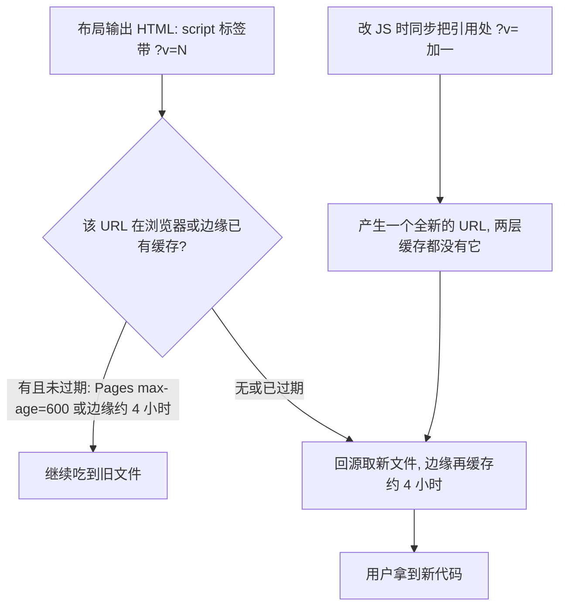

# 静态资源、音频资产与缓存击穿约定

这个仓库有两类「资源性问题」，它们看起来都是「文件放哪儿」，其实是完全不同的两套机制：**哪些大文件必须留在 git 里、哪些必须挡在 wiki 生成之外**（两份忽略清单），以及**改完 js/css 之后浏览器和 CDN 会不会照旧给你旧文件**（`?v=` 缓存击穿）。

两件事都只能从仓库里的**注释与配置**读出来——没有 CI 校验、没有构建脚本、没有缓存配置，全部靠约定维持。本页把这两套约定连同当前快照固定下来。它们在四层边界里的位置见 [系统全景与仓库边界](../architecture/overview.md)（本仓库的权威总览），本页只处理其中的资产与缓存两条接缝。

相关背景页面：[站点构建、布局装配与部署形态](../architecture/site-build-and-deploy.md)（发布形态）、[外部依赖与服务耦合](../integrations/external-services.md)（Cloudflare 边缘与 Pages 的分工）、[讲经页内容模型](../concepts/audio-page-model.md)（音频 URL 从哪来）。

## 两份忽略清单，各管一段

仓库根有两份名字很接近、语义完全不相干的清单文件，**混用是这一层最常见的错误**：

| 文件 | 谁读它 | 管什么 | 语义 |
|---|---|---|---|
| [.gitignore](../../.gitignore) | git | 哪些文件**不进版本控制** | 标准 gitignore |
| [.openwikiignore](../../.openwikiignore) | OpenWiki 生成器 | 哪些文件**不进 wiki** | gitignore 风格，但匹配大小写不敏感 |

关键事实写在 [.openwikiignore](../../.openwikiignore) L3–L4 的第一段注释里：**OpenWiki 不读 `.gitignore`，只读 `.openwikiignore`**。也就是说某个文件是否会被写进 wiki，与它在不在 git 里毫无关系；反过来也一样。

这条区分现在在**两份清单里都被写下来了**：除 `.openwikiignore` 开头的说明外，[.gitignore](../../.gitignore) L14–L16 也补了一段指向性注释，明确「上面『别把音频加回忽略列表』说的是 `.gitignore`」，而「同目录的 `.openwikiignore` 是另一回事：它只控制 OpenWiki **读取**哪些文件来写 wiki，与 git 跟踪无关」。两段注释互为镜像，读其中一份时不会误把结论套到另一份上。

`.openwikiignore` 的匹配语义（[.openwikiignore](../../.openwikiignore) L9–L11 原文）：last-match-wins、`!` 取反、前导 `/` 锚定仓库根、尾随 `/` 仅匹配目录，并且**匹配大小写不敏感**——注释说明这是有意为之，防止在大小写不敏感的 APFS 上换种拼写绕过排除。改动这份清单时要按这套语义读，不能按 `.gitignore` 的直觉读。

### 同一份文件可以同时属于两个相反的集合

音频就是这种情形：**必须在版本控制里，必须不在 wiki 里**。

- 必须在 git 里，代价是体积：`.gitignore` 顶部注释（[.gitignore](../../.gitignore) L1–L4）记录了一段事故——2026-09-27 之前本地单独把 `*.mp3`/`*.m4a`/`玉机子/`/`经典读诵/` 排除在忽略之外（即本地忽略、远端 main 一直带着这些文件），结果是**本地与远端分叉成两条平行历史**，同日合并（分支 `backup-before-unify-20260927`）。注释结尾是一句祈使句式的警告：**别再把音频加回忽略列表，否则会再次分叉。**
- 必须不在 wiki 里，代价是生成质量：[.openwikiignore](../../.openwikiignore) 用通配符排除 `*.m4a`、`*.mp3`、`*.apk`、`*.doc`、`*.docx`（L13–L18），并显式列出 `玉机子/`、`经典读诵/`、`体真山人语录/`、`downloads/`（L20–L28）。注释解释了原因：不排除的话 wiki 生成会去读一堆二进制，**既慢又产出乱码**（L6–L7）。

所以「音频已经在 git 里了，wiki 这边就可以放开」是错的推论，反之亦然。处理体积问题时改 `.gitignore`，处理 wiki 生成问题时改 `.openwikiignore`，**永远不要用一份清单去解决另一份清单的问题**。

### 两份清单的实际覆盖面

按当前两份文件逐条对照（行号为生成时复核结果）：

| 路径 | `.gitignore` | `.openwikiignore` | 结果 |
|---|---|---|---|
| `玉机子/`、`经典读诵/`、`体真山人语录/` 下的音频 | 不排除（L1–L4 明令） | 排除（L13–L18 通配 + L25–L27 显式） | 入库，不进 wiki |
| `downloads/*.apk` | 排除（L10–L12） | 整个 `downloads/` 排除（L28） | 不入库，不进 wiki |
| `local-test.html` | 排除（L8） | **不排除** | 不入库，但 wiki 能读到（见 [布局与前端 DOM/脚本契约](../architecture/layout-and-frontend-contract.md)） |
| `openwiki/.run.json` | 排除（L17） | 不排除 | 不入库，wiki 能读到（性质见 [OpenWiki 与仓库自动化](./openwiki-and-repo-automation.md)） |
| `_site/`、`.jekyll-cache/` | 排除（L6–L7） | 排除（L39–L41） | 两边都挡掉 |
| `css/bootstrap*`、`js/bootstrap*`、`js/jquery-3.2.1.slim.min.js`、`js/vendor/` | 不排除 | 排除（L30–L34） | 入库，不当成本项目代码读 |
| `*.map` | 不排除 | 排除（L36–L37） | 入库，不进 wiki |
| `*.doc`、`*.docx` | 不排除 | 排除（L17–L18） | 入库，不进 wiki |
| `.DS_Store` | 排除（L5） | 排除（L44） | 两边都挡掉 |
| `.vscode/` | **不排除** | 排除（L45） | 会入库，但不进 wiki |

注意 APK 这条的不对称：`.gitignore` 只排 `downloads/*.apk`（该目录下别的东西仍然会入库），而 `.openwikiignore` 排的是整个 `downloads/`。**不要把这两条改得一样**——它们防的是不同的东西。

APK 为什么不入库，[.gitignore](../../.gitignore) L10–L12 写得很直白：APK 发布走 GitHub Releases（`releases/download/v1.0.0/...`），**每次出新版都提交 7MB 二进制会持续膨胀 `.git`**（注释给出当时的数字：`.git` 已 1.5GB，主要是音频）。仓库侧只有首页那两行链接与之耦合，见 [外部依赖与服务耦合](../integrations/external-services.md)。

`.gitignore` L17 新增的 `openwiki/.run.json` 是另一类条目：它不是体积问题，而是**瞬时运行状态不该进提交**。这条与 [.github/workflows/openwiki-update.yml](../../.github/workflows/openwiki-update.yml) 里的删除步骤是同一个意图的两道保险；`.run.json` 的性质与 workflow 的清理步骤见 [OpenWiki 与仓库自动化](./openwiki-and-repo-automation.md)，本页不重复。值得记住的是它**只在 `.gitignore` 里、不在 `.openwikiignore` 里**——所以它仍是 wiki 的可见输入，别把两份清单的这条差别抹平。

## 仓库体积的构成

[.openwikiignore](../../.openwikiignore) L6–L7 与 L20–L28 给出了当前体积账本：

| 路径 | 体积 | 内容 |
|---|---|---|
| 工作区合计 | 3.0G | 其中约 2.9G 是讲经音频、APK 与第三方 vendor 代码 |
| `玉机子/` | 1.3G | 讲经录音，子目录如「讲道德经」476M、「讲南宗下手法」400M |
| `经典读诵/` | 110M | 读诵 mp3 |
| `体真山人语录/` | 53M | m4a |
| `downloads/` | 6.9M | `yujizi-listener.apk` |

另外 [js/musicplayer.js](../../js/musicplayer.js) L76–L79 从播放器角度记了同一件事：**这批 mp3 单个 66~88MB**，正因如此预取提前量才必须从 5 分钟收紧到 60 秒（否则转场前 5 分钟就在抢带宽）。也就是说「大体积音频」不只是仓库体积问题，它同时决定了播放器的带宽策略，见 [连续播放转场全流程](../workflows/continuous-playback-transition.md)。

这些数字是从注释里抄下来的，不是从文件系统量出来的——`.openwikiignore` 把音频目录整个挡在 wiki 之外，**wiki 生成既不能读取也不能枚举它们**。清单里那些目录体积会随内容变化，改动前应当重新核对，而不是把这里的数字当现状。

## 缓存击穿：两层缓存与 `?v=`

### 缓存从哪来

站点在 `www.yujizi.org`，静态资源经过两层缓存（两处注释说的是同一件事）：

1. **GitHub Pages** 对 js/css 设 `Cache-Control: max-age=600`——最多 10 分钟（[_includes/comments.html](../../_includes/comments.html) L56–L58 原文：「改了 `comments.js` 却不动这个版本号，回访用户最多 10 分钟还在跑旧代码」）。
2. **Cloudflare** 还会把静态资源缓存约 4 小时（[_includes/comments.html](../../_includes/comments.html) L59–L60；[_layouts/music.html](../../_layouts/music.html) L113–L115 从「还可能缓存更久」的角度复述）。

所以存在两种失效方式，**排查方向不同**：改了 js 没 bump → 浏览器/CDN 直接命中旧 URL；bump 了但边缘还压着旧内容 → 新版本被旧缓存盖住。第二种只能靠部署后清一次 CDN 缓存解决，而**清缓存的动作不在这个仓库里**：注释指向 `~/work/yujizi-comments/deploy.sh`（[_includes/comments.html](../../_includes/comments.html) L60）。仓库里没有任何 Cloudflare 配置文件，也没有部署脚本，所以本页不给出、也不应编造部署命令。

### `?v=` 为什么必须手工 bump

版本号**不存在于任何 manifest、构建配置或文件名哈希**里，它只存在于引用该文件的 `<script>` 标签的查询串上。仓库里正好三处：

- [_layouts/music.html](../../_layouts/music.html) L119：`/js/musicplayer.js?v=4`
- [_layouts/music.html](../../_layouts/music.html) L125：`/js/keepalive.js?v=3`
- [_includes/comments.html](../../_includes/comments.html) L64：`/js/comments.js?v=4`（带 `defer`）

没有指纹流水线可用，所以「bump」这个动作的含义是**改引用处的查询串**，让文件换一个从未被缓存过的 URL。它必须与内容改动在同一次提交里完成——`?v=` 不会自己变。

这张图说明 `?v=` 的作用位置：它绕开的是「同一 URL 的缓存」，而不是缓存本身；只要引用串不变，两层缓存都会继续命中旧内容。

> 注意这里的边界：注释给出的 10 分钟上限是针对 js/css 的。布局输出的 HTML 本身也是 Pages 提供的静态文件，所以 bump 之后是否每个回访用户都立刻拿到新脚本，仓库里没有可验证的配置能回答。实际观察「改完没生效」时，先确认拿到的是新 HTML，再怀疑版本号。

### 当前版本号快照（bump 前的对照表）

三处引用旁边都写有注释，**这些注释就是该文件的改动日志**，是判断「这次改动是否已经体现在版本号里」的第一手对照：

| 文件 | 引用处 | 当前版本 | 注释里的日志 |
|---|---|---|---|
| [js/musicplayer.js](../../js/musicplayer.js) | [_layouts/music.html](../../_layouts/music.html) L119 | `?v=4` | v2：修「播放完停止」模式下不显示剩余时间；v3：修连续播放转场后卡在下一首开头、时长显示 0 秒（预取改为只取头部 512KB）；v4：加「时长 0」看门狗——换曲后 10 秒元数据仍未到就重载自救 |
| [js/keepalive.js](../../js/keepalive.js) | [_layouts/music.html](../../_layouts/music.html) L125 | `?v=3` | **没有逐版日志**。文件头注释（[js/keepalive.js](../../js/keepalive.js) L1–L19）记的是事实而非版本：2026-09-29 验证通过、2026-10-03 真机验证（小米 Android + Chrome）连续播放 + 定时 1 小时息屏不再中断；早期常驻的 18kHz 静音导频已删除且**不要再加回来** |
| [js/comments.js](../../js/comments.js) | [_includes/comments.html](../../_includes/comments.html) L64 | `?v=4` | v2：错误处理区分「断网」与「被边缘拦下」，并解析非 JSON 响应；v3：改为同源调用（`data-api` 留空），彻底不再涉及 CORS；v4：修掉误导性的报错文案，失败时打 `console.warn` 便于定位 |

三处注释都在描述**具体行为变化**，不是「改了点什么」。这就是这套约定的可维护性来源：bump 时顺手补一行 `vN：…`，下一个改这个文件的人就能对着表确认自己该不该加一。`keepalive.js` 是唯一的例外，它的版本历史只能从 git 历史里重建——**改它的时候顺手补一行日志，比事后猜更有价值**。

### 约定覆盖不到的地方

版本号只挂在这三个脚本标签上，还有几处**故意不带** `?v=`，改东西时必须知道：

- **音频 URL 不带任何版本参数**。[阴符经.html](../../阴符经.html) L9–L14 的 `musicList` 里是纯路径（如 `/玉机子/玉机子讲阴符经/28416276.m4a`），没有查询串。也就是说音频文件被替换、内容变了而路径不变时，两层缓存（边缘约 4 小时）仍可能把旧音频发给回访用户，而仓库里没有任何机制能击穿它。音频的 URL 语义见 [讲经页内容模型](../concepts/audio-page-model.md)。
- **`style.css`、jQuery slim 与 `js/yujizi.js` 也都是裸路径**：两个布局各写一次 `/style.css`（[_layouts/default.html](../../_layouts/default.html) L24、[_layouts/music.html](../../_layouts/music.html) L23），default 布局还挂着 `/js/jquery-3.2.1.slim.min.js` 与 `/js/yujizi.js`（[_layouts/default.html](../../_layouts/default.html) L100–L101）。改这几个文件时**没有可 bump 的版本号**，只能靠两层缓存的 TTL 自然过期——这是当前约定最明显的空档，改样式或 `yujizi.js` 后「没生效」属预期行为。
- **[local-test.html](../../local-test.html) 引用的是不带版本号的裸路径**（L76–L77：`/js/jquery-3.2.1.slim.min.js`、`/js/musicplayer.js`）。它不经过任何布局、拆不到 `?v=`，也因此永远拿最新文件——反过来说，它**复现不出回访用户的旧缓存行为**，不能用来验证缓存击穿是否修好。

### 服务端必须认 `Range`，否则预取退化为放弃

缓存这一层还有一个只影响音频的前端依赖：[js/musicplayer.js](../../js/musicplayer.js) L446–L474 的 `pPrefetch()` 用 `fetch(url, { headers: { Range: 'bytes=0-' + (P_PREFETCH_MAX - 1) } })` 只取头部 512KB（`P_PREFETCH_MAX = 512 * 1024`，L9）来暖元数据缓存。

判据很硬（L458–L473）：

- 回 **206** 才算服务端认了 range，取到头部就 `res.body.cancel()`，不再在 JS 里过一遍数据；
- 回 **200**（服务端无视 Range、准备把整个 66~88MB 灌回来）→ 立刻 abort，并把该 URL 记进 `pPrefetchGivenUp`，**整个会话都不再试**；
- 去重是粘性的（`pPrefetched`），注释记录了原因：早先每次 200 都允许重试，而 `timeupdate` 每秒触发数次，实测 8 秒内打了 25 次 Range 请求，把「预取抢带宽拖慢播放」的老毛病又请了回来。

所以「服务端/边缘是否支持 Range」在这里是**功能开关而不是优化项**：不支持时预取整体放弃，退化成 2026-09-27 之前的行为。改动 CDN 缓存规则或源站响应行为时，这条依赖要先确认。

## 改这一层时的失效模式

| 改动 | 后果 |
|---|---|
| 改了 `js/musicplayer.js` / `js/keepalive.js` / `js/comments.js` 却不动 `?v=` | 引用串没变，两层缓存继续命中旧文件；回访用户最多 10 分钟（边缘可能约 4 小时）仍在跑旧代码 |
| bump 了版本号但部署后没清 CDN 缓存 | 新版本可能被旧缓存盖住（[_includes/comments.html](../../_includes/comments.html) L59–L60 的原话） |
| 想靠「改文件名加指纹」取代 `?v=` | 引用写死在布局与 include 里（`music.html` L119/L125、`comments.html` L64），且 `local-test.html` 也直接引用 `/js/musicplayer.js`；改名等于三处引用同时改 |
| 把 `*.mp3` / `*.m4a` / `玉机子/` / `经典读诵/` 加回 `.gitignore` | 本地与远端再次分叉出两条平行历史（2026-09-27 的教训，见 [.gitignore](../../.gitignore) L1–L4） |
| 把音频目录从 `.openwikiignore` 移出 | wiki 生成去读约 2.9G 二进制，既慢又产出乱码（[.openwikiignore](../../.openwikiignore) L6–L7） |
| 把 `downloads/` 从 `.openwikiignore` 移出，或把 `downloads/*.apk` 从 `.gitignore` 移出 | 分别破坏「不进 wiki」与「不进 git」两条决定，APK 是 7MB 级二进制 |
| 用 `.gitignore` 去排除 wiki 内容（或反之） | 无效：OpenWiki 不读 `.gitignore`（[.openwikiignore](../../.openwikiignore) L3–L4，[.gitignore](../../.gitignore) L14–L16 同义复述） |
| 把 `openwiki/.run.json` 从 `.gitignore` 移出并提交 | 提交了瞬时运行状态；workflow 本会显式删除它，两道保险同时失效（见 [OpenWiki 与仓库自动化](./openwiki-and-repo-automation.md)） |
| 改了音频文件内容但沿用同一路径 | 没有任何版本参数可 bump，边缘约 4 小时的缓存窗口内回访用户可能听到旧音频 |
| 改动 CDN/源站使它不再支持 Range | `pPrefetch()` 在首个 200 响应后放弃该 URL 并在整个会话不再重试，转场失去预取保障 |

## 改动前的检查清单

1. **判断你要动的是哪份清单**：只影响 git → `.gitignore`；只影响 wiki 生成 → `.openwikiignore`。两份都动时分别确认理由。
2. **音频永远不加回 `.gitignore`**，也永远不从 `.openwikiignore` 里移出音频目录与通配符。
3. **改 js 就 bump 引用处的 `?v=`**，并在同一条注释里补一行 `vN：…` 日志；三处引用位置见上表。
4. **改完确认自己 bump 的是「引用处」**，不是文件名——没有指纹流水线。
5. **涉及音频或 js 的部署后，在仓库外清一次 CDN 缓存**（脚本路径见 [_includes/comments.html](../../_includes/comments.html) L60；具体命令不在本仓库，不要凭猜写）。
6. **验证**：本仓库没有测试框架与 lint，缓存击穿只能靠行为观察（回访、强刷对比、看 `?v=` 是否变化）；方法见 [验证与复现手册](../testing/verification-playbook.md)。

## 相关页面

- [系统全景与仓库边界](../architecture/overview.md) —— 四层边界、两份忽略清单在其中的位置，以及「想改 X 该动哪些文件」的落点索引
- [站点构建、布局装配与部署形态](../architecture/site-build-and-deploy.md) —— 装配路径、两套布局、Pages + CNAME + Cloudflare 的发布形态
- [布局与前端 DOM/脚本契约](../architecture/layout-and-frontend-contract.md) —— `?v=` 三条引用所处的脚本标签与顺序约束
- [外部依赖与服务耦合](../integrations/external-services.md) —— 边缘缓存、`/api/*` 路由与 GitHub Releases 的边界
- [讲经页内容模型（pageid / musicList）](../concepts/audio-page-model.md) —— 音频 URL 的来源与「仓库里有、wiki 里没有」这一状态
- [连续播放转场全流程](../workflows/continuous-playback-transition.md) —— 预取与 `Range` 支持对转场成败的影响
- [OpenWiki 与仓库自动化](./openwiki-and-repo-automation.md) —— `.openwikiignore` 如何影响 wiki 生成范围，以及 `openwiki/.run.json` 的性质
