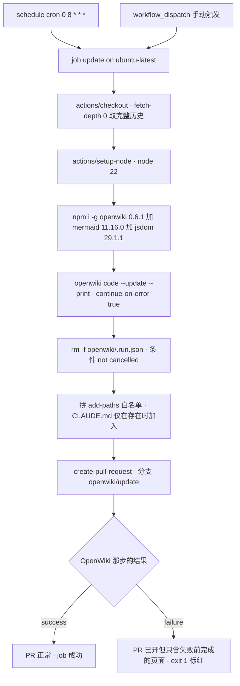

# OpenWiki 与仓库自动化

这个仓库**只有一条自动化流水线**：[.github/workflows/openwiki-update.yml](../../.github/workflows/openwiki-update.yml)。它与站点构建、部署完全无关——GitHub Pages 的 Jekyll 构建在平台侧完成，不使用任何 workflow（见 [站点构建、布局装配与部署形态](../architecture/site-build-and-deploy.md)）。它做的是**维护 `openwiki/` 这份生成出来的证据索引**：跑一次 OpenWiki 更新，把结果打成 PR 等人评审。

所以本页要回答的是四个问题：**这套文档流水线怎么跑、跑完什么进 PR、wiki 生成看得见哪些文件、以及人和 agent 该怎么对待这份生成物。**

外部依赖一侧（哪些凭据在仓库外、模型怎么配）另见 [外部依赖与服务耦合](../integrations/external-services.md)；`.openwikiignore` 与 `.gitignore` 的对照关系在 [静态资源、音频资产与缓存击穿约定](./assets-and-cache-busting.md) 里有更完整的表格。

## 唯一的 workflow

### 触发与权限

| 项 | 值 | 行 |
|---|---|---|
| 名字 | `OpenWiki Update` | L1 |
| 触发 | `workflow_dispatch`（手动） + `schedule: cron "0 8 * * *"`（每日 08:00） | L3–L6 |
| 权限 | `contents: write` + `pull-requests: write` | L8–L10 |
| job | `update`，`runs-on: ubuntu-latest` | L12–L14 |

两点直接后果：

- **没有 `push` 触发**。改了源码不会立刻重生成 wiki，只能等下一次每日运行、手动 `workflow_dispatch`，或合并别人已经开好的 `openwiki/update` PR。
- **权限是 `create-pull-request` 能建分支与 PR 的前提**（L8–L10）。收紧这两条会让流水线在最后一步失败，而不是安静跳过。

三个第三方 action 都用**提交 SHA 固定**（`actions/checkout@34e1148…`、`actions/setup-node@49933ea…`、`peter-evans/create-pull-request@22a9089…`，注释里标着 `# v4` / `# v7`），所以升级 action 版本意味着换 SHA，不是改标签。

### 步骤顺序



这张图展示这条流水线的固定顺序：先跑更新、再清瞬时状态、最后按白名单打包开 PR；失败不会阻止 PR，但会在末尾把 job 标红。

**`fetch-depth: 0` 是硬需求，不是保险。** 注释（L19–L22）写明 `openwiki code --update` 会把 HEAD 与「它上次记录过的 commit」做 diff，**浅克隆会藏掉那个 commit，更新就变成对着空变更集跑**。也就是说省掉这一行不会报错，只会让每次 `--update` 都以为仓库没有任何变化。

**mermaid 与 jsdom 是可选但本仓库需要。** 安装行（L29–L31）把 `openwiki@0.6.1` 钉死，并附带 `mermaid@11.16.0`、`jsdom@29.1.1`，注释说明它们的作用是给 Mermaid 图做高保真校验、**如果 wiki 里没有图就可以删**。本仓库的 wiki 有 Mermaid 图，删掉这两个依赖等于放弃图校验（校验失败的图会被降级成纯文本代码块）。

**OpenWiki 那步还挂着一段进程级 shim。** 同一个 step 的 env 里有一行 `NODE_OPTIONS: "--import=${{ github.workspace }}/.github/openwiki/opencode-go-fetch.mjs"`（L42–L47），对应仓库文件 [.github/openwiki/opencode-go-fetch.mjs](../../.github/openwiki/opencode-go-fetch.mjs)。注释写明理由：网关（OpenCode Go / Zen）对任何缺少 `x-opencode-session` 头的请求直接回 HTTP 400 `MissingSessionID`，而 OpenWiki 的 `openai-compatible` provider **没有任何配置开关能加自定义请求头**——它只管理 `*_API_KEY`、`*_BASE_URL`、`STREAMING` 等少数几个键。所以只能在进程边界上解决：该模块在 CLI 启动前替换 `globalThis.fetch`，只给目标 host 的请求补上 `x-opencode-session`（每个进程一个会话 id，不是每个请求一个）与一个自报身份的 `user-agent`，其余请求原样透传。用 `NODE_OPTIONS` 而不是 CLI 参数，是为了让子进程也继承。结论：**删掉这个文件或这行 env，workflow 会在每一次运行上都失败**，而不是降级成不加头的请求。

### 失败语义：失败也要开 PR

`openwiki code --update --print` 带 `continue-on-error: true`（L33–L36），`create-pull-request` 之后还有一步 `Propagate OpenWiki failure`：

```
if: ${{ steps.openwiki.outcome == 'failure' }}
run: exit 1
```

（L93–L95）

这条设计是**有意为之的**，PR 正文里也写明了（L80–L87）：当 OpenWiki 结果为 `failure` 时，这个 PR **故意只保留失败之前已经完成的页面**，合并它就是让这批进度成为下次运行的新基线。换句话说：

- 「job 失败」不等于「PR 不该合并」。失败时先看 PR 正文里的 `OpenWiki result:` 一行与 PR 里改了哪些页面，再决定合并还是关掉重跑。
- 反过来，「job 成功」也不代表 wiki 已经更新——**wiki 只有在这个 PR 被合并后才生效**，因为流水线自己只开 PR，从不直接 push 到 `main`。

`continue-on-error` 还有一个副作用值得知道：OpenWiki 失败时后续步骤照常执行，所以 `.run.json` 仍会被清掉、PR 仍会把半成品页面带上；真正阻止 job 变绿的只有最后那一步 `exit 1`。

**开完 PR 后还有一步纯播报**：`Annotate OpenWiki update pull request`（L89–L91）在 `create-pr` 真的有产出 `pull-request-url` 时打一条 `::notice`，把 PR 链接顶到 workflow 日志的顶部。它不改任何状态，只是在几十行日志里省掉一次翻找。

### PR 的内容是一份白名单

`.run.json` 的清理与 `add-paths` 的拼装都用 `if: ${{ !cancelled() }}` 守卫（L57–L69），确保即使 OpenWiki 挂了也照常执行：

| 步骤 | 行为 | 证据 |
|---|---|---|
| 删除瞬时状态 | `rm -f -- openwiki/.run.json`（step 名即「Remove transient OpenWiki run state」） | L57–L59 |
| 拼 `add-paths` | `openwiki,AGENTS.md,.github/workflows/openwiki-update.yml`，**`CLAUDE.md` 仅在存在时追加** | L61–L69 |
| 开 PR | 分支 `openwiki/update`，commit 与 title 均为 `docs: update OpenWiki` | L71–L79 |

`CLAUDE.md` 那个条件判断的注释解释了原因（L64–L65）：**`git add` 遇到不存在的路径会失败，然后什么都没 stage**——所以路径必须按实际存在性拼。本仓库当前没有 `CLAUDE.md`，这条分支处于未激活状态，但它是防「随手加个 CLAUDE.md 就把流水线弄挂」的护栏。

白名单里三项各自的含义：

- `openwiki/` —— 生成出来的页面与状态文件本身。
- `AGENTS.md` —— 说明这次运行会**改写**其中的 OPENWIKI 区块（该区块用成对 HTML 注释划界，见下节），所以必须进白名单，否则改动会被丢掉。
- `.github/workflows/openwiki-update.yml` —— 流水线允许更新自己（例如 OpenWiki 顺手调整了注释或配置）。

**推论同样重要：这条流水线永远不会顺手提交白名单以外的文件。** 你手改的 `js/`、`_config.yml`、页面 HTML 都不会被这个 PR 带上，得自己提交。

## 生成物与状态文件

`openwiki/` 目录里除了页面本身，还有三类由工具自己维护的文件，**职责完全不同，混用会得出错误结论**：

| 文件 | 性质 | 内容 | 谁维护 |
|---|---|---|---|
| [openwiki/.page-manifest.json](../.page-manifest.json) | 稳定状态 | `schemaVersion: 1` + 逐页 `path`/`gitHead`/`sourceFingerprint`/`pageVersion`/`completedBy`/`completedRunId` | OpenWiki，随每次运行更新 |
| [openwiki/.last-update.json](../.last-update.json) | 稳定状态 | 最近一次运行的元数据：`updatedAt`、`command`（如 `update`）、`model`、`status`、`language` | OpenWiki |
| [openwiki/.run.json](../.run.json) | **瞬时运行状态** | 进行中运行的全部内部细节：`runId`、`mode`、`phase`、`startedAt`、`targetGitHead`、`sourceFingerprint`、页面计划（`initialPages`、`requiredRewritePages`）等 | OpenWiki 运行时写，**被 workflow 显式删除** |

关于这三份文件，有几件事必须分清：

1. **不要把 `.run.json` 当配置读。** 它记录的是一次特定运行在某一刻的进行状态（`runId`、`mode`、`phase`、`targetGitHead`、`sourceFingerprint`），连同 `initialPages` 这种**那次运行自己的页面计划**，以及 `previousLastUpdate`、`preparedWiki` 这类仅供本次运行使用的暂存字段。抓在中途的一份 `.run.json` 里这些字段全都只是**那一刻的**快照，不是仓库的稳定约定；workflow 删除它（L57–L59）就是为了不让这份瞬时状态进入提交。它还同时被 [.gitignore](../../.gitignore) L17 挡在版本控制之外——两道保险指向同一件事。
2. **`.page-manifest.json` 才是「上次文档化到哪个提交」的落点。** 它逐页记录 `gitHead`，并且与 `.run.json` 的 `targetGitHead` 取同一个提交；`completedRunId` 记录的又是**完成该页的那次运行**的 `runId`（因此不同页可以是不同的 run id，不必等于当前 `.run.json` 的 `runId`）。这就是 `--update` 用来做 diff 的基线记录，也是它为什么需要 `fetch-depth: 0` 的直接对应物——**浅克隆时这个 commit 不在本地**，diff 就落空了。
3. **`sourceFingerprint` 是仓库范围的指纹，不是单页的。** 当前所有页面共享同一个 `sourceFingerprint`，说明它表征的是「这一批页面基于哪一份源码状态生成」，而不是每个文件各自的哈希；逐页变化的是 `pageVersion`。
4. **`.last-update.json` 记的是某次运行的元数据快照**（`updatedAt`、`command`、`model`、`status`、`language`），是判断「这份 wiki 是谁、用哪个模型、以什么语言、在哪一刻生成的」的第一手材料。注意 `status` 可以是 `interrupted`——**它不是「一切正常」的保证**，运行中断时 `command` 反映的是那次中断的运行（当前仓库里 `command` 是 `update`，`.run.json` 的 `previousLastUpdate` 里还留着上一次 `command: "init"` 的快照）。页面 frontmatter 里的 `verified:` 条目（`by: openwiki/0.6.1` + 时间戳）与之对应。

页面 frontmatter 里的 `verified`、`generated` 之类字段由 OpenWiki 拥有，**不要手写也不要改**。

## `AGENTS.md` 的 OPENWIKI 区块：这份 wiki 该怎么被用

[AGENTS.md](../../AGENTS.md) 全文就是一段被 HTML 注释夹住的区块：`<!-- OPENWIKI:START -->`（L1）到 `<!-- OPENWIKI:END -->`（L16）。它不描述这个站点，而是**约定 coding agent 如何对待生成出来的 wiki**。核心几条（原文为英文，这里摘要其约束）：

- **wiki 是「按需取用」的可选上下文，不是启动必读**（L5）。agent 在任务开始时**不得枚举、预加载或搜索 wiki**（L7）。
- 什么时候才去检索（L7）：用户明确要求时、不熟悉的架构或依赖行为会实质影响任务时、或者读源码之后仍留下重要不确定时。**问题一旦有据可依就停下**，不要无限扩查。
- 检索方式（L8）：有工具时用 `openwiki_search` 取即时上下文、`openwiki_read` 读完整相关小节；搜索返回 `workspace_required` 时先问用哪个 workspace 再用其 ID 重试。workspace 归属本身需要发现时用 `openwiki_list_workspaces` / `openwiki_list_wikis`（L9）。
- **工具不可用时的降级路径**（L10）：读 `openwiki/quickstart.md`，顺它的链接找页面。
- **源码与测试是权威**（L11）：简报里的 unknowns 与 review items 是**验证缺口**，不是自动成立的需求。
- 优先用**最窄的、安静的**验证方式证明改动生效，并保留完整失败输出（L12）。
- **生成页不可手改**（L14）：`Do not hand-edit generated OpenWiki pages unless explicitly asked`——除非被明确要求，否则应当改源码/文档，让 OpenWiki 重新生成。

最后一条是本页最实用的操作结论：**你在这个目录下写的东西，下一次流水线运行会把它覆盖掉。** 要修 wiki 内容，改的是被它引用的源码与仓库文档（`js/`、`_layouts/`、`_includes/`、`AGENTS.md`、`docs/`），然后等下一次每日运行或手动触发。这与本仓库「没有构建脚本、改文件即生效」的整体风格一致，验证方式见 [验证与复现手册](../testing/verification-playbook.md)。

区块的成对注释标记解释了为什么 `AGENTS.md` 必须出现在 PR 白名单里：OpenWiki 有明确的边界可以只重写这一段，而不动文件其余部分——所以它把 `AGENTS.md` 当成自己的产出之一。

## `.openwikiignore` 决定 wiki 生成能看见什么

[.openwikiignore](../../.openwikiignore) 是 wiki 生成范围的唯一控制点。第一条注释（L3–L4）就点明最容易搞错的一点：**OpenWiki 不读 `.gitignore`，只读本文件**。所以「这个文件在不在 git 里」与「这个文件会不会被写进 wiki」是两件互不相干的事。

匹配语义（L9–L11）：gitignore 风格，`last-match-wins`、`!` 取反、前导 `/` 锚定仓库根、尾随 `/` 仅匹配目录，并且**匹配大小写不敏感**——注释说明这是有意的，防止在大小写不敏感的 APFS 上用另一种拼写绕过排除。

排除了什么，以及为什么（L6–L7 给出理由：不排除的话生成会去读一堆二进制，**既慢又产出乱码**）：

| 类别 | 条目 | 行 |
|---|---|---|
| 媒体与二进制 | `*.m4a`、`*.mp3`、`*.apk`、`*.doc`、`*.docx` | L14–L18 |
| 大体积媒体目录 | `玉机子/`、`经典读诵/`、`体真山人语录/`、`downloads/` | L25–L28 |
| 第三方 vendor 代码 | `css/bootstrap*`、`js/bootstrap*`、`js/jquery-3.2.1.slim.min.js`、`js/vendor/` | L31–L34 |
| 机器产物 | `*.map` | L37 |
| Jekyll 构建产物 | `_site/`、`.jekyll-cache/` | L40–L41 |
| 编辑器 / 系统 | `.DS_Store`、`.vscode/` | L44–L45 |

这里有两个**由清单直接推导出来的阅读约束**，写 wiki 时必须遵守：

- **音频目录既不能读也不能枚举。** 清单注释自己给出体积账（工作区 3.0G，其中约 2.9G 是音频/vendor，L6–L7、L21–L24）。所以关于音频目录结构、文件名与内容的一切描述，只能从页面里出现的 URL 字符串推断，不能声称读到了文件（见 [讲经页内容模型](../concepts/audio-page-model.md)）。
- **被排除的文件不该被当成项目代码逐文件归纳。** vendor 的 Bootstrap/jQuery（L31–L34）与 `*.map` 属于此类；它们仍会被浏览器加载或入库，但不在 wiki 的阅读范围内（见 [遗留层：jQuery 与 yujizi.js](../concepts/legacy-multi-audio-player.md)）。

反过来，**`.openwikiignore` 没有排除的东西即使不在 git 里也能被 wiki 读到**：[local-test.html](../../local-test.html) 被 [.gitignore](../../.gitignore) L8 排除、不入版本控制，却仍存在于工作区，因此 wiki 生成（如果在本地跑）会读到它——[验证与复现手册](../testing/verification-playbook.md) 就依赖这一点来解释本地验证装置。

一句话概括两层排除的关系：**体积与入库问题改 `.gitignore`，wiki 生成问题改 `.openwikiignore`，永远不要用一份清单去解决另一份的问题**（对照表见 [静态资源、音频资产与缓存击穿约定](./assets-and-cache-busting.md)）。

## 这条流水线的运行配置在哪

只有极少数几项能在这个仓库里改：

| 想改 | 落点 | 还要做什么 |
|---|---|---|
| 更新频率 | [.github/workflows/openwiki-update.yml](../../.github/workflows/openwiki-update.yml) L6 的 cron | 无；`workflow_dispatch` 可随时手动跑一次 |
| 模型 | 同文件 L41 的 `OPENWIKI_MODEL_ID`（当前 `deepseek-v4.1-flash`） | 换 provider 要连 L38 的 `OPENWIKI_PROVIDER: openai-compatible` 一起改 |
| 凭据与网关地址 | 仓库 **secrets**（`OPENAI_COMPATIBLE_API_KEY`、`OPENWIKI_LANGSMITH_API_KEY`、`LANGSMITH_API_KEY`）与仓库 **variables**（`OPENAI_COMPATIBLE_BASE_URL`）（L37–L53） | 在 GitHub 仓库设置侧改，仓库内改不动 |
| 请求头 shim | [.github/openwiki/opencode-go-fetch.mjs](../../.github/openwiki/opencode-go-fetch.mjs) 与 L47 的 `NODE_OPTIONS` | 网关换了 host 或 header 要求就改这里；删掉它等于每次运行都 400 |
| OpenWiki 版本 / 图校验 | 同文件 L31 的 `npm install --global` 行 | 删 mermaid 与 jsdom 就放弃 Mermaid 图校验 |
| PR 能带哪些文件 | 同文件 L61–L69 的 `add-paths` 拼装 | 加新路径时注意 `git add` 会在路径不存在时整体失败 |

同一个运行还会把**自己这次文档更新过程**作为 trace 发到 LangSmith：`LANGCHAIN_PROJECT: openwiki`、`LANGCHAIN_TRACING_V2: "true"`（L52–L55）；而 `OPENWIKI_LANGSMITH_API_KEY` 是给 LangSmith connector 的 code-mode pull 做认证的（L48–L51），注释提示多 workspace 时按 `_2`、`_3` 的序列追加 secret 与 env 条目。

## 失效模式速查

| 改动 / 情况 | 后果 |
|---|---|
| 去掉 `fetch-depth: 0`（浅克隆） | `--update` 找不到上次记录的 commit，变成对着空变更集跑，看起来「一切正常」但什么都不更新（L19–L22） |
| 把 `AGENTS.md` 从 `add-paths` 移出 | OpenWiki 改写了 OPENWIKI 区块，但改动不会进 PR，随即丢失（L61–L69） |
| 在 `add-paths` 里写一个当前不存在的路径 | `git add` 失败并**什么都没 stage**——所以 `CLAUDE.md` 必须按存在性拼（L64–L65） |
| 删掉 `NODE_OPTIONS` / `opencode-go-fetch.mjs` | 网关对缺 `x-opencode-session` 的请求回 HTTP 400，OpenWiki 那步每次运行都失败（L42–L47） |
| 指望流水线带走你手改的其他文件 | 不可能：白名单之外一概不提交（L71–L79） |
| 把 OpenWiki 失败当成「PR 作废」 | PR 是**故意**保留失败前已完成页面的，合并它才能让进度成为下次基线（L80–L87） |
| 把 `.run.json` 加回提交或当成稳定配置 | 它是瞬时运行状态，且 workflow 会主动删除它（L57–L59）；`.gitignore` L17 是第二道保险 |
| 手改 `openwiki/` 下的生成页 | 下一次运行覆盖；正确做法是改源码/文档重生成（[AGENTS.md](../../AGENTS.md) L14） |
| 为了「让 wiki 看见某目录」去改 `.gitignore` | 无效：OpenWiki 只读 `.openwikiignore`（[.openwikiignore](../../.openwikiignore) L3–L4） |

## 相关页面

- [系统全景与仓库边界](../architecture/overview.md) —— 仓库的权威总览：四层可独立改动的边界（内容页 / Jekyll 布局与 include / 浏览器端运行时 / 仓库外服务）、`.github/` 与 `openwiki/` 在其中各自的位置，以及两份忽略清单分别挡掉了哪些路径
- [静态资源、音频资产与缓存击穿约定](./assets-and-cache-busting.md) —— `.gitignore` 与 `.openwikiignore` 的逐条对照表与体积账
- [外部依赖与服务耦合](../integrations/external-services.md) —— 这条 workflow 与 GitHub Pages、Cloudflare、Releases 的耦合点总览
- [验证与复现手册](../testing/verification-playbook.md) —— 生成页不可手改时，改动该在哪里被验证
