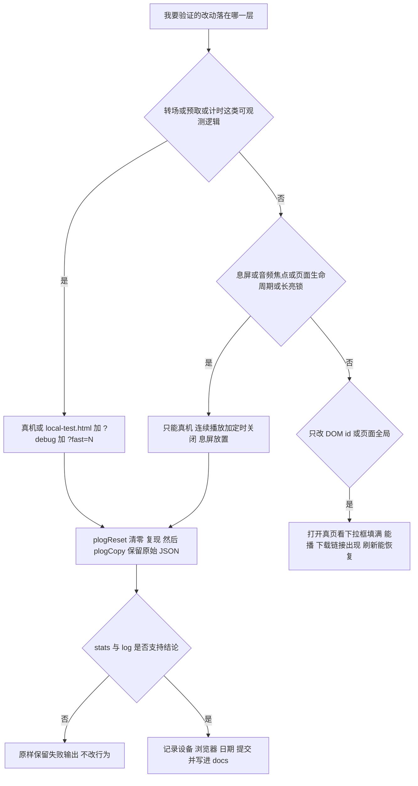

# 验证与复现手册

这个仓库**没有测试框架**：根目录没有 `package.json`、没有 `Gemfile`、没有 `Makefile`，也没有任何 lint 配置或测试脚本（[jsconfig.json](../../jsconfig.json) 全文只有一条 `typeAcquisition.include: ["jquery"]`，作用是让编辑器认识 jQuery 全局，与运行时和校验无关）。仓库里唯一的自动化 workflow 是 OpenWiki 文档更新（[.github/workflows/openwiki-update.yml](../../.github/workflows/openwiki-update.yml) L1–L11）：它里面确实会出现 `npm install --global openwiki@0.6.1 …`（L31），但那只是**在 CI 里安装 OpenWiki CLI 这个工具本身**，不是仓库的依赖清单、更不是测试命令——**它不会跑任何针对播放器的检查**。站点本身是 Jekyll 静态站，构建在 GitHub Pages 服务端完成，也没有测试阶段。

所以在改 [js/musicplayer.js](../../js/musicplayer.js) 或 [js/keepalive.js](../../js/keepalive.js) 之前，请先接受三条事实：**没有 `npm test`、没有 lint、没有任何机器会在你 push 前拦住回归**。能做的只有「在装置上复现 + 保留证据 + 把结论写进文档」。本页就是这件事的操作手册。

验证的指导原则在 [AGENTS.md](../../AGENTS.md) L12 里已经写明，值得逐字读：

> Prefer the narrowest quiet validation that proves the changed behavior. Preserve complete failure output.

落到本仓库就是两句话：**优先用已有的三件装置在真机上复现一小步**，而不是去搭一套不存在的测试脚手架；**复现出来的日志（尤其是失败那一次的）原样保留**，不要只留一句「没好」。

## 一、可用装置只有三件

| 装置 | 形态 | 能验证什么 | 盲区 |
|---|---|---|---|
| [local-test.html](../../local-test.html) | 仓库根目录的手写 HTML，不入版本控制 | 播放器的普通行为：选曲、连续播放转场、定时关闭、剩余时间 | 不加载 `keepalive.js`（验不了长亮锁）、不带 `?v=`（复现不出旧缓存）、是手工副本会与布局漂移 |
| `?debug` 面板 + `plogCopy()` / `plogReset()` | 由 `musicplayer.js` 在带参数时注入 | 读取黑匣子：转场成败、异常暂停、时间线 | 面板只渲染部分字段与最后 12 条；统计跨会话累计 |
| `?fast=N` | 同一个文件的 URL 参数分支 | 高频、可重复地制造**真实转场** | 它制造的是转场，不是息屏；需要真实音频与 `Range` 支持 |

### 1. local-test.html：本地装置，也是「同一契约的手工副本」

[local-test.html](../../local-test.html) 是一份手写 HTML（L1 直接是 `<!doctype html>`，没有 front matter，因此不经过任何布局），它复刻了 `music.html` 的播放器结构，并额外加了一个只属于它的定时选项：

- 内联脚本定义 `const pageid = "localtest"` 与一份三首的 `musicList`，URL 指向 `/经典读诵/*.mp3`（L20–L27）；
- 播放器结构 L30–L71 与 [_layouts/music.html](../../_layouts/music.html) 的播放器区块几乎逐字相同，源码注释自己写明「与 _layouts/music.html 完全相同的播放器结构,外加 15 秒定时选项(仅本测试页)」（L29）；
- 那个额外选项是 `<option value="15000">15 秒(测试)</option>`（L50），在 `music.html` 的 `#myselect` 里并不存在（[_layouts/music.html](../../_layouts/music.html) L72–L80 最短是 5 分钟）。**这是本仓库最快的定时关闭观察窗口。**

要把它跑起来有一个前提容易被忽略：它与布局一样用**根绝对路径**引用资源（`/css/bootstrap.min.css`、`/style.css`、`/js/musicplayer.js`），所以**不能直接以 `file://` 打开**，必须把仓库根当成站点根用 HTTP 伺服——最省事的就是 `jekyll serve`（[_config.yml](../../_config.yml) L2 的 `host: 0.0.0.0` 正是它绑定全网卡的设置，顺带让同一局域网里的手机能直接打开这个页面）。音频路径指向的是仓库里真实存在的文件，不需要额外准备。

两条必须记住的属性：

1. **它不入版本控制。** [.gitignore](../../.gitignore) L8 明确排除 `local-test.html`，所以它不会被推到 Pages；它只是工作区里的测量装置。
2. **它只加载两个脚本**：`/js/jquery-3.2.1.slim.min.js` 与 `/js/musicplayer.js`（L76–L77），**不加载 `keepalive.js`**，而且引用的是**不带 `?v=` 的裸路径**。因此你**无法**在它上面验证屏幕长亮锁（那个文件根本没执行），也**复现不出**回访用户的旧缓存行为（它永远拿最新文件）。这两点决定了「改长亮相关代码时在 local-test.html 上看起来正常」不构成任何证据。

因为它只是手工副本，「id 或全局改了要同步两处」这条纪律是验证装置自身的前提：任何 `musicplayer.js` 依赖的元素 id 或页面全局名变动，都必须在 `_layouts/music.html` 与 [local-test.html](../../local-test.html) 同步，否则装置会**悄悄偏离生产结构**，而后你验证的就不是线上那份代码了。

### 2. `?debug` 面板与两个全局出口

诊断层整体包在一个 IIFE 里（[js/musicplayer.js](../../js/musicplayer.js) L679–L735），所以**不加 `?debug` 时它根本不存在**；加了之后它会向 `body` 追加一个固定深色的面板（L680–L686），每 2 秒重绘（L732–L733）。

面板上有两个按钮，它们绑的是挂在 `window` 上的全局函数：

| 入口 | 行为 | 代码 |
|---|---|---|
| `plogCopy()` | 把 `{stats, log}` 序列化成 JSON 写剪贴板；剪贴板不可用或写入被拒时退回 `prompt('手动复制:', data)` | L693–L699 |
| `plogReset()` | 清空内存里的 `plogBuf` / `pstats` / `ptrans`，删掉 `_plog` / `_pstats` / `_ptrans` 三个键，再立刻写一条 `stats-reset` | L700–L710 |

`plogCopy` 的 `prompt` 兜底不是装饰：`navigator.clipboard.writeText` 存在但**写入失败**（权限被拒、页面失焦等）时，第二个回调会把原始 JSON 交给 `prompt` 显示（L696–L698），用户只能手抄或截图。`prompt` 是阻塞式的，所以期间面板不会重绘、内容不会被盖掉——但也意味着**这条路只能靠人抄**。

面板本身只渲染**最后 12 条**日志，且每行只带 `vis` 的前三个字符、`idx`、`ct` 与 `paused`（L720–L722）：

```
17:52:37.651 [vis] pause-unattributed timer-active grace=8000ms (idx=0 ct=812.4 paused)
```

**`readyState` 不在这一行里。** 想用 `rs` 区分「没在播」与「在播但没拿到数据」（后者是「时长 0」那类故障的典型状态：`paused=false` + `rs=0` + `duration` 非有限值），就必须走 `plogCopy()` 拿原始 JSON，而不是看面板、更不能只看截图里的面板行。

### 3. `?fast=N`：用转场次数换时间的复现台

参数解析在 L312–L313：

```js
var PQS = new URLSearchParams(location.search);
var PFAST = PQS.has('fast') ? (parseInt(PQS.get('fast')) || 20) : 0;
```

解析方式带来一个容易踩的坑：**任何无法解析成非零数字的值都等于 20**（`?fast` 不带值、`?fast=abc`、甚至 `?fast=0` 都是 20），只有**完全不带 `fast` 参数**时 `PFAST` 才是 `0`（关闭）。

起跳发生在 `playing` 处理器里（L584–L590）：

```js
if (PFAST && !pFastSeeked && isFinite(musicPlayer.duration)
  && musicPlayer.duration - musicPlayer.currentTime > PFAST + 2) {
  pFastSeeked = true;
  plog('fast-seek', '->末尾前' + PFAST + 's (dur=' + Math.round(musicPlayer.duration) + 's)');
  musicPlayer.currentTime = musicPlayer.duration - PFAST;
}
```

三条使用纪律由此而来：

- **每首只起跳一次。** `pFastSeeked` 在 `loadstart` 里复位（L593–L596），所以「一次加载 = 一次起跳」；换曲会重新加载，于是每首都能起跳。
- **歌曲本身要够长。** 只有当剩余时间 `> N + 2` 秒时才起跳，短曲不会跳。
- **用它制造的是转场，不是息屏。** `?fast=20` 让每次真机验证在约 20 秒内拿到一次完整的「`ended` → 下一首 → `trans-ok`/`trans-fail`」循环，这才是它存在的理由。它**不能**代替息屏验证，因为屏幕不会因此熄灭。

### 该用哪件装置：路由图



上图是本仓库的验证分派：能靠 `?debug` + `?fast` 在真机上跑出可重复事件链的，就走装置；只有与息屏、音频焦点、页面生命周期相关的改动才必须回到「真机 + 息屏放置」这条路，两条路最终都收敛到「先清零、再取原始 JSON」。

## 二、证据标准

这一节是整份手册里最硬的部分，因为它决定你**能不能相信自己的结论**。

### 算证据的

- **真机上的行为**（用户实际使用的设备与浏览器），以及随之产生的日志。
- **用户自己回传的截图或 `plogCopy` 原始 JSON。** 决定性证据形态是 `vis` 字段的序列：事件发生在 `visible` 态还是 `hidden` 态。
- **日志本身由 JS 写出**这一事实——它反证了「页面当时在运行」。息屏连续播放那次定位就建立在这两点上，见第四节的基线文档。

### 不算证据的

[docs/播放器息屏播放-已验证版本.md](../../docs/播放器息屏播放-已验证版本.md) L46–L48 把这条写成了给未来的自己的警告，而且是实测结论，以下三者都**不构成证据**：

- **CDP 的 `Page.setWebLifecycleState('frozen')`**——用它模拟「页面被冻结」不算；
- **headless 模式下多标签的 `visibilityState`**——实测两个标签页都报 `visible`，`visibilitychange` **根本不派发**；
- 更一般的结论：**桌面模拟不出手机行为。**

所以「我在桌面 Chrome 里切了标签页、页面看起来没事」这句话对息屏类改动**零证据力**。桌面浏览器没有「系统暂停音频元素、JS 继续运行」这个状态，而这次故障恰恰就发生在那里。

### 一个具体的反例：宽限窗口会吃掉你的复现

`pause` 事件无法区分「用户在锁屏面板按了暂停」与「系统夺走音频焦点后暂停」，代码的处理是不猜、记时刻，并布下 `P_USER_PAUSE_GRACE`（8 秒）宽限（L11–L18、L598–L611）；回前台时只有 `pUserPausedUntil <= Date.now()` 才允许续播（L646–L651）。

于是复现「系统暂停后回前台自动接上」时，**必须在暂停之后隔得比 8 秒更久再回到前台**。基线文档里那条真机日志的间隔是 17:52:37 → 17:55:22（约 2 分 45 秒），远超宽限——这不是巧合，而是这条通道能被触发的必要条件。若你在 8 秒内切回前台，看到「没接上」是**正确行为**，不是回归。

## 三、必须原样保留的失败输出

`plogCopy()` 的输出是一个对象，两个顶层键（[js/musicplayer.js](../../js/musicplayer.js) L694）：

```json
{
  "stats": {
    "trans": 2, "ok": 1, "fail": 1,
    "earlyTimer": 0, "oddPause": 1, "zeroDur": 0,
    "reasons": { "stuck-loading": 1 }
  },
  "log": [
    { "ts": 1790990357651, "e": "pause-unattributed", "d": "timer-active grace=8000ms",
      "vis": "visible", "idx": "0", "ct": 812.4, "rs": 4, "paused": true },
    { "ts": 1790990360010, "e": "visibility", "d": "hidden",
      "vis": "hidden", "idx": "0", "ct": 812.4, "rs": 4, "paused": true },
    { "ts": 1790990522858, "e": "visibility", "d": "visible",
      "vis": "visible", "idx": "0", "ct": 812.4, "rs": 4, "paused": true },
    { "ts": 1790990522860, "e": "visible-resume", "d": "系统暂停后接上",
      "vis": "visible", "idx": "0", "ct": 812.4, "rs": 4, "paused": true }
  ]
}
```

（`ts` 与 `ct` 是示意值；字段名、类型与取值范围以 `plog()` 为准，见 L343–L358。`e: "visibility"` 的 `d` 就是当时的 `document.visibilityState`，由 L636 写入。）

**每条日志的八个字段，一个都不能省**：

| 字段 | 含义 | 为什么不能省 |
|---|---|---|
| `ts` | 毫秒时间戳，面板里格式化为 `HH:MM:SS.mmm`（L688–L691） | 和用户截图的时间对齐 |
| `e` | 事件名（`pause-unattributed`、`trans-ok`、`visible-resume`、`wakelock-fail`…） | 这是「发生了什么」 |
| `d` | 细节字符串，**失败原因与时长都在这里**（例如 `trans-fail` 的 `1->2 stuck-loading 45021ms`，L385–L388） | 丢掉它等于丢掉原因 |
| `vis` | `document.visibilityState` | **本次排障的决定性字段**：区分可见态与后台/息屏态 |
| `idx` | 写下日志那一刻 `musicSelect.value` | 曲目归属；转场的 `from->to` 只在 `d` 里，两者要对照读 |
| `ct` | `currentTime`，保留一位小数 | 判断播放头有没有推进；「换曲后卡住」的判据是 `ct <= 0.5` |
| `rs` | `readyState` | 区分「没在播」与「在播但没数据」（「时长 0」故障是 `paused=false` + `rs=0`） |
| `paused` | `musicPlayer.paused` | 与 `rs` 合起来才能定性；单看它会被带偏 |

`stats` 一侧同样要全留：`trans` / `ok` / `fail` 是转场成败，`reasons` 是失败原因计数表（`stuck-paused[:错误名]`、`stuck-loading`、`media-error-<code>`、`superseded`、`process-died`），`earlyTimer` 是「定时器提前 60 秒以上触发」，`oddPause` 是「定时生效期间出现的无法归因暂停」，`zeroDur` 是「时长 0」看门狗实际自救次数（L319、L363–L392、L520–L521、L610）。**`fail` 的数字配上 `reasons` 的分布才是可诊断的信息**，只留一个 `fail: 3` 什么都说明不了。

### 取证据之前的两条纪律

1. **先 `plogReset()` 清零再复现。** `pstats` 在载入时是**与旧值合并**而不是覆盖（`Object.assign(pstats, pSaved)`，L339–L341），所以计数与原因表都是**跨会话累计**的——一个 `fail` 未必发生在你这次复现里。`plogReset` 会把三个黑匣子键一起删掉并立刻写一条 `stats-reset`。
2. **别把 `plogReset` 当「清空一切」。** 它只删 `_plog` / `_pstats` / `_ptrans`，**不碰** `_currentMusic` 与 `_currentTime`（L700–L710）。后两个键只在用户选曲（L33–L34、L51）与 `playNext` 换曲（L135–L136）时被改动，仓库里没有清空它们的入口。要复现「刷新后恢复播放头」这类场景，就得先意识到上一次的续播位置还在。

### 另一条纪律：看到「没有某条日志」时先查加载顺序

[js/keepalive.js](../../js/keepalive.js) 只在 `plog`、`pPlayIntent`、`musicPlayer` 三者都已存在时才工作（`pWakeReady()`，L25–L28），而这些都由 `musicplayer.js` 定义。因此**脚本顺序颠倒时它安静地什么都不做**，日志里也就一条 `wakelock-*` 都不会有。

推论对验证很重要：**「日志里没有 `wakelock-on`」不等于「没有申请长亮锁」。** 拿到这样的日志时，先核对构建产物里 `keepalive.js` 是否排在 `musicplayer.js` 之后（[_layouts/music.html](../../_layouts/music.html) L119–L125），再下结论。

## 四、基线：docs/播放器息屏播放-已验证版本.md 的效力

[docs/播放器息屏播放-已验证版本.md](../../docs/播放器息屏播放-已验证版本.md) 是 `docs/` 下唯一的文件，也是本仓库唯一一份把「已验证」写成结论的文档——所以**它就是当前的行为基线**。它固定记录四件事：

| 部分 | 内容 | 位置 |
|---|---|---|
| 验证身份 | 真机设备与浏览器（小米 Android + Chrome）、日期（2026-10-03）、**验证 commit `5c75dbb`** | L3–L5 |
| 结论 | 「连续播放 + 定时 1 小时、息屏放置，音频不再中断」；根因是**息屏后系统暂停音频而恢复路径有缺陷**，不是 JS 被冻结；结论由用户截图的 `vis` 序列支撑（停止发生在**可见**态，且日志是 JS 写的） | L7–L23 |
| 提交链 | 5 个 commit 及「是否关键」的判定：`26e3d47`（预取改 Range，必要）、`a71f898`（时长 0 看门狗，保险）、`39ede4f`（息屏保活层 + 预取提前量，**部分无效**）、`5b34005`（回前台接上，必要）、`5c75dbb`（长亮锁自维持 + 意图轮询，**决定性**） | L25–L33 |
| 已知无效 + 给未来的自己 | 静音导频可删；四条经验（先消除触发条件、桌面模拟不可信、`visibilitychange` 在息屏期间不派发、让用户用自己的证据说话） | L35–L52 |

### 它的效力边界

- **效力范围 = 那一台设备 + 那个浏览器 + 那个 commit。** 文档没有、也不能声称「所有平台都通过」。如果换了一台机型或系统版本，这是一份**待复验的假设**，不是结论。
- **它的证据来自用户，不来自本地测量。** 这一点是有效性的来源，也是它的脆弱处：本地复现不出来并不意味着文档错了，桌面/headless 复现不出来更不算反驳（见第二节）。
- **提交链是可核对的，也应该核对。** 表里的短哈希都能在仓库历史里找到，提交信息与「内容」一栏对得上：`5c75dbb`（长亮锁自维持）之后紧跟的那个提交就是记录这份文档的 `docs: 记录播放器息屏连续播放的真机验证结论`，再下一个是 `refactor: 删掉静音导频,keepalive 只保留屏幕长亮`——与文档「这部分可以删掉」的判词前后一致。注意「是否关键」这一列是**人类判断**（`39ede4f` 被标为「部分无效」），不是机器产物；用 `git log` 对着表核一遍，是判断「今天的代码是否还处于这个已验证状态」的第一步。
- **读它引用的日志前要对齐版本。** 文档引用的那行是 `pause-unattributed timer-active (paused)`，不带 `grace=8000ms`；而当前 `plog('pause-unattributed', …)` 会写入 `grace=` 后缀（L608–L609）。也就是说**用户截图里的 `d` 文本可能来自更早的版本**，比对时以源码为准，不要因为文案不一致就否定证据。

### 已明确无效、不得加回的部分

[js/keepalive.js](../../js/keepalive.js) L12–L15 用警告框的形式钉住了这件事：早期版本常驻一条 **Web Audio 静音导频（18kHz @ −58dB）**，想骗过平台的「最近发过声」豁免；实测证明它对本次故障无效，**已经移除且不要加回来**（它只白耗 CPU 和电）。当前 `keepalive.js` 只做一件事：播放期间申请 `navigator.wakeLock('screen')` 让屏幕常亮。

由此还有一个调试字段的连带消失：文档提到的调试面板 `keepalive-on` 字段随静音导频一起失效（文档 L40），当前代码里已不存在该事件名（全仓库现在只有 `wakelock-on` / `wakelock-off` / `wakelock-fail` / `wakelock-reacquire`）。**在旧截图里读到它时，先按当前源码核对字段是否还存在。** 这是更一般的纪律：日志事件名会随代码演进增减。

## 五、按改动类型选验证方式

| 改动落在哪 | 用什么装置 | 通过判据 | 必须留意的陷阱 |
|---|---|---|---|
| 预取、转场、看门狗 | 真机（或 local-test.html）+ `?debug` + `?fast=20` | `plogReset` 之后 `stats.trans` 增长且 `ok` 同步增长、`fail` 与 `reasons` 不增长；日志里 `trans-ok` 的时长合理、无 `zero-dur-heal` | 每次转场要等 N 秒；`?fast=0` 其实是 20；短曲不起跳 |
| 长亮锁（`keepalive.js`） | **只有真机**：连续播放 + 定时开启 + 息屏放置 | 到点前音频不中断；日志出现 `wakelock-on` | local-test.html 不加载该文件；顺序错时它静默不工作；改完要 bump `?v=` |
| 息屏后回前台续播 | 真机 + 定时开启 | 回前台出现 `visible-resume` 且随后有 `playing` | 间隔必须超过 8 秒宽限；**未开定时 + 系统暂停今天没有恢复路径**，那种配置下「没接上」是预期行为 |
| 定时关闭与「剩余」显示 | [local-test.html](../../local-test.html) 的 15 秒选项最快 | `#remainTime` 正常走字、到点归「—」、`stats.earlyTimer` 不增长 | `plogReset` 不清播放记忆；切模式要立刻重算而不是等 10 秒 |
| 播放记忆（`_currentMusic` / `_currentTime`） | 真机真页，反复刷新 | 刷新后下拉框与播放头恢复 | local-test.html 用 `pageid = "localtest"`，**验证不了别的页**的记忆；没有清空入口 |
| DOM id / 页面全局 | 打开真页 | 下拉框被 `musicList` 填满、选曲能播、下载链接出现、刷新能恢复 | `musicplayer.js` 一处判空都没有，id 拼错 = 解析期抛错；改动要在布局与 local-test.html 两处同步 |
| 媒体错误、暂停归因 | 真机 + `?debug` | 日志出现预期的 `media-error` / `pause-<原因>` 序列 | 手工制造媒体错误（例如临时改错 `url`）要记得改回去 |

**任何要上真机的验证，都先确认 `?v=` 已经 bump。** `musicplayer.js` 与 `keepalive.js` 的缓存版本号只写在 [_layouts/music.html](../../_layouts/music.html) L119 与 L125 的 `<script>` 标签上，没有 manifest 也没有指纹流水线；不 bump 就发到真机，回访用户可能还在跑旧代码（GitHub Pages `max-age=600`，Cloudflare 更久），你验证的就不是你改的那份文件。

## 六、几条最容易骗到自己的陷阱

1. **在 `local-test.html` 上验证长亮相关的改动。** 它不加载 `keepalive.js`，「看起来正常」没有信息量。
2. **用桌面浏览器或 headless 多标签做息屏结论。** 见第二节：它们连 `visibilitychange` 都不按真机的规则派发。
3. **拿未清零的 `pstats` 归因。** 计数跨会话累计，`fail` / `reasons` 可能来自上一周。
4. **只看 `?debug` 面板行。** `rs` 不在面板里；判定「在播但没数据」必须拿 `plogCopy` 的原始 JSON。
5. **把面板里的 `HH:MM:SS.mmm` 当成绝对时标。** 它是本机时间（L688–L691），和用户截图对齐即可；不要试图从 `ts` 反推时区或系统时钟。
6. **把「日志里没有 `wakelock-*`」当作「没申请锁」。** 先查脚本顺序。
7. **在没开定时关闭、只按了播放的配置下测「回前台接上」。** 那条通道要求定时仍在生效，否则不救是设计。
8. **改完只留一句「没好」。** 完整保留 `{stats, log}` 两半、连同设备/浏览器/日期/提交一起写进 `docs/`——这是本仓库唯一能让结论**越过一次会话**的机制，基线文档就是这么来的。

## 相关页面

- [播放记忆与黑匣子日志（localStorage 键）](../concepts/player-persistence-and-diagnostics.md) —— `_plog` / `_pstats` / `_ptrans` 的读写时机与全部读取入口
- [失败恢复与自愈路径](../workflows/playback-recovery-and-selfhealing.md) —— `zero-dur-heal`、`watchdog-heal`、`error-heal`、`visible-resume` 这些日志事件各自对应哪条救援通道、何时不救
- [息屏连续播放与屏幕长亮锁](../workflows/screen-off-continuous-playback.md) —— 本轮验证的对象：锁的申请、维持与放弃
- [连续播放转场全流程（含预取与时长 0 看门狗）](../workflows/continuous-playback-transition.md) —— `?fast` 制造的正是这条流程
- [定时关闭与「剩余」时间显示](../workflows/timed-stop-and-remaining-time.md) —— 15 秒定时选项验证的那条路径
- [播放器状态机：播放意图、转场与暂停归因](../concepts/player-state-machine.md) —— 读到 `pause-unattributed` / `visible-resume` 时背后的守卫条件
- [布局与前端 DOM/脚本契约](../architecture/layout-and-frontend-contract.md) —— `local-test.html` 与布局必须同步的那份契约
- [静态资源、音频资产与缓存击穿约定](../operations/assets-and-cache-busting.md) —— `?v=` 为什么必须手工 bump、真机拿到的可能是旧代码
