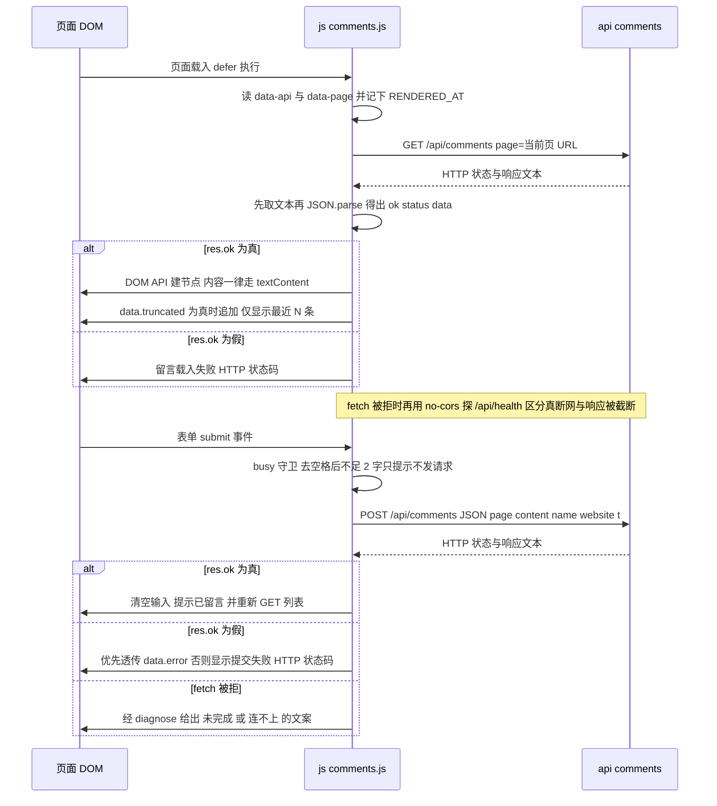
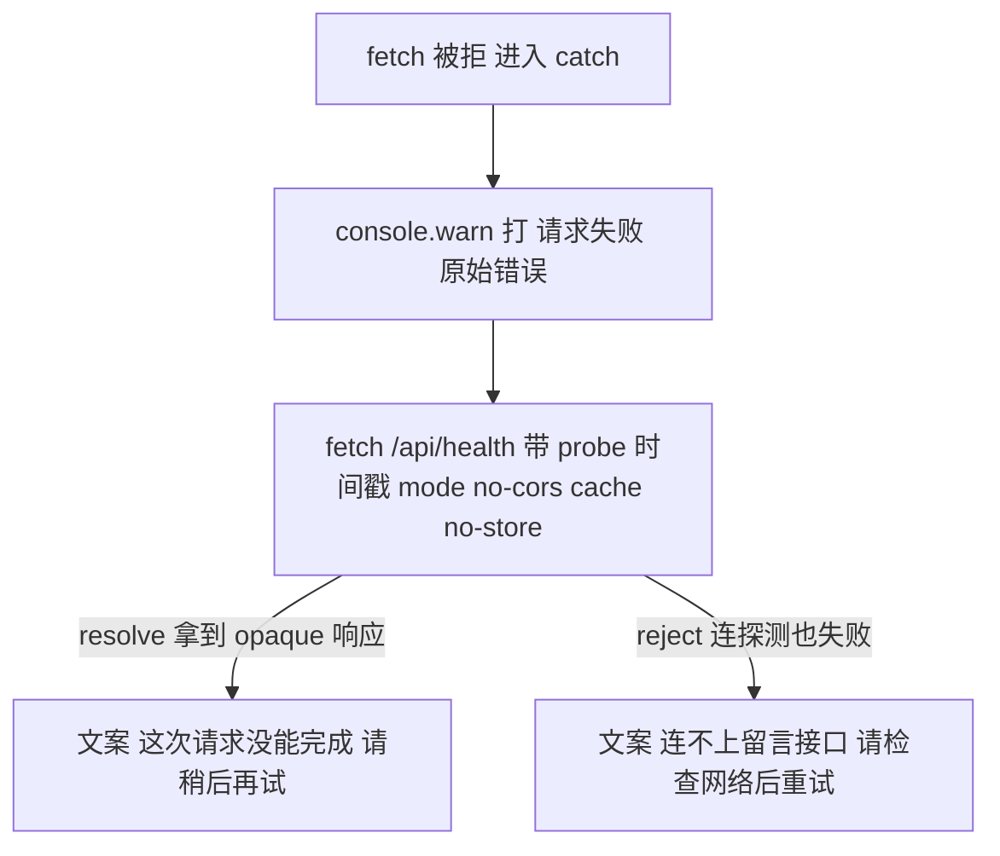

# 留言板读写往返与失败分支

留言板是整个站点唯一会向服务器**写数据**的地方，因此它也是唯一一处「前端代码的形状由另一个仓库决定」的地方——后端是一个 Cloudflare Worker，仓库在 `~/work/yujizi-comments`，**不在本仓库内**（[_config.yml](../../_config.yml) L4 是唯一的路径线索）。本页只写仓库内可验证的部分：挂载点与配置传递、两个请求的形状、渲染方式、失败分支、以及那几个「改之前必须先读懂」的反垃圾约定。

仓库内涉及的三份文件分工是固定的一句话：**结构**在 [_includes/comments.html](../../_includes/comments.html)，**行为**在 [js/comments.js](../../js/comments.js)，**样式**在 [style.css](../../style.css) 的「留言板」一节（`style.css` L313–L318 的注释就是这么写的）。没有任何构建步骤会把这三者对齐，契约靠 `id` 与类名拼写维持。

## 一次留言的完整往返



这张图说明读与写两条路径共用同一个 `readJson` 出口，以及四类结局：渲染成功、载入失败、提交成功（随后再读一次）、提交失败（后端文案或状态码）。

## 挂载点与配置传递

两个布局在正文之后各 include 一次同一个文件（[_layouts/default.html](../../_layouts/default.html) L85、[_layouts/music.html](../../_layouts/music.html) L97），所以**每一页都有留言板**，`page.url` 是它唯一的分区键。挂载点把配置作为 `data-*` 交给 JS，而不是写死在脚本里：

```html
<section class="talk" id="talk"
         data-api="{{ site.comments_api }}"
         data-page="{{ page.url | default: '/' }}"
         aria-label="留言">
```

（[_includes/comments.html](../../_includes/comments.html) L14–L17。）

| 属性 | 来源 | 消费方式 |
|---|---|---|
| `data-api` | `_config.yml` 的 `comments_api`（[_config.yml](../../_config.yml) L8） | `API = (data-api || "").replace(/\/+$/, "")`——去掉尾部斜杠当作前缀，空串表示走相对路径（`comments.js` L17） |
| `data-page` | Liquid `page.url`，取不到时回退 `'/'` | `PAGE`，既是 GET 的 `page` 参数也是 POST body 的 `page` 字段（`comments.js` L18、L126、L166） |

### 留空 = 同源，填绝对地址 = 跨域

模式由 `comments_api` **一个键**决定，当前留空，这就是生产配置：

- **留空 = 同源**：站点在 `www.yujizi.org`，Worker 用路由 `www.yujizi.org/api/*` 接管 `/api/*`，前端只走相对路径。同源不触发 OPTIONS 预检、不需要 CORS 头，中间代理也剥不掉跨域头——注释把「移动端出过的『网络异常』整类问题由此消失」写在这里（[_config.yml](../../_config.yml) L5–L6、[_includes/comments.html](../../_includes/comments.html) L5–L10、[js/comments.js](../../js/comments.js) L13–L16 三处说的是同一件事）。
- **填绝对地址**（如 `https://comments.yujizi.org`）= 回退**跨域模式**，靠后端 CORS 白名单放行，注释把它定位为「调试或换后端时可用」（[_config.yml](../../_config.yml) L7、[js/comments.js](../../js/comments.js) L16）。

因此**改这一个键就等于切换留言后端模式**，而且切到跨域后必须有人在 Cloudflare 那侧确认白名单放行了 `www.yujizi.org`：仓库内改一行、仓库外要配合的典型例子。模式与 `?v=` 的完整运维含义见 [外部依赖与服务耦合](../integrations/external-services.md)。

## 读：`GET {API}/api/comments?page=…`

```js
fetch(API + "/api/comments?page=" + encodeURIComponent(PAGE), {
  headers: { accept: "application/json" }
})
```

（[js/comments.js](../../js/comments.js) L125–L129。）响应处理只有三条判断：

1. `res.ok` 为假 → 列表区整块替换成 `留言载入失败（HTTP <status>）。`（L131–L133）；
2. 成功 → 取 `data.comments` 数组交给 `render()`（L135–L137）；
3. `data.truncated` 为真 → 在列表末尾追加一条 `.talk-note`：`仅显示最近 {list.length} 条，共 {data.total} 条。`（L139–L144）。

第 3 条是**故意不静默丢数据**的设计：源码注释记着「后端上限 200 条」，超出时前端明说，而不是让旧留言无声消失（L138）。注意提示里的两个数字来源不同——条数是**本次返回的数组长度**，总数来自 `data.total`，所以后端换上限时前端不用改。

### 渲染全程不碰 `innerHTML`

列表由 `createElement` + `textContent` 拼出来（`buildItem()` L46–L73、`render()` L75–L88、`fail()` L90–L96）。文件头的注释把这条件质写成结论：**「留言内容里的 `< > &` 不需要依赖转义正确性，从根本上没有 XSS 面」**（L1–L6）。它对改动方向有实际约束——任何时候想用 `innerHTML` 拼一条留言，都等于把这条性质从「结构性成立」降级成「依赖转义正确性」。

结构上有三处由数据决定的细节：

- **昵称**：`c.name || "无名"`，为空时给 `.talk-who` 加 `is-anon` 类，样式把匿名昵称降为浅色（`comments.js` L53–L56、`style.css` L333）。
- **时间**：既用本地格式显示（`fmtTime()`，手拼 `YYYY-MM-DD HH:MM`），又写进 `<time datetime>`，后者是 `new Date(c.created_at).toISOString()`（`comments.js` L58–L61、L38–L43）。**因此 `created_at` 必须是可被 `new Date()` 解析的时间戳**，否则这里会抛 `RangeError`。
- **换行**：正文只塞进一个 `.talk-text` 段落，靠 `white-space: pre-wrap` 保留用户输入的换行、靠 `overflow-wrap: anywhere` 防止长串撑破容器（`style.css` L338–L343）。也就是说纯文本渲染不需要把 `\n` 转成 `<br>`——这正是「不用 innerHTML」能成立的前提。

## 写：`POST {API}/api/comments`

提交路径的 body 只有五个字段（`comments.js` L162–L173）：

| 字段 | 取值 | 说明 |
|---|---|---|
| `page` | `PAGE` | 与 GET 同源的分区键 |
| `content` | `contentEl.value.trim()` | 已去首尾空白 |
| `name` | `nameEl.value.trim()` | 可空；输入框 `maxlength="20"` |
| `website` | `hpEl ? hpEl.value : ""` | 蜜罐，见下一节 |
| `t` | `RENDERED_AT` | 页面渲染时刻，见下 |

请求前的本地校验**只有一条**：`content.length < 2` 时提示「请至少写两个字。」并把焦点移回输入框，不发请求（L155–L156）。表单带 `novalidate`（[_includes/comments.html](../../_includes/comments.html) L25），所以浏览器不弹自己的校验气泡，唯一输入层限制是 textarea 的 `maxlength="500"`。`name` 没有本地校验，是否合法由后端决定。

### `busy` 守卫与按钮禁用是一个生命周期

提交开始即 `busy = true` + `submitEl.disabled = true`，两者都在**整条 promise 链的最尾部**复位（`comments.js` L158–L159、L188）。这带来一个不变式：**从点击到「成功刷新列表」或「失败文案落地」为止，按钮一直是禁用的**（`style.css` L377 给禁用态 0.5 透明度）。第二次点击会被 `if (busy) return;` 直接吞掉（L153）。

成功与失败各自做什么：

- **成功**：清空 `contentEl`、在 `#talk-msg` 写「已留言。」、然后**重新 `load()` 一次**（L181–L183）。前端不做本地插入——列表顺序、上限与截断提示全部以服务端这次返回为准。注意这是两次独立结果：如果刷新失败，`#talk-msg` 仍显示「已留言。」而列表区会变成载入失败文案，两个落点互不覆盖。
- **失败**：**优先透传后端文案**——`res.data && res.data.error` 直接用，取不到才退回 `提交失败（HTTP <status>）。`（L177–L179）。所以面向用户的具体拒收原因（含蜜罐命中、太快等）由另一个仓库决定，前端只负责别把它藏起来。

### `t`：为什么可以是「页面渲染时刻」

`RENDERED_AT = Date.now()` 在脚本执行时取一次（L30），之后不管用户停留多久，POST 都送这同一个值。注释记录了理由与边界（L28–L30）：

> 后端用它判断「提交太快 = 机器人」。页面停留很久后再发也不会被拒 —— 后端只卡下限，上限是 2 小时。

这两句的**精确阈值属于后端**，本仓库不臆测：改动 `t` 的取值口径（例如改成提交瞬间的时间戳）前，先在 `~/work/yujizi-comments` 里确认下限判定与那 2 小时上限各自怎么用。

## 蜜罐字段 `website`：诱饵与自动填充的冲突

**改这个字段名、或给它加 `autocomplete` 之前，先读完这一节。** 这是全仓库唯一一处「安全措施与可用性直接对立」的地方。

蜜罐的本质：正常用户看不见这个输入框，值**必然为空**；机器人按字段名盲填，填了就被后端拒（[_includes/comments.html](../../_includes/comments.html) L30–L31、[js/comments.js](../../js/comments.js) L169–L171）。字段名故意选 `website`——它是经典机器人的填充目标，保留它当诱饵（`comments.html` L33）。

**代价写在同一段注释里**：`website`（以及紧挨着的「网址」这个 label）**同时是浏览器与密码管理器的自动填充目标**，手机端尤其激进。一旦被自动填上，**真人提交会被后端当成机器人拒掉——一个很难自查的失败**（`comments.html` L34–L36）。所以这个字段挂齐了各家忽略标记：

```html
<input id="talk-website" name="website" type="text"
       tabindex="-1" autocomplete="off"
       data-lpignore="true" data-1p-ignore data-bwignore
       data-form-type="other" value="">
```

（[_includes/comments.html](../../_includes/comments.html) L38–L44。）逐项对应：`autocomplete="off"` 是标准属性（但部分自动填充会忽略它），`data-lpignore="true"` 是 LastPass、`data-1p-ignore` 是 1Password、`data-bwignore` 是 Bitwarden、`data-form-type="other"` 是另一个自动填充厂商的提示，`tabindex="-1"` 让它无法被键盘聚焦。旁边那个 `name` 字段则相反，明确写了 `autocomplete="nickname"`——**这是有意让自动填充去填的字段**；两个字段的自动填充策略是一对，不是随手写的。

可见性由样式负责，而且**刻意不用 `display:none`**：

```css
/* 蜜罐:对正常用户不可见。⚠️ 刻意不用 display:none —— 一部分机器人会跳过
   display:none 的字段,那样这个陷阱就白设了。移出视口更稳。 */
.talk-hp { position: absolute; left: -9999px; width: 1px; height: 1px; overflow: hidden; }
```

（[style.css](../../style.css) L379–L381。）所以「把这个容器改成 `display:none` 或 `hidden`」看起来是等价清理，实际会削弱陷阱。

三个由此推出的规矩：

1. **不要为了「更保险」把 `website` 改成别的名字。** 机器人不填的字段名同时也失去了诱饵价值；改名还得同时改 `data-*` 忽略标记、`id`（JS 依赖 `#talk-website`）与 `.talk-hp` 容器。
2. **不要删那几个 `data-*-ignore` 标记。** 它们看着像冗余，实际是防「真人被误判」的那一层；删掉后故障表现是「少数用户永远提交失败」，而不是任何报错。
3. **真人被自动填充误伤的排查指纹**：提交总失败（后端文案通常笼统），而换浏览器、或在没有密码管理器的环境下就正常；页面源码里那段注释就是为这条排查线索留的。

## 失败分支：先取文本，再决定说什么

失败处理集中在一个被两条路径共用的函数上（L98–L106）：

```js
function readJson(r) {
  return r.text().then(function (txt) {
    var data = null;
    try { data = JSON.parse(txt); } catch (e) { /* 不是 JSON，保持 null */ }
    return { ok: r.ok, status: r.status, data: data };
  });
}
```

**「先取文本再解析」不是为了兼容性，而是为了不误导排查方向**：被边缘防护拦下时返回的是 HTML 错误页，直接 `r.json()` 会抛异常，把「被拦」误报成「网络不通」（`comments.js` L98–L99）。

一个必须知道的副作用：解析失败时 `data` 为 `null`，GET 路径的 `var data = res.data || {};` 会让它退化成空对象，于是**「HTTP 200 但不是 JSON」的响应会静默渲染成空列表**（显示「还没有人留言。」），而不是报错（L135–L137）。这是这套处理里唯一安静的地方——排查「留言不见了」时要先看响应到底是不是 JSON。

### `diagnose`：fetch 被拒时的决策树



这张图说明为什么这里要**再发一次请求**：no-cors 探测能拿到 opaque 响应就证明主机可达，问题只可能在响应环节。

（[js/comments.js](../../js/comments.js) L114–L123。）

- `no-cors` 下**不读响应内容**，只判断「主机是否可达」，配合 `cache: "no-store"` 与 `?probe=<Date.now()>` 避免拿到缓存结论（L116）。
- 探测**只调 `/api/health`**，这是本仓库与后端之间除 comments 之外唯一的接口依赖。
- 注释里有一条**否定式约束**，值得原样遵守：**别在这里写「可能触发了频率限制」之类的猜测**——限流会返回正常 HTTP 响应，根本走不到这个分支，写上去只会把排查方向带偏（L112–L113，作者注明「这个错我犯过」）。同理，前端也不该把「被边缘拦下」写成「网络异常」，那正是 `?v=2` 与 `?v=4` 两次修改要修掉的东西。
- `console.warn("[talk] 请求失败：", err)` 是留给现场诊断的唯一痕迹（L115）。前端没有日志面板、没有埋点，**这条 warn 就是全部可用证据**。

### 结局对照表

| 情形 | 用户看到什么 | 落点 | 依据 |
|---|---|---|---|
| GET 非 2xx | `留言载入失败（HTTP <status>）。` | 列表区（`.talk-empty.is-error`） | L131–L133 |
| GET 200 但非 JSON | 「还没有人留言。」（静默退化为空态） | 列表区 | L100–L106、L135–L137 |
| GET `fetch` 被拒 | 「这次请求没能完成，请稍后再试。」或「连不上留言接口，请检查网络后重试。」 | 列表区 | L114–L123、L146–L148 |
| POST 非 2xx 且带 `error` | **后端原文** | `#talk-msg`（`.is-error`） | L177–L179 |
| POST 非 2xx 无 `error` | `提交失败（HTTP <status>）。` | `#talk-msg` | L178 |
| POST `fetch` 被拒 | 同上的两句诊断文案 | `#talk-msg` | L185–L187 |
| 本地校验不过 | 「请至少写两个字。」+ 焦点回到输入框 | `#talk-msg`，**不发请求** | L155–L156 |

反馈有两个固定落点，别把它们搞混：**`#talk-msg` 管提交**（`role="status"` + `aria-live="polite"`，会被读屏播报），**`#talk-list` 管载入、空态与载入失败**（`comments.html` L21–L23、L53；`comments.js` L33–L36、L75–L96）。载入失败不在 live region 里。

## 脚本与 DOM / CSS 之间的三份隐式契约

这一层没有任何机器校验，改错不报错、只是行为或外观悄悄变。三份契约分别是：

1. **`id`**：`#talk-list`、`#talk-form`、`#talk-msg`、`#talk-content`、`#talk-name`、`#talk-submit` 在顶层被直接赋值、**没有任何判空**（`comments.js` L20–L26），唯一的例外是 `#talk-website`：它只在一处被读，且写了 `hpEl ? hpEl.value : ""`（L171）。这与 [js/musicplayer.js](../../js/musicplayer.js) 的风格一致，而两个布局的内联脚本恰好相反（到处 `if (el)`）：**本文件属于「必须保证 id 存在」那一类**，改上面那六个 id 就是运行时 TypeError。
2. **类名**：JS 写死的类名是样式唯一的挂点——`talk-item` / `talk-head` / `talk-who`(+`is-anon`) / `talk-when` / `talk-text` / `talk-empty`(+`is-error`) / `talk-items` / `talk-note` / `talk-msg`(+`is-error` / `is-ok`)（`comments.js` L46–L96、L35、L141；消费方 `style.css` L319–L385）。改名即掉样式，不报错。
3. **挂载点缺失即整体退出**：`if (!mount) return;` 在最外层，之后再决定立即 `load()` 还是等 `DOMContentLoaded`（`comments.js` L10–L11、L191–L195）。脚本带 `defer`（`comments.html` L64），所以正常路径下 DOM 已就绪、走的是立即 `load()` 那一支；换 layout 或条件化 include 时，这条守卫保证不报错、但留言板也就不存在了。

样式侧只有一条硬约束，但很重要：[style.css](../../style.css) 的留言板一节**不写死任何颜色，只用 `var(--*)`**，所以昼夜主题自动跟随、不需要第二套样式（`style.css` L313–L318）。新加留言板样式时沿用同一套令牌，理由与反例见 [水墨清静设计系统与主题机制](../concepts/design-system.md)。

## 运维：版本号与两级缓存

`comments.js` 由 include 自己加载，带手工版本号：

```html
<script src="/js/comments.js?v=4" defer></script>
```

（[_includes/comments.html](../../_includes/comments.html) L64。）**改动 `comments.js` 就把它加一**，这是唯一手段：版本号不在任何 manifest 或指纹流水线里。原因写在紧邻的注释里（L56–L60）：GitHub Pages 对 js 设 `Cache-Control: max-age=600`（回访用户最多 10 分钟还在跑旧代码），Cloudflare 还会把静态资源缓存约 4 小时（部署后要清一次缓存，脚本在 `~/work/yujizi-comments/deploy.sh`）。

注释里保留着这个版本号的演进史，是理解当前失败处理为什么会写成这样的最短路径：

| 版本 | 改了什么 |
|---|---|
| v2 | 错误处理区分「断网」与「被边缘拦下」，并解析非 JSON 响应 |
| v3 | 改为同源调用（`data-api` 留空），彻底不再涉及 CORS |
| v4 | 修掉误导性的报错文案，失败时打 `console.warn` 便于定位 |

两级缓存的实际行为与 `?v=` 快照见 [静态资源、音频资产与缓存击穿约定](../operations/assets-and-cache-busting.md)。

## 改动速查

| 你想改 | 落点 | 必须同时做的事 |
|---|---|---|
| 留言后端模式 | [_config.yml](../../_config.yml) L8 的 `comments_api` | 填绝对地址 = 跨域，需后端白名单配合；前端代码不用动 |
| 接口路径或字段名 | [js/comments.js](../../js/comments.js) L126、L162–L173 | 与 `~/work/yujizi-comments` 同步改，并 bump `?v=` |
| 蜜罐字段名 / 自动填充标记 | [_includes/comments.html](../../_includes/comments.html) L38–L44 | 先读本页「蜜罐」一节；同时改 `#talk-website`（JS 依赖）与 `.talk-hp`（样式依赖） |
| 载入失败 / 提交失败文案 | [js/comments.js](../../js/comments.js) L90–L96、L114–L123、L132、L178 | **不要加「可能触发限流」这类猜测**；保持后端 `error` 文案透传；bump `?v=` |
| 留言条目结构或类名 | [js/comments.js](../../js/comments.js) L46–L96 | 同步改 [style.css](../../style.css) L319–L385；保留 `textContent`（不用 `innerHTML`）；bump `?v=` |
| 留言板样式 | [style.css](../../style.css) L313–L390 | 只用 `var(--*)` 令牌，否则暗色主题不跟随 |
| 列表截断行为 | [js/comments.js](../../js/comments.js) L139–L144 | 数字口径是「本次数组长度 + `data.total`」；上限归后端，前端不要写死 200 |

验证方法要注意一点：本仓库**没有测试框架，也没有针对留言板的本地装置**——[local-test.html](../../local-test.html) 只复刻播放器结构、不加载 `comments.js`，而留言板必须靠 `/api/*` 与真实后端配合。所以留言板的改动只能在真页上验证（生产同源模式下就是打开 `www.yujizi.org` 任意页面），并且**先把 `?v=` bump 掉**，否则你验证的不是你改的那份文件。仓库级的验证纪律见 [验证与复现手册](../testing/verification-playbook.md)。

## 相关页面

- [站点构建、布局装配与部署形态](../architecture/site-build-and-deploy.md) —— `` 在装配路径中的位置、`data-api` / `data-page` 的上游
- [外部依赖与服务耦合](../integrations/external-services.md) —— 留言后端契约、同源/跨域两种模式与 Cloudflare 路由
- [水墨清静设计系统与主题机制](../concepts/design-system.md) —— 留言板样式所依赖的令牌化样式规则
- [静态资源、音频资产与缓存击穿约定](../operations/assets-and-cache-busting.md) —— `?v=4` 的两级缓存含义与运维动作
- [验证与复现手册](../testing/verification-playbook.md) —— 无测试框架下的验证纪律与「保留完整失败输出」
