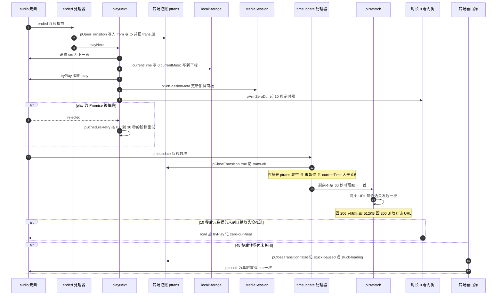
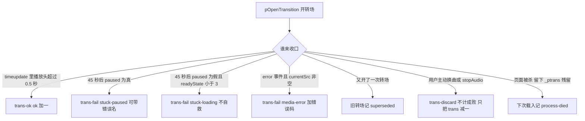

# 连续播放转场全流程（含预取与时长 0 看门狗）

「连续播放」模式下的一次**转场**，指的是从一首音频触发 `ended` 到下一首真的出声（或确认没出声）这一段过程。它由三个事件与三条计时线串起来：`ended` 里开一个转场句柄（`ptrans`）并换 `src`，`timeupdate` 用「播放头是否真的往前走了」裁定成功，`error` 事件是第三条失败出口，**45 秒看门狗**（挂在 10 秒 interval 上）与 **10 秒「时长 0」看门狗**（自带定时器）分别在两条完全不同的卡死形态上兜底，`play()` 的拒绝则走进一个 0.6 秒起的重试阶梯；而为了让这次切换「有东西可切」，播放剩余不足 60 秒时会用一次 `Range` 请求把下一首的头部 512KB 拉进缓存。

所有代码都在 [js/musicplayer.js](../../js/musicplayer.js) 一个文件里，没有任何启动入口函数——这条链是**被事件驱动的**。状态语义（`pPlayIntent`、`pExpectedPause` 等）见 [播放器状态机](../concepts/player-state-machine.md)；本页只讲这条链本身。

## 参与者与各自的真值来源

| 参与者 | 在转场里负责什么 | 位置 |
|---|---|---|
| `#music-select` 下拉框 | 当前曲目的真值来源（`parseInt(musicSelect.value)`），也是预取目标的基数；`playNext` 会改写它 | L82、L117、L121；[_layouts/music.html](../../_layouts/music.html) L59–L61 |
| `<audio id="music-player">` | 唯一被播的元素；`src` / `play()` / `load()` / `currentTime` / `readyState` / `duration` 都从它读 | [_layouts/music.html](../../_layouts/music.html) L84（`preload="metadata"`） |
| `#play-mode` | 决定 `ended` 走哪条分支：`continuous` / `loop` / `stop-after` | [_layouts/music.html](../../_layouts/music.html) L64–L70；L157–L173 |
| `ptrans` | 进行中的转场句柄 `{start, from, to}`；只在转场期间存在，并被持久化到 `<pageid>_ptrans` | L320、L368–L400 |
| `pstats` | `trans` / `ok` / `fail` / `reasons` 计数——**这是转场成败唯一可观测的出口** | L319、L378–L392 |
| `pPlayIntent` | 所有自愈通道的第一步守卫；换曲时必须为真 | L123、L422、L508、L535 |
| `pZeroDur` | 「时长 0」看门狗 `{timer, idx, at}` | L335、L491–L525 |
| `pPrefetched` / `pPrefetchGivenUp` | 预取的粘性去重集合与「本次会话放弃」集合（**只在内存里，刷新即清**） | L330–L331、L454 |
| `pPlayId` / `pRetry` | 让被换曲作废的旧 `play()` 拒绝不打扰新一次尝试 | L325–L326、L403–L434 |

持久化键的完整语义见 [播放记忆与黑匣子日志](../concepts/player-persistence-and-diagnostics.md)；本页只用到 `<pageid>_currentMusic`、`_currentTime`、`_ptrans` 三个。

## 端到端时序



上图是一次连续播放转场的参与者与顺序：`ended` 先开转场再换曲，成功裁定发生在 `timeupdate`，两条看门狗分别以 10 秒与 45 秒为界，预取则搭在同一个 `timeupdate` 处理器的尾部。

## 第一步：`ended` 如何分流

```js
musicPlayer.addEventListener('ended', () => {
  plog('ended');
  if (isLoopMode) {
    musicPlayer.currentTime = 0;
    pPlayIntent = true;
    tryPlay('loop');
  } else {
    // 连续播放:开一个转场,后续靠 timeupdate/看门狗裁定成败
    if (playModeSelect.value !== 'stop-after') {
      var pFrom = parseInt(musicSelect.value);
      var pTo = (pFrom + 1 >= musicList.length) ? 0 : pFrom + 1;
      pOpenTransition(pFrom, pTo);
    }
    playNext();
  }
});
```

（[js/musicplayer.js](../../js/musicplayer.js) L157–L173。）

| 模式 | `ended` 时的分支 | 是否开转场 |
|---|---|---|
| `continuous` | `isLoopMode` 为假、`value !== 'stop-after'` → 先 `pOpenTransition` 再 `playNext()` | **是** |
| `loop` | `currentTime = 0` + `pPlayIntent = true` + `tryPlay('loop')`，**不换曲** | 否 |
| `stop-after` | 直接 `playNext()`（不起转场），随后被 `playNext` 内部的 `stopAudio('stop-after')` 停掉 | 否 |

三条容易踩坏的契约：

1. **转场只覆盖「换了一首还在等它播起来」这件事。** `loop` 与 `stop-after` 都不开转场，所以 `pstats.trans` 统计的是**曲目切换次数**，不是「播完次数」。`stop-after` 的终态是「`src` 已指向下一首、播放头在开头、`pPlayIntent` 为假」，见下节。
2. **`pFrom` / `pTo` 只是记账标签。** 真正被选中的曲目由 `playNext()` 自己重算的 `nextIndex` 决定（L117–L121），两处用的是同一个公式（含末尾回绕到 `0`）但**是两份独立代码**。日志里 `trans-open 1->2` 的 `to` 来自这里的 `pTo`，而实际生效的是 `playNext` 里那个值——改其中一处而不改另一处，日志就会开始骗人。
3. **`playModeSelect.value` 才是模式真值，`isLoopMode` 只是缓存位。** 它在 [_layouts/music.html](../../_layouts/music.html) L65–L69 渲染、只在 `change` 处理器里同步（L150–L155），初值是 `false`。因此布局里 `selected` 必须留在 `continuous`：改成 `loop` 会导致载入后既无 `change` 事件、`isLoopMode` 又为 `false`，`ended` 就走进连续播放分支，表现为「单曲循环模式下它自己换曲了」。

## 第二步：`playNext()` 的六件事，顺序即契约

```js
function playNext() {
  let nextIndex = parseInt(musicSelect.value) + 1;
  if (nextIndex >= musicList.length) nextIndex = 0;
  musicSelect.value = nextIndex;
  const nextMusic = musicList[nextIndex];
  pPlayIntent = true;
  pErrHeal = 0;
  musicPlayer.src = nextMusic.url;
  tryPlay('next');
  pSetSessionMeta(nextMusic.name);
  pArmZeroDur(nextIndex);   // 换曲后开「时长 0 看门狗」:10 秒后元数据还没到就重载

  musicDownload.href = nextMusic.url;
  musicDownload.download = nextMusic.name;

  localStorage.setItem(`${pageid}_currentMusic`, nextIndex);
  localStorage.setItem(`${pageid}_currentTime`, 0);

  if (playModeSelect.value === 'stop-after') {
    stopAudio('stop-after');
    return;
  }
}
```

（[js/musicplayer.js](../../js/musicplayer.js) L116–L144。）这个同步函数体一次做完六件事：

1. **推进下标并回绕**（`nextIndex >= musicList.length` → `0`），写回下拉框；
2. **置 `pPlayIntent = true` 并清零 `pErrHeal`**——新的一首重新获得两次媒体错误自救额度；
3. **换 `src`**，然后 `tryPlay('next')`：`play()` 的 Promise 被拒绝会进入 0.6s/2s/5s/10s/20s/30s 的阶梯重试（L403–L434）；
4. **`pSetSessionMeta`** 把曲名写进锁屏/通知栏面板；
5. **`pArmZeroDur`** 起 10 秒「时长 0」看门狗（见下文）；
6. **写两个记忆键**：`_currentMusic` 写新下标、**`_currentTime` 写 `0`**。

第 6 条的「写 `0`」是**成功判据能够成立的前提**，不是顺手清理：`loadedmetadata` 会从 `_currentTime` 恢复播放头（L89–L95）。如果换曲时残留着上一首的秒数，一次根本没出声的加载会因为 `currentTime` 落在 0.5 秒以上而被误判为转场成功。`playNext` 的整个函数体是同步执行的，所以这两行必早于浏览器随后派发的任何事件。**把 `_currentTime` 的写入挪到异步回调里，就会破坏这条判据。**

`stop-after` 那条分支是「先起播、立刻停」：`pPlayIntent = true`（L123）与 `tryPlay('next')`（L126）先执行，随后才 `stopAudio('stop-after')`（L139–L141）。所以这个模式的终态是「`src` 指向下一首、播放头在 0、意图为假」，用户下一次按播放接到的是下一首而不是刚播完的那一首——这是有意的，但任何重排 `playNext` 顺序的重构都会把它改成「回到当前曲目重播」。

## 第三步：成功判据是「播放头推进超过 0.5 秒」

```js
musicPlayer.addEventListener('timeupdate', () => {
  // 转场成功判定:新曲目实际推进了播放头
  if (ptrans && !musicPlayer.paused && musicPlayer.currentTime > 0.5) {
    pCloseTransition(true);
  }
  localStorage.setItem(`${pageid}_currentTime`, musicPlayer.currentTime);
  updateRemainTime();
  ...
});
```

（[js/musicplayer.js](../../js/musicplayer.js) L66–L87。）

| 看起来像证据的东西 | 为什么不算 |
|---|---|
| `playing` 事件 | 代码只让它做另一件事——清零重试阶梯（L577–L583），**从不参与转场裁定**；也就是说它没有被当作证据使用 |
| `play()` 的 Promise resolve | 只代表「元素接受了播放请求」。生产实测的卡死形态正是 `paused = false` + `readyState 0` + `duration NaN`，即 resolve 之后一个字节都没到 |
| `musicPlayer.paused === false` | 同一个反转：系统暂停、播不出来的形态都可能 `paused` 为假 |
| **`currentTime > 0.5`** | 唯一被信任的证据：播放头必须真的往前走过 |

这个判据是**轮询式**的：`timeupdate` 在播放期间每秒派发数次（代码注释的说法是「每秒触发数次」），所以转场成功的最坏感知延迟就是一个 `timeupdate` 周期。它同时也是转场唯一的**成功**出口——其余三个出口（45 秒看门狗、媒体错误、被新转场顶替）都是失败或撤销，见下表。

## 预取：剩余不足 60 秒时只取头部 512KB

```js
var P_PREFETCH_MAX = 512 * 1024;   // 预取上限 512KB:够暖元数据缓存,又不抢带宽
var P_PREFETCH_LEAD = 60;          // 剩余不足 60 秒才预取下一首
```

（[js/musicplayer.js](../../js/musicplayer.js) L9–L10。）触发点在同一个 `timeupdate` 处理器尾部：

```js
if (isFinite(musicPlayer.duration) && musicPlayer.duration > 0
  && musicPlayer.duration - musicPlayer.currentTime < P_PREFETCH_LEAD) {
  let nextMusicIndex = parseInt(musicSelect.value) + 1;
  if (nextMusicIndex < musicList.length) {
    pPrefetch(musicList[nextMusicIndex].url);
  }
}
```

（[js/musicplayer.js](../../js/musicplayer.js) L80–L86。）

### 两个常量为什么是这两个值

| 常量 | 当前值 | 取值理由（源码注释里的原始论证） | 改动的后果 |
|---|---|---|---|
| `P_PREFETCH_MAX` | `512 * 1024`（512KB） | 「够暖元数据缓存，又不抢带宽」 | 调大 = 与 `<audio>` 抢更多带宽，可能重现「转场后卡在开头」；调小到读不出头部就没意义 |
| `P_PREFETCH_LEAD` | `60`（秒） | 2026-09-29 从 300 秒收紧到 60 秒。太早没有价值：这批 mp3 单个 **66~88MB**，提前 5 分钟预取意味着**转场前 5 分钟就在抢带宽**，反而拖慢当前这一首 | 调回 300 = 把老毛病请回来；调得比一次预取所需更短（1 分钟足够 512KB 跑完）则可能来不及预热 |

**改这两个常量时的影响面不只在一个时间点，而在「检查被调用的频率」上。** 这个 `if` 处在 `timeupdate` 处理器里，而 `timeupdate` 每秒派发数次——也就是说守卫条件每秒被评估数次。真正只发一次请求靠的是 `pPrefetch()` 内部的**粘性去重**，而不是这个 `if`。任何让去重失效的改动（例如允许对同一 URL 重试）都会立刻把「预取抢带宽」放大成「每秒数次重复请求」：源码注释记录过这个真实事故——早先在 200 分支上写 `pPrefetched[url] = false` 想「下次还能重试」，结果实测**8 秒内打了 25 次 Range 请求**。这也是为什么这条链的守卫既在 `timeupdate` 里、又在 `pPrefetch` 里，两层都不能删。

### Range 探测：206 才继续，200 就放弃整个会话

```js
function pPrefetch(url) {
  if (pPrefetched[url] || pPrefetchGivenUp[url]) return;
  pPrefetched[url] = true;
  plog('prefetch-start', ...);
  fetch(url, { headers: { Range: 'bytes=0-' + (P_PREFETCH_MAX - 1) } })
    .then(function (res) {
      if (res.status !== 206) {
        plog('prefetch-skip', 'http ' + res.status + '(no range) 本次会话不再重试');
        pPrefetchGivenUp[url] = true;
        if (res.body) res.body.cancel();
        return;
      }
      plog('prefetch-done', res.headers.get('content-range') || '');
      if (res.body) res.body.cancel();   // 数据已在缓存里,不必在 JS 里过一遍
    }).catch(function (e) { plog('prefetch-fail', e.name); });
}
```

（[js/musicplayer.js](../../js/musicplayer.js) L446–L474。）

| 响应 | 处理 | 日志 | 后续 |
|---|---|---|---|
| **206**（服务端认了 Range） | 头部数据已进缓存，`res.body.cancel()` 不再在 JS 里过一遍数据 | `prefetch-done` + `content-range` | 本次会话不再对该 URL 发起第二次 |
| **非 206**（典型是 200：服务端无视 Range、准备把整个 66~88MB 灌回来） | 立刻 `cancel()`，并把 URL 记进 `pPrefetchGivenUp` | `prefetch-skip` | **整个会话都不再试该 URL** |
| 网络层失败 | 记一笔，`pPrefetched[url]` 保持为真不释放 | `prefetch-fail` | 弱网下不反复打同一地址；等下一轮换曲自然重来 |

这里的「支持 Range」是**功能开关而不是优化项**：服务端不支持时预取整体退化成 2026-09-27 之前的行为（没有预取）。改动 CDN 缓存规则或源站响应行为时要先确认这条依赖，见 [静态资源、音频资产与缓存击穿约定](../operations/assets-and-cache-busting.md)。

### 预取触发条件里的三个隐性限制

由 L80–L86 的写法直接推出，改这部分前必须知道：

1. **必须已经拿到元数据。** `isFinite(duration) && duration > 0` 是前置条件——`preload="metadata"`（[_layouts/music.html](../../_layouts/music.html) L84）负责尽早给出 `duration`；元数据没到就不会预取（但那时「剩余」也还没显示，见 [定时关闭与「剩余」时间显示](./timed-stop-and-remaining-time.md)）。
2. **只预取「下拉框下标 + 1」那一首，不回绕。** `nextMusicIndex < musicList.length` 这个守卫意味着**最后一首播完时不会预取**，而 `playNext()` 恰好会在那时回绕到第 0 首。也就是说「末首 → 首曲」是唯一一类**没有预取保障**的转场。
3. **只在 `timeupdate` 里触发。** 播放完全卡住（`timeupdate` 不再派发）时预取也随之停止；反过来说，只要在播，剩余进入 60 秒后的第一次 `timeupdate` 就会评估这个条件。

## 10 秒「时长 0」看门狗

```js
function pArmZeroDur(idx) {
  window.clearTimeout(pZeroDur.timer);
  // ⚠️ 必须归一成数字。下拉框 change 事件里 selectedIndex 是字符串("1"),
  // 而下面 pCheckZeroDur 拿它跟 parseInt(musicSelect.value)(数字)比 !==,
  // 类型不一致会让守卫永远成立 → 自救一次都不触发(测试实测日志为空)。
  pZeroDur.idx = parseInt(idx, 10);
  pZeroDur.at = Date.now();
  pZeroDur.timer = setTimeout(function () { pCheckZeroDur(); }, 10000);
}
```

（[js/musicplayer.js](../../js/musicplayer.js) L491–L499。）它是**换曲路径的产物**，由两处调用：`playNext()`（L128）与选曲 `change` 处理器（L45）——手动选曲同样可能撞上「时长 0」。`pCheckZeroDur()`（L500–L525）的守卫逐条是：

| # | 必须成立的守卫 | 不成立时的行为 |
|---|---|---|
| ① | `pZeroDur.idx === parseInt(musicSelect.value)`（仍是同一首） | 已被后续换曲覆盖 → 本次任务作废（旧定时器由下一次 `pArmZeroDur` 的 `clearTimeout` 失效） |
| ② | `!isFinite(duration) \|\| duration <= 0`（元数据**还没**到） | 元数据到了 → 无事，不重载 |
| ③ | `currentTime <= 0.5`（播放头**没**推进） | 在推进 → 只是慢加载，别去打断它 |
| ④ | `pPlayIntent` | 无播放意图（主动暂停/定时已到/换了别的曲子）→ 记 `zero-dur-skip` 并退出 |
| ⑤ | 定时未到（`theTime` 为空或未到期） | 定时已到 → 记 `zero-dur-skip` 并退出 |
| ⑥ | `playModeSelect.value === 'continuous'` | 非连续播放 → 记 `zero-dur-skip` 并退出（`loop` / `stop-after` 不适用） |

六个条件全成立才自救：`pstats.zeroDur++`、`psave()`、`plog('zero-dur-heal', ...)`，然后 `musicPlayer.load()`（丢掉半截的缓冲，重新按 Range 拉）加 `tryPlay('zero-dur-heal')`。

三条必须一起读的语义：

- **它不看 `ptrans`、也不看 `paused`。** 定语就是「我刚换到这一首，10 秒后元数据还没到」。成功判据里 `paused` 那一条在这里被刻意排除：2026-09-29 生产实测的卡死时刻是 `paused = FALSE`（`play()` 早已 resolve）+ `readyState 0` + `duration NaN`，早先一版写成 `if (!musicPlayer.paused) return;` 的守卫恰好把真实故障整个跳过（注释在 L512–L516）。
- **它的产物是一次保底自救，不是一次转场失败。** `pCheckZeroDur` 完全不碰 `ptrans`：如果转场还开着，救活之后照样由 `timeupdate` 把它关成 `trans-ok`。统计上它走的是独立的 `pstats.zeroDur` 计数器与 `zero-dur-heal` 日志事件，**不进 `pstats.reasons`**。
- **`pZeroDur.idx` 必须归一成数字。** 选曲处理器传进来的是 `e.target.value`（字符串 `"1"`），而守卫用的是 `pZeroDur.idx !== parseInt(musicSelect.value)`（数字）。类型不一致时 `!==` 恒为真，守卫第一条就返回，**一次自救都不会触发，而且日志是空的**（L493–L496、L502）。

`stopAudio()` 会显式 `clearTimeout(pZeroDur.timer)` 并把 `idx` 复位成 `-1`（L240–L241），所以「定时到点停播」不会再被这条看门狗复活。

## 45 秒看门狗：`stuck-paused` 与 `stuck-loading`

```js
function pWatchdog() {
  // 「时长 0」看门狗不依赖 ptrans,独立于 45 秒阈值,靠自己的 10 秒定时器
  if (ptrans && Date.now() - ptrans.start > 45000) {
    if (musicPlayer.paused) {
      var pReason = 'stuck-paused' + (plastErr ? ':' + plastErr : '');
      pCloseTransition(false, pReason);
      if (pPlayIntent && !pHealDone) {
        pHealDone = true;
        plog('watchdog-heal', '重载 src');
        var pUrl = musicList[parseInt(musicSelect.value)] && musicList[parseInt(musicSelect.value)].url;
        if (pUrl) { musicPlayer.src = pUrl; tryPlay('watchdog-heal'); }
      }
    } else if (musicPlayer.readyState < 3) {
      pCloseTransition(false, 'stuck-loading');
    }
  }
}
```

（[js/musicplayer.js](../../js/musicplayer.js) L527–L545。）

| 分支 | 守卫 | 记账 | 是否自救 |
|---|---|---|---|
| 卡在暂停 | 45 秒后 `musicPlayer.paused` 为真 | `stuck-paused`，或 `stuck-paused:<plastErr>`（例如 `stuck-paused:NotAllowedError`） | **救一次**：`pHealDone` 保证每次转场只重载一次 `src` 并 `tryPlay('watchdog-heal')` |
| 卡在加载 | 45 秒后 `paused` 为假且 `readyState < 3` | `stuck-loading` | **不自救**，而且会把 `ptrans` 关成 `null` |

`pHealDone` 在 `pOpenTransition` 里复位（L373），所以「每次转场一次」。45 秒的起点是 `ended` 那一刻的 `ptrans.start`，因此这个窗口包含换 `src`、`play()` 被拒绝后的重试阶梯、以及网络首字节时间。

### `pWatchdog()` 没有自己的定时器

它被挂在 `updateRemainTime()` 的最后一行（L223），而 `updateRemainTime()` 的调用方是 `timeupdate`、`pause` 处理器、播放模式 `change` 处理器和那个 **10 秒 interval**（L182）。于是：

- 播放正常时，看门狗每 250ms 左右被叫一次；
- **播放完全卡死时（`timeupdate` 不再派发）只剩 10 秒 interval 这条命脉。**

把 `pWatchdog()` 从 `updateRemainTime()` 里摘出来、或者删掉那个 10 秒 interval，45 秒看门狗在真实故障里就会失去触发机会。

### `stuck-loading` 那条分支为什么治不了「时长 0」

这正是两个看门狗必须同时存在的理由：真实故障的状态是 `paused = false` + `readyState 0`，于是 45 秒看门狗只走 `else if` 分支记一笔 `stuck-loading` 并把 `ptrans` 关成 `null`——**之后 `ptrans` 条件不再成立，再没有任何代码会回头看它**。所以「时长 0」看门狗必须存在，且必须不看 `ptrans`、不看 `paused`（源码注释 L476–L484 记的就是这条漏网路径）。

## 失败原因分类表

`pCloseTransition(false, reason)` 会把原因累加进 `pstats.reasons[reason]` 并写一条 `trans-fail from->to <reason> <dur>ms` 日志；`plogCopy()` 的 `stats.reasons` 就是这张表（[js/musicplayer.js](../../js/musicplayer.js) L378–L392）。



上图是转场的七个收口出口：一个成功、四个失败原因、一个撤销、一个跨会话的补记。

| `reasons` 取值 | 产生位置 | 含义 | 是否自救 | 对应日志 |
|---|---|---|---|---|
| （无，成功） | L68–L70 → L378–L383 | 播放头推进超过 0.5 秒 | — | `trans-ok from->to <dur>ms` |
| `stuck-paused` / `stuck-paused:<错误名>` | L530–L534 | 45 秒后仍处于暂停 | 重载 `src` 一次 | `trans-fail` + `watchdog-heal` |
| `stuck-loading` | L541–L543 | 45 秒后 `paused` 为假但 `readyState < 3` | **不自救** | `trans-fail` |
| `media-error-<code>` | L613–L618（`error` 事件且 `currentSrc` 非空） | 媒体元素报错，`code` 是 `MediaError.code` | 由 `error` 处理器另走 `error-heal`（每曲最多 2 次） | `media-error` + `trans-fail` |
| `superseded` | L369（`pOpenTransition` 第一行） | 上一个转场还没关就开了新的，按失败结算 | — | `trans-fail ... superseded` |
| `process-died` | L663–L674（载入时发现残留的 `<pageid>_ptrans`） | 上次会话死在转场进行中：转场打开时被持久化，收口时才删除 | — | `trans-fail ... process-died(载入时发现未完成转场)` |
| （撤销，不计成败） | L395–L400、L37、L242 | 用户主动换曲（`user-select`）或 `stopAudio`（`stopped-by-<reason>`）；`pstats.trans--`，**不写 ok/fail** | — | `trans-discard` |

相关计数器与它们的关系（初值见 L319）：

| 字段 | 含义 | 与转场的关系 |
|---|---|---|
| `trans` | 开启过的转场数（用户主动换曲/停止会撤销） | `ok + fail` 与它并不恒等，因为撤销会减一 |
| `ok` / `fail` | 转场成功 / 失败次数 | 只有这两个才计入成败 |
| `reasons` | 上表的失败原因计数表 | 只统计失败，成功不进表 |
| `zeroDur` | 「时长 0」看门狗实际重载自救的次数 | **独立于转场成败**；一次自救之后转场往往会被记成 `trans-ok` |
| `oddPause` / `earlyTimer` | 定时生效期间的无法归因暂停 / 定时提前 60 秒以上触发 | 与转场同一场排障里一起读，见 [失败恢复与自愈路径](./playback-recovery-and-selfhealing.md) |

**「`trans-fail` 的 reasons」与 `zero-dur-heal` 是两个不同的记账面。** `stuck-paused` / `stuck-loading` / `media-error-<code>` / `superseded` / `process-died` 都由 `pCloseTransition(false, …)` 写进 `pstats.reasons`，并且都伴随一条 `trans-fail` 日志；而 `zero-dur-heal` **不是失败原因**，它是独立的 `pstats.zeroDur` 计数器加一条同名日志事件，触发时 `ptrans` 可以原封不动地继续开着，救活之后照样被记成 `trans-ok`。排障时两者要分开看：`reasons` 里有 `stuck-loading` 说明转场被 45 秒看门狗判死，`zeroDur` 增长说明 10 秒元数据看门狗真的动手重载过。

两点读表纪律：计数是**跨会话累计**的（载入时 `Object.assign` 合并，L339–L341），`?fast=N` 复现前应先 `plogReset()` 清零；`_ptrans` 的残留是**启发式**——正常关页面时恰好处于转场中也会得到 `process-died`，它证明的是「上次没走完收尾」，不是「系统杀了进程」。详见 [播放记忆与黑匣子日志](../concepts/player-persistence-and-diagnostics.md)。

## 两个已定位故障的因果链

### 故障 A：预取抢带宽 → 转场后冻在下一首开头 + 时长显示 0 秒

| 环节 | 内容 |
|---|---|
| 症状 | 连续播放切到下一首，卡在开头不动，界面时长显示 **0 秒**（`readyState 0` / `duration NaN`） |
| 起因 | 原 `pPrefetch()` 用 `fetch()` 把**整个文件**读完 |
| 机制 | 这批 mp3 单个 **66~88MB**，预取实测抢走约 90MB 带宽 → 真正的 `<audio>` 元素拿不到首字节 |
| A/B 实测 | 预取照常：平均出声 **14331ms**、**42/130** 采样点时长读不出；掐断预取：平均 **334ms**、**2/130**。「同样的转场次数，成败差别只在这一条」 |
| 修法 | 只取头部 512KB 的 `Range` 请求暖缓存，`P_PREFETCH_LEAD` 同时从 300 秒收到 60 秒（早先 5 分钟的提前量等于转场前 5 分钟就在抢带宽） |
| 保留的降级 | 服务端不支持 Range（回 200）→ 放弃预取，退化成 2026-09-27 之前的行为 |

源码注释把最后一点写成明确取舍：换曲真正常见的慢点（m4a 索引表在文件尾）交给播放器自己按 Range 拉，「那本来就是它该做的」（[js/musicplayer.js](../../js/musicplayer.js) L436–L445）。提交链把这一条标为**必要**（`26e3d47`，见 [docs/播放器息屏播放-已验证版本.md](../../docs/播放器息屏播放-已验证版本.md) L29）。

### 故障 B：`paused = false` 让「时长 0」漏过了 45 秒看门狗

| 环节 | 内容 |
|---|---|
| 症状 | 同上（卡在下一首开头、时长 0），但预取已经是 512KB 版本 |
| 真实状态 | `paused = FALSE`（`play()` 早已 resolve）+ `readyState 0` + `duration NaN` |
| 机制 | `pWatchdog()` 只在 `paused` 为真时才自救；`paused` 为假时只走 `else if (readyState < 3)` 记一笔 `stuck-loading` 并**把 `ptrans` 关成 `null`**，此后没有任何代码回看（L476–L484） |
| 修法 | 加独立的 10 秒「时长 0」看门狗：不看 `ptrans`、不看 `paused`，只看「刚换到这一首、10 秒后元数据还没到、播放头没推进」 |
| 同源教训 | 一个更早的守卫写成 `if (!musicPlayer.paused) return;`——真实故障正好落进「已在播放」分支被整个跳过，**一次自救都不触发**（L512–L516）。正确判据是「有没有拿到元数据」与「播放头有没有动过」 |
| 提交链位置 | 标为**保险**（`a71f898`） |

两个故障共同解释了本页为什么同时需要「一个成功判据 + 两条看门狗 + 一次 Range 预取」：它们分别覆盖「有没有真的出声」「卡住的是数据还是暂停」「出声之前的等待能不能缩短」。

## 观测与复现

| 手段 | 用法 | 能确认什么 |
|---|---|---|
| `?debug` 面板 | `?debug` 打开，2 秒重绘 | `【转场】共 N 次 \| 成功 N \| 失败 N`、`【失败原因】` 分布、进行中转场已持续几秒、最后 12 条日志（L679–L735） |
| `plogCopy()` | 面板上的「复制日志」 | 取原始 JSON：`rs`（`readyState`）**只在这里**，面板行不带（L693–L699、L720–L722） |
| `plogReset()` | 面板上的「清零」 | 清掉跨会话累计的 `trans/ok/fail/reasons`，再复现；不清 `_currentMusic` / `_currentTime`（L700–L710） |
| `?fast=N` | 例如 `?fast=20` | 在 `playing` 里把播放头跳到「结尾前 N 秒」，**每首一次**（`pFastSeeked` 在 `loadstart` 复位），从而高频制造真实转场（L312–L313、L584–L596） |

要盯的日志事件依次是：`ended` → `trans-open f->t` → `play-call next` → （可能 `play-rejected` / `retry-N:next`）→（可能 `prefetch-start` / `prefetch-done` / `prefetch-skip`）→ `trans-ok f->t <dur>ms`；失败侧看 `trans-fail f->t <reason> <dur>ms`（`stuck-loading` 这类原因名只出现在这一条的 `d` 里，不是独立事件）、`watchdog-heal`、`zero-dur-heal`、`trans-discard`。`?fast=0`、`?fast`、`?fast=abc` 都等于 20，只有不带 `fast` 参数才关闭。完整证据标准见 [验证与复现手册](../testing/verification-playbook.md)。

## 改这一层的检查清单

1. **动 `P_PREFETCH_MAX` / `P_PREFETCH_LEAD` 之前先想 `timeupdate` 的频率。** 守卫每秒被评估数次，真正的保护是 `pPrefetch()` 里的粘性去重；别在任何分支上把「已发起的 URL」重新变成可重试。
2. **别解开成功判据的两个前提**：判据读的是 `currentTime > 0.5`，而它成立依赖 `playNext()` 在同步体内把 `_currentTime` 写 `0`（此前 `loadedmetadata` 会恢复旧秒数）。
3. **新增任何「开转场」的地方，必须同时想好谁来关它**，否则 `<pageid>_ptrans` 会残留，下次载入被记成一次 `process-died`。已有的收口点就是上面失败分类表里的那几条：`timeupdate` 成功、45 秒看门狗的两个分支、媒体错误、以及用户操作触发的 `pDiscardTransition`。
4. **两条看门狗的分工不能合并。** 45 秒看门狗要求 `paused` 为真，在 `paused=false` 的卡死形态上是空转的；「时长 0」看门狗刻意不看 `ptrans`、不看 `paused`。任何「统一成一个看门狗」的重构都会把故障 B 重新放出来。
5. **别把 `pWatchdog()` 从 `updateRemainTime()` 里摘出来**，也别删 10 秒 interval——那是播放完全卡死时它唯一的触发机会。
6. **`pFrom` / `pTo` 与 `playNext()` 的 `nextIndex` 是两份重复的取模逻辑**，改回绕规则时两处都要改；否则日志里的 `from->to` 与实际播放的曲目不再对应。
7. **改 `js/musicplayer.js` 就 bump [_layouts/music.html](../../_layouts/music.html) L119 的 `?v=` 并补一行 `vN：…` 日志**（当前是 `v4`：加「时长 0」看门狗；`v3` 是预取改 512KB）。不 bump 就上真机，回访用户可能还在跑旧代码，你验证的就不是你改的那份文件。
8. **预取依赖服务端支持 `Range`。** 改动 CDN 或源站行为时要先确认 206 仍然返回，否则预取整体退化为放弃。
9. **验证只能靠真机日志与 `?fast=N`。** 本仓库没有测试框架；转场类改动用 `?debug` + `?fast=20`，通过判据是 `trans` 与 `ok` 同步增长、`fail` 与 `reasons` 不增长、没有 `zero-dur-heal`。

## 相关页面

- [播放器状态机：播放意图、转场与暂停归因](../concepts/player-state-machine.md) —— `ptrans` / `pPlayIntent` / `pZeroDur` 这些变量的完整语义与所有已知的反向守卫
- [播放记忆与黑匣子日志（localStorage 键）](../concepts/player-persistence-and-diagnostics.md) —— `_ptrans` 的生命周期与 `reasons` 为什么是跨会话累计的
- [失败恢复与自愈路径](./playback-recovery-and-selfhealing.md) —— `tryPlay` 重试阶梯、`error-heal`、`watchdog-heal`、`zero-dur-heal`、`visible-resume` 各自的守卫与「何时不救」
- [息屏连续播放与屏幕长亮锁](./screen-off-continuous-playback.md) —— 让转场链在息屏下继续跑的前提：`navigator.wakeLock('screen')`
- [定时关闭与「剩余」时间显示](./timed-stop-and-remaining-time.md) —— 同一个 `timeupdate` 处理器里的 `updateRemainTime()`，以及它作为 45 秒看门狗唯一调用者的角色
- [验证与复现手册](../testing/verification-playbook.md) —— `?debug` + `?fast=N` 的操作纪律与证据标准
- [静态资源、音频资产与缓存击穿约定](../operations/assets-and-cache-busting.md) —— `Range` 这条服务端依赖与 `?v=` 的手工 bump 约定
- [布局与前端 DOM/脚本契约](../architecture/layout-and-frontend-contract.md) —— `play-mode` 默认必须留在 `continuous`、`<audio preload="metadata">` 与脚本顺序
