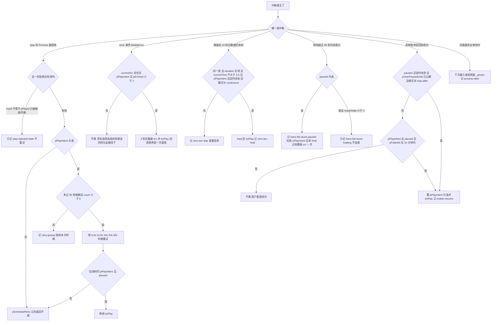

# 失败恢复与自愈路径

[js/musicplayer.js](../../js/musicplayer.js) 里没有一处 `catch` 是「修好它」，也没有任何代码会主动让用户看到错误。播放中断之后只有两种结局：某条**救援通道**在不违反用户意图的前提下把声音接回来，或者一条通道都不成立、静静地留在中断状态——而后者在真机上是无声无息的，用户唯一的线索是「声音没了」。

本页把全部通道汇总在一处，重点不在「怎么救」，而在**每条通道的守卫**，也就是「什么时候必须不救」。转场本身从 `ended` 到出声的正常路径（`pOpenTransition` / `playNext` / `timeupdate` 成功判定 / 预取）不在这里重复，见 [连续播放转场全流程](./continuous-playback-transition.md)；`pPlayIntent`、`pExpectedPause`、`pUserPausedUntil` 的完整语义见 [播放器状态机](../concepts/player-state-machine.md)。

## 一条总闸门：`pPlayIntent`

`pPlayIntent` 是唯一权威的「此刻应当在播放」，**它同时是每一条自愈通道的第一步守卫**。这不是巧合，而是设计：`stopAudio(reason)` 把「停播」实现成一个先拆意图、再拆定时器、最后才 `pause()` 的终态（[js/musicplayer.js](../../js/musicplayer.js) L226–L248）：

```js
pPlayIntent = false;
window.clearTimeout(pRetry.timer);   pRetry.deadline = 0;
window.clearTimeout(pZeroDur.timer); pZeroDur.idx = -1;
if (ptrans) pDiscardTransition('stopped-by-' + reason);
pExpectedPause = reason;
musicPlayer.pause();
theTime = null
```

置假即等于一次断电。`window.clearTimeout` 只是让「已经排上队但还没跑」的回调消失，真正的保险是那些回调内部**再查一次** `pPlayIntent`（例如 L432、L623）。新加任何救援行为时，第一步守卫几乎总是 `pPlayIntent`，而不是 `musicPlayer.paused`。

## 救援分派决策图



上图是救援分派：七种中断形态各自走哪条通道、通道自己的守卫条件、以及守卫不成立时的「不救」分支。注意三条通道（45 秒看门狗、媒体错误、元数据看门狗）在救之前都会先往统计里记一笔，重试阶梯则只在放弃时记 `retry-giveup`。

## 通道一览

| 通道 | 触发 | 守卫（不成立就不救） | 次数上限 | 日志事件 | 位置 |
|---|---|---|---|---|---|
| 拒绝重试阶梯 | `play()` 的 Promise 被拒绝 | 非 stale（`myId === pPlayId`）；`pPlayIntent`；`Date.now() <= pRetry.deadline`；`count < 6`；回调时仍 `pPlayIntent && paused` | 6 次 / 90 秒 | `play-call` `play-rejected` `play-rejected-stale` `retry-N:<ctx>` `retry-giveup` | L403–L434 |
| 媒体错误自救 | `error` 事件 | `currentSrc` 非空；`pPlayIntent`；`pErrHeal < 2`；3 秒后的回调里再查一次 `pPlayIntent` | 每曲 2 次 | `media-error` `error-heal` | L613–L629 |
| 45 秒看门狗自救 | 转场超过 45 秒 | `ptrans` 存在；`paused` 为真；`pPlayIntent`；`!pHealDone` | 每次转场 1 次 | `watchdog-heal` + `trans-fail stuck-paused` | L527–L545 |
| 10 秒「时长 0」看门狗 | `pArmZeroDur` 的定时器 | 同一首；`duration` 无效；`currentTime <= 0.5`；`pPlayIntent`；定时未到；模式为 `continuous` | 每次换曲 1 次 | `zero-dur-heal` / `zero-dur-skip` | L491–L525 |
| 回前台续播 · 系统暂停 | `visibilitychange` 回到 `visible` | `paused`；`theTime` 未到；`pUserPausedUntil <= now`；模式非 `stop-after` | 无计数 | `visible-resume 系统暂停后接上` | L646–L651 |
| 回前台续播 · 失败窗口 | 同上 | `pPlayIntent`；`paused`；`pFailedAt` 在 10 分钟内 | 无计数 | `visible-resume` | L653–L658 |
| 载入时未完成转场 | 脚本载入 | 存在 `<pageid>_ptrans` | 每次载入 1 次（**只记账，不救**） | `trans-fail … process-died` | L663–L674 |

## 通道一：`tryPlay()` 的拒绝阶梯

```js
function tryPlay(ctx) {
  plog('play-call', ctx);
  var myId = ++pPlayId;
  var p = musicPlayer.play();
  if (p && p.then) {
    p.then(function () { plog('play-resolved', ctx); })
      .catch(function (e) {
        if (myId !== pPlayId) { plog('play-rejected-stale', ctx + ' ' + e.name); return; }
        plastErr = e.name;
        pFailedAt = Date.now();
        plog('play-rejected', ctx + ' ' + e.name + ':' + e.message);
        pScheduleRetry(ctx);
      });
  }
  return p;
}
```

（[js/musicplayer.js](../../js/musicplayer.js) L403–L419。）`tryPlay` 是**全部播放发起点**共用的包装：选曲（L43）、换曲（L126）、单曲重播（L163）、长亮锁重建后的 `ms-play`（L562）、以及三条自救通道自己（L524、L539、L626）。它做三件事：自增 `pPlayId`、把拒绝的错误名落进 `plastErr` 供后续 `stuck-paused` 归类、以及把拒绝交给阶梯。

阶梯本身（L421–L434）：

| 档 | 延迟 | 依据 |
|---|---|---|
| 1 | 600ms | 元素刚换 `src`、还没进入可播状态 |
| 2 | 2s | — |
| 3 | 5s | — |
| 4 | 10s | — |
| 5 | 20s | — |
| 6 | 30s | 最后一次；之后放弃 |

```js
function pScheduleRetry(ctx) {
  if (!pPlayIntent) return;
  if (!pRetry.deadline) pRetry.deadline = Date.now() + 90000;
  if (Date.now() > pRetry.deadline || pRetry.count >= 6) {
    plog('retry-giveup', ctx + ' count=' + pRetry.count);
    return;
  }
  pRetry.count++;
  var delay = [600, 2000, 5000, 10000, 20000, 30000][pRetry.count - 1];
  ...
}
```

（[js/musicplayer.js](../../js/musicplayer.js) L421–L434。）

三条必须一起读的语义：

1. **旧拒绝靠 `pPlayId` 作废，不靠取消。** `play()` 的 Promise 无法取消；一次被拒绝的尝试在换曲之后仍然会走进 `.catch`。`myId !== pPlayId` 时只记 `play-rejected-stale` 就返回，**既不进阶梯也不写 `pFailedAt`**。否则用户快速连点选曲会累积出一串针对旧曲目的重试，等于代码在跟用户抢播放器。改动 `tryPlay` 时这条是最容易漏的一条。
2. **`pRetry.count` / `deadline` 是会话级、`pErrHeal` 才是曲目级。** 阶梯的两个计数只在 `playing` 事件里清零（L577–L583），所以连续几次换曲都失败时，下一次失败会从更靠后的档位起步、也更早撞上 90 秒限期；而 `pErrHeal` 在选曲（L41）与换曲（L124）时归零，是「每曲两次媒体错误自救」的额度。
3. **阶梯的每一步回调都要重新过一遍意图检查。** `if (pPlayIntent && musicPlayer.paused) tryPlay(...)`（L432）：用户在这 30 秒里按了暂停或定时到点，排队中的重试就全部作废。`pScheduleRetry` 开头的 `if (!pPlayIntent) return;` 是第一道，这里是第二道。

## 通道二：媒体错误自救（`error` 事件）

```js
musicPlayer.addEventListener('error', function () {
  if (!musicPlayer.currentSrc) return; // 清空选择触发的伪错误
  var c = musicPlayer.error ? musicPlayer.error.code : '?';
  plastErr = 'media-error-' + c;
  plog('media-error', 'code=' + c);
  if (ptrans) pCloseTransition(false, 'media-error-' + c);
  if (pPlayIntent && pErrHeal < 2) {
    pErrHeal++;
    setTimeout(function () {
      if (!pPlayIntent) return;
      plog('error-heal', '第' + pErrHeal + '次重载');
      var pUrl = musicList[parseInt(musicSelect.value)] && musicList[parseInt(musicSelect.value)].url;
      if (pUrl) { musicPlayer.src = pUrl; tryPlay('error-heal'); }
    }, 3000);
  }
});
```

（[js/musicplayer.js](../../js/musicplayer.js) L613–L629。）这条通道修的是「部分加载损坏 / 会话被收回 / 网络抖动」，手段是**重设 `src` 再试**。续播位置不靠这条通道保存——重载之后播放头由 `loadedmetadata` 从 `<pageid>_currentTime` 恢复（L89–L95），机制见 [播放记忆与黑匣子日志](../concepts/player-persistence-and-diagnostics.md)。

四个守卫点：① `currentSrc` 为空直接返回——清空选择时 `src` 被置 `''` 也会触发一次伪 `error`，那不是故障；② `pPlayIntent` 必须为真；③ `pErrHeal < 2`，上限是**每曲两次**，由 `playNext` 与选曲处理器在换曲时归零；④ 3 秒的延迟本身就是一次宽限，回调里再查一次 `pPlayIntent`。

这条通道同时是转场失败的一个出口：`ptrans` 存在时记 `trans-fail media-error-<code>`。所以一次媒体错误在统计里会同时表现为 `reasons['media-error-N']` 增长和（如果救回来了）一条 `error-heal`。

## 通道三：45 秒看门狗（`stuck-paused` 才有自救）

`pWatchdog()` 与转场统计的详细分工见 [连续播放转场全流程](./continuous-playback-transition.md)，这里只看它的**救与不救**：

| 分支 | 条件 | 记账 | 是否自救 |
|---|---|---|---|
| 卡在暂停 | 45 秒后 `musicPlayer.paused` 为真 | `stuck-paused` 或 `stuck-paused:<plastErr>` | **救一次**：`pPlayIntent && !pHealDone` 时把 `src` 重新指向当前曲目并 `tryPlay('watchdog-heal')` |
| 卡在加载 | 45 秒后 `paused` 为假但 `readyState < 3` | `stuck-loading` | **不自救**，并且把 `ptrans` 关成 `null`——此后没有代码会回头看它 |

`pHealDone` 在 `pOpenTransition` 里复位（L373），所以额度是「每次转场一次」而不是「每曲一次」。45 秒的起点是 `ended` 那一刻的 `ptrans.start`，这个窗口里包含换 `src`、一次可能被拒绝的 `play()`、以及整个重试阶梯的前几档——`pRetry` 的 90 秒限期比它更长，因此存在「看门狗已经判死并自救一次，阶梯还在排队」的重叠状态，这是有意的。

**`stuck-loading` 那一条不自救，是「时长 0」看门狗必须存在的直接原因**：真实故障的形态是 `paused = false`（`play()` 早已 resolve）+ `readyState 0`，正好落进只记账的分支。详见下一条。

## 通道四：10 秒「时长 0」元数据看门狗

```js
function pCheckZeroDur() {
  if (pZeroDur.idx !== parseInt(musicSelect.value)) return;                       // 已被后续换曲覆盖
  if (isFinite(musicPlayer.duration) && musicPlayer.duration > 0) return;          // 元数据到了
  if (musicPlayer.currentTime > 0.5) return;                                       // 播放头在推进
  if (!pPlayIntent) { plog('zero-dur-skip', '无播放意图(idx=' + pZeroDur.idx + ')'); return; }
  if (theTime && theTime.getTime() <= Date.now()) { plog('zero-dur-skip', '定时已到'); return; }
  if (playModeSelect.value !== 'continuous') { plog('zero-dur-skip', '非连续播放'); return; }
  ...
  musicPlayer.load();
  tryPlay('zero-dur-heal');
}
```

（[js/musicplayer.js](../../js/musicplayer.js) L500–L525；触发它的 `pArmZeroDur` 在 L491–L499，由 `playNext`（L128）与选曲（L45）调用。）

它是**唯一一条由自己的定时器驱动**的救援通道（其余要么由媒体元素事件驱动，要么搭在 10 秒 interval 上）。`stopAudio()` 会显式 `clearTimeout(pZeroDur.timer)` 并把 `idx` 复位成 `-1`（L240–L241），所以「定时到点停播」不会被它复活——这就是它同时还要查 `theTime` 与 `pPlayIntent` 的双保险。

`zeroDur` 是**独立于转场成败的记账面**：它不进 `pstats.reasons`，救活之后转场往往照样被 `timeupdate` 记成 `trans-ok`。排障时「`reasons` 里有 `stuck-loading`」与「`zeroDur` 增长了」读的是两件事。

## 通道五：回前台的 `visible-resume`（两条分支）

```js
document.addEventListener('visibilitychange', function () {
  plog('visibility', document.visibilityState);
  if (document.visibilityState !== 'visible') return;

  // 分支一：被系统暂停（扩音焦点被夺），定时仍在生效
  if (musicPlayer.paused && theTime && theTime.getTime() > Date.now()
    && pUserPausedUntil <= Date.now() && playModeSelect.value !== 'stop-after') {
    pPlayIntent = true;
    plog('visible-resume', '系统暂停后接上');
    tryPlay('visible-resume');
  }

  // 分支二：10 分钟内有过 play() 失败，且意图仍在
  if (document.visibilityState === 'visible' && pPlayIntent && musicPlayer.paused
    && pFailedAt && Date.now() - pFailedAt < 600000) {
    plog('visible-resume', '');
    tryPlay('visible-resume');
  }
});
```

（[js/musicplayer.js](../../js/musicplayer.js) L635–L659。）两条分支的守卫语义完全不同，**这是本页最要紧的一节**：

| 分支 | 修的是哪种中断 | 守卫 | 不救的情形 |
|---|---|---|---|
| 一 | 息屏 / 来电 / 其他 App 夺走音频焦点导致的系统暂停。这种暂停里 `play()` 早已 resolve，所以 `pFailedAt` 是 `0` | `paused` + `theTime` 未到 + `pUserPausedUntil <= now` + 模式非 `stop-after` | 没开定时关闭、定时已到、还在 8 秒用户暂停宽限内、`stop-after` 模式 |
| 二 | 有过 `play()` 拒绝而一直没起来的播放 | `pPlayIntent` + `paused` + `pFailedAt` 在 10 分钟内 | 意图已被撤销、`pFailedAt` 为 0、或失败已超过 10 分钟 |

三点后果：

1. **分支一要求定时关闭处于生效状态。** 守卫里的 `theTime && theTime.getTime() > Date.now()` 意味着「没开定时」或「定时已到」时这条通道永远不成立；而分支二需要 `pFailedAt`，它在 `play()` resolve 的情况下是 `0`。因此**「没开定时 + 系统暂停」在今天的代码里没有恢复路径** —— 这正是 [docs/播放器息屏播放-已验证版本.md](../../docs/播放器息屏播放-已验证版本.md) 那份真机验证的配置写成「连续播放 + 定时 1 小时」的原因，也是 [验证与复现手册](../testing/verification-playbook.md) 里「在没开定时、只按了播放的配置下测『回前台接上』，不救是设计」那条陷阱的来源。
2. **分支一是唯一会主动置 `pPlayIntent = true` 的救援通道。** 其他通道都只「在意图之内动手」。它的合理性在于：这类中断里用户从没表达过暂停，意图理应仍然成立。反过来说，任何让意图变假的路径（`stopAudio`、MediaSession pause、清空选择）都能彻底关掉这条通道。
3. **分支一只看 `paused`，不看 `readyState`/`duration`。** 这与「时长 0」看门狗刻意不看 `paused` 正好互补：前者治「暂停着」，后者治「在播但没数据」。把两者的判据统一会很方便，也会同时废掉两条通道。

### 三条「永不接上」的历史教训

这三处守卫都写错过，而且错法都是**条件比现实更窄或更宽**，修好之前的表现都是「回到前台什么都没发生」，日志里却看不出异常——这正是本页要逐条记下来的原因。

1. **`pUserPausedUntil` 不能按真假判断。** 它存的是「用户主动暂停的**到期时刻戳**」，不是布尔标记。早先写成 `!pUserPausedUntil`，而这个值一旦被设成就永远不为 `0`，守卫恒为假 → 系统暂停后永远接不上。正确判据是「已过期」：`pUserPausedUntil <= Date.now()`（L14–L18、L647）。**注意它的守恒性**：「绝不复活」只在 `P_USER_PAUSE_GRACE`（8 秒）之内成立——8 秒之后，一次锁屏面板上的用户暂停与一次系统暂停在状态上完全一致，只要定时还在生效，回前台就会被接上。它也只被赋值、从不被显式清零，所以一次早先的用户暂停可以在随后 8 秒内挡住一次合法的系统续播。改这个常量或改判据之前必须先知道这一点。
2. **`&& pFailedAt` 把最常见的形态整个挡在门外。** 早先分支一的守卫里带着 `pFailedAt`，理由是「失败了才需要续播」；但息屏夺走音频焦点这种最常见的中断里，`play()` 早已 resolve，`pFailedAt` 一直是 `0`。真机日志（[docs/播放器息屏播放-已验证版本.md](../../docs/播放器息屏播放-已验证版本.md) L14–L21：`pause-unattributed timer-active` 之后约 2 分 45 秒回到可见态、然后什么都没有）证实的正是这条。修正是**改成两条独立分支**，而不是在一条里堆 `||`。
3. **`pExpectedPause` 是一次性令牌，而 `pUserPausedUntil` 是时刻戳——两者混用就会归因错。** `pExpectedPause` 只被 `pause` 处理器读出并立刻清空（L600–L601），没有过期时间；`pUserPausedUntil` 是给「无法归因的暂停」布的保守宽限。判断「谁暂停了」只有这两条路径被允许回答，新增第三种归因之前先想清楚它与 8 秒宽限的关系。另有一个连带陷阱：如果设置 `pExpectedPause` 的那次 `pause()` 是空操作（元素本来就已暂停，清空选择时会出现），令牌会一直挂着，被**下一次无关的暂停**消费掉——那一次真正的异常暂停会被记成 `select-clear` 之类，而且不会布下宽限。

补充一条与通道四同源的教训：`pZeroDur.idx` 必须归一成数字。选曲 `change` 处理器传进来的是 `e.target.value`（字符串 `"1"`），而守卫用的是 `!== parseInt(musicSelect.value)`（数字），类型不一致时 `!==` 恒为真，守卫第一条就返回，**一次自救都不会触发，而且日志是空的**（L493–L496、L502）。

## 通道六：载入时发现未完成的转场（`process-died`）

```js
var pLeft = localStorage.getItem(PKEY_TRANS);
if (pLeft) {
  var pLt = JSON.parse(pLeft);
  pstats.fail++;
  pstats.reasons['process-died'] = (pstats.reasons['process-died'] || 0) + 1;
  plog('trans-fail', … + 'process-died(载入时发现未完成转场)');
  localStorage.removeItem(PKEY_TRANS);
  psave();
}
```

（[js/musicplayer.js](../../js/musicplayer.js) L663–L674。）`<pageid>_ptrans` 只在转场进行中存在（转场打开时随 `psave()` 写入，收口时删除），所以载入时读到残留，说明**上次会话死在一次转场中间**。它是七条通道里唯一**只记账、不尝试恢复**的一条：没有可恢复的现场，剩下的只是统计。

两条读表纪律：这是**启发式**——正常关页面时恰好处于转场中同样会得到 `process-died`，它证明的是「上次没走完收尾」，不是「系统杀了进程」；而 `pstats` 是跨会话累计的（载入时 `Object.assign` 浅合并，L339–L341），所以这笔失败可能是上一周留下的。

## 与 `keepalive.js` 的交叉

[js/keepalive.js](../../js/keepalive.js) 不是一条救援通道，但它把 `pPlayIntent` 当成读取契约：`pWakeLockSync()` 用 `pPlayIntent && !musicPlayer.paused && pWake.fails < 3` 决定要不要持有 `navigator.wakeLock('screen')`（L32–L34），并用 3 秒轮询（L111–L115）补上 `playing` 事件丢失的情况。也就是说**「意图为真、尚未出声」这段窗口正是长亮锁最难申请到的时刻**，而锁是「息屏」这个触发条件本身的对策，见 [息屏连续播放与屏幕长亮锁](./screen-off-continuous-playback.md)。

改动这一层的纪律：`pPlayIntent` 改名、改成对象、或改成只在 `playing` 时才为真，都会让长亮锁**静默失效**（那个文件的守卫是 `typeof … !== 'undefined'`，不报错）。

## 日志事件与它们的通道对照

| 日志事件 | 属于哪条通道 | 读它时要知道什么 |
|---|---|---|
| `play-call <ctx>` | 全部（`tryPlay` 的入口） | `ctx` 说明是选曲/换曲/重试/自救哪一次发起 |
| `play-resolved` | 全部 | **不代表出声**：只说明元素接受了请求 |
| `play-rejected` / `play-rejected-stale` | 重试阶梯 | 前者随后一定跟一次阶梯推进；后者是被换曲作废的旧拒绝 |
| `retry-N:<ctx>` / `retry-giveup` | 重试阶梯 | 放弃时 `d` 里带 `count=` |
| `media-error` / `error-heal` | 媒体错误自救 | `error-heal` 的 `d` 里是「第 N 次重载」 |
| `watchdog-heal` / `trans-fail … stuck-paused` | 45 秒看门狗 | 没救时只有 `trans-fail`，原因名在 `d` 里 |
| `zero-dur-heal` / `zero-dur-skip` | 10 秒元数据看门狗 | 计数进 `pstats.zeroDur`，**不进 `reasons`**；`zero-dur-skip` 的 `d` 写明是哪条守卫否掉的 |
| `visible-resume` | 回前台续播 | `d` 为「系统暂停后接上」的是分支一，空字符串的是分支二 |
| `pause-unattributed` / `pause-<原因>` | 归因（非救援） | 前者会布下 8 秒宽限，是分支一能不能成立的前置 |
| `trans-fail … process-died` | 载入时补记 | 只在下次载入出现 |

**「日志里没有某条事件」不等于「那条通道没跑」。** 诊断层的 `localStorage` 访问全部包在空 `catch` 里（L337、L356、L362–L364、L664–L674），存储写不进去时 `plogBuf.push` 有记录、落盘没有，刷新后这一段就没了——看到日志比预期短时，先怀疑存储写入失败。这条与「`pstats` 跨会话累计」一起决定了读日志的纪律，完整证据标准见 [验证与复现手册](../testing/verification-playbook.md)。

## 改这一层的检查清单

1. **新增救援行为，第一步守卫写 `pPlayIntent`，不是 `paused`。** 「是不是还在播」与「数据到没到」是两件事：真实故障里 `paused = false` + `readyState 0` 是最常见的形态。
2. **每条通道都要有明确的「不救」出口。** 只写「什么时候救」的通道，在真机上会表现为「用户按了暂停，它又自己播起来了」——那比不救更难查。
3. **不要合并两条 `visible-resume` 分支。** 分支一修系统暂停、分支二修 `play()` 失败，判据分别落在 `theTime`/`pUserPausedUntil` 与 `pFailedAt` 上，`||` 起来只会让它更难解释。
4. **新增或修改停止路径，照抄 `stopAudio` 的收尾顺序**：先清意图与所有定时器（含 `pZeroDur`），再设 `pExpectedPause`，最后 `pause()`。漏掉哪一步都会留下一条能复活的通道。
5. **`pZeroDur` 这类被 `stopAudio` 引用的状态对象，声明位置必须早于任何可能调用 `stopAudio()` 的路径**：`var` 会提升但值是 `undefined`，`pZeroDur.timer` 会抛 `TypeError` 并**打断 `stopAudio` 本身**（L332–L335）。
6. **`pPlayIntent` 是跨文件契约**（`keepalive.js`），改名或改语义前先读那里。
7. **验证只能靠真机日志与 `?fast=N`**，本仓库没有测试框架；息屏与音频焦点类改动没有桌面替代品。方法见 [验证与复现手册](../testing/verification-playbook.md)。

## 相关页面

- [播放器状态机：播放意图、转场与暂停归因](../concepts/player-state-machine.md) —— `pPlayIntent` / `pExpectedPause` / `pUserPausedUntil` / `pZeroDur` 的完整语义与全部已知的反向守卫
- [连续播放转场全流程（含预取与时长 0 看门狗）](./continuous-playback-transition.md) —— 从 `ended` 到出声的正常路径，以及转场七个收口出口与失败原因分类表
- [息屏连续播放与屏幕长亮锁](./screen-off-continuous-playback.md) —— 「消除触发条件」这条策略与 `visible-resume` 分支一的真机证据
- [播放记忆与黑匣子日志（localStorage 键）](../concepts/player-persistence-and-diagnostics.md) —— `_plog` / `_pstats` / `_ptrans` 如何承载这些通道的现场证据
- [验证与复现手册](../testing/verification-playbook.md) —— `?debug` + `?fast=N` 的操作纪律、证据标准与必须原样保留的失败输出
