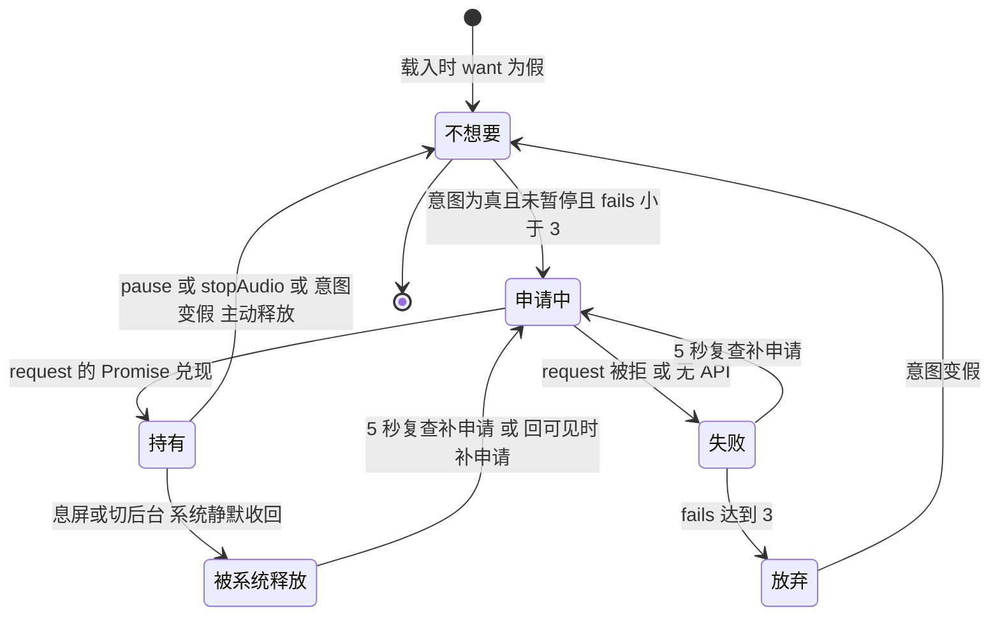

# 息屏连续播放与屏幕长亮锁

「息屏连续播放失败」这件事在这个仓库里被处理成了一条**很短的链路**：[js/keepalive.js](../../js/keepalive.js) 在「用户有播放意图且没暂停」期间申请一次 `navigator.wakeLock('screen')`，让屏幕根本不熄灭。全文件 121 行，只做这一件事，其余全是**维持与放弃**的机制。

之所以只做这一件事，是 2026-10-03 那次真机定位的结论：根因是**息屏后系统暂停了音频元素，而回前台的恢复路径有缺陷**，不是 JavaScript 被冻结。既然触发条件是「熄屏」，最便宜的解法就是让熄屏不发生，而不是去防守熄屏之后的每一种后果（音频焦点丢失、定时器节流、进程冻结）。这个思路写在 [js/keepalive.js](../../js/keepalive.js) L8–L10 与 [docs/播放器息屏播放-已验证版本.md](../../docs/播放器息屏播放-已验证版本.md) L44。

本页只讲这条链路本身。它读的那些播放器状态（`pPlayIntent`、`musicPlayer.paused`）的完整语义见 [播放器状态机](../concepts/player-state-machine.md)；锁掉之后靠什么把声音接回来见 [失败恢复与自愈路径](./playback-recovery-and-selfhealing.md)；那份真机验证文档的效力边界与证据标准见 [验证与复现手册](../testing/verification-playbook.md)。

## 一句话策略：消除触发条件，而不是对抗后果

仓库里留下来的判断是：**静音导频严格比直接长亮脆弱。**

| 做法 | 机制 | 当前状态 |
|---|---|---|
| 屏幕长亮锁 | 播放期间申请 `navigator.wakeLock('screen')`，让屏幕不熄灭 | **保留**，唯一在做的事 |
| Web Audio 静音导频 | 常驻一条 18kHz @ −58dB 的超声导频，想欺骗平台「最近 30 秒发过声」的豁免判定 | **已删除，不得加回** |
| 恢复路径（回前台接上） | 息屏后系统暂停音频，回前台时再 `tryPlay` | 保留，但它是「对抗后果」，且有守卫限制 |

静音导频的判词很直接：它**从未被证明有效**，用户实测成功的是长亮锁，它只白耗 CPU 和电（[js/keepalive.js](../../js/keepalive.js) L12–L15、[docs/播放器息屏播放-已验证版本.md](../../docs/播放器息屏播放-已验证版本.md) L37–L40）。

```js
⚠️ 曾删掉的东西(别再加回来):
早期版本常驻一条 Web Audio 静音导频(18kHz @ −58dB),想欺骗平台的
「最近 30 秒发过声」豁免。实测证明它对本次故障无效,已移除。
```

（[_layouts/music.html](../../_layouts/music.html) L124 与 [js/keepalive.js](../../js/keepalive.js) L12–L15 各写了一遍同一条警告。）

这里有一处连带的历史痕迹：基线文档 L40 提到调试面板里的 `keepalive-on` 字段会随静音导频失效。**当前代码里已不存在这个事件名**，全仓库只剩 `wakelock-on` / `wakelock-off` / `wakelock-fail` / `wakelock-reacquire` 四个（写入点 [js/keepalive.js](../../js/keepalive.js) L42–L92）。在旧截图里读到 `keepalive-on` 时，那不是今天这份代码的输出。

## 加载顺序：一条会静默失效的硬依赖

[js/keepalive.js](../../js/keepalive.js) 依赖 [js/musicplayer.js](../../js/musicplayer.js) 定义的三个全局：`plog`、`pPlayIntent`、`musicPlayer`。全文用它自己的 `pWakeReady()` 做守卫：

```js
function pWakeReady() {
  return (typeof plog === 'function') && (typeof musicPlayer !== 'undefined')
    && (typeof pPlayIntent !== 'undefined');
}
```

（[js/keepalive.js](../../js/keepalive.js) L25–L28。）布局把这一约束写在脚本标签旁边，并把它排在正确的一侧:

```html
<script src="/js/musicplayer.js?v=4"></script>
<!-- ⚠️ 顺序有依赖:keepalive.js 用到 musicplayer.js 定义的 plog /
     pPlayIntent / musicPlayer,放在前面会 ReferenceError 静默失效。 -->
<script src="/js/keepalive.js?v=3"></script>
```

（[_layouts/music.html](../../_layouts/music.html) L119–L125。）

**顺序颠倒的后果比注释描述的更隐蔽**：三个守卫全部返回假值，于是 `playing` / `pause` 监听（L102–L104）与 3 秒意图轮询（L111–L115）根本不会绑定，只剩 L121 那次「载入后 1.5 秒同步一次」还在——长亮锁从此不会被维持，而**整条链路上没有一行抛到控制台**。这与 [js/musicplayer.js](../../js/musicplayer.js) 对 `getElementById` 完全不判空正好相反，两种坏法都不报警；完整的契约面见 [布局与前端 DOM/脚本契约](../architecture/layout-and-frontend-contract.md)。

## 锁的生命周期

状态只有一个对象：

```js
var pWake = { lock: null, want: false, fails: 0, retryTimer: null };
var pWakePollTimer = null;
```

（[js/keepalive.js](../../js/keepalive.js) L22–L23。）四个字段各自承担一件事：`lock` 是当前持有的 `WakeLockSentinel`（或 `null`），`want` 是「此刻应当持有锁」这个**意图**，`fails` 是连续申请失败次数，`retryTimer` 是 5 秒复查定时器。`retryTimer` 与 `lock` 是分开的：**有锁时复查定时器照旧跑着**，它看的是「意图在、却没锁」这个状态。



这张图是长亮锁的状态生命周期：`want` 只有两种取值，真正分支的是「想要但没锁」这一态——它由 5 秒复查与 `visibilitychange` 两条路补申请，失败累计到 3 次后停止尝试，直到意图变假把状态压回「不想要」。

### 要不要（`pWakeLockSync`）

`pWakeLockSync()` 是唯一的决策函数，被四个入口调用。它算出的 `want` 是一条三合一判断：

```js
var want = pPlayIntent && !musicPlayer.paused && pWake.fails < 3;
```

（L34。）第一条是播放器状态机里的「用户意图」，第二条是元素真的在播，第三条是「还没放弃」。

- **`want` 为假 → 释放并复位。** 释放时先把哨兵从 `pWake.lock` 摘下来再调 `release()`，`release().catch(...)` 与整个调用都包在 `try` 里（L39–L43），并停掉复查定时器（L44）。释放路径同时打 `wakelock-off`。注释点明了为什么 `pause` 也必须同步：**不释放的话，用户停播之后屏幕还亮着**（L100）。
- **`want` 为真 → 申请 + 起复查。** 已经持有就直接返回，没有锁就立刻申请一次，然后无条件 `pWakeRetryStart()`。

`want` 被设为真之后还有一步**能力检测**：`navigator.wakeLock` 或 `.request` 缺失时不申请，只 `fails++` 并在 `fails` 已经从 0 变过时才写一条 `wakelock-fail 'no API'`（L50–L53）——也就是说**不支持这个 API 的浏览器不会被日志刷屏**，代价是只有第二条日志能证明「这里确实试过」。

### 申请失败不会重试……直到复查接手

```js
function pWakeRequest() {
  navigator.wakeLock.request('screen').then(function (lock) {
    pWake.lock = lock;
    pWake.fails = 0;
    plog('wakelock-on', pWake.want ? '' : '迟到的锁');
    lock.addEventListener('release', function () { pWake.lock = null; });
  }).catch(function (e) {
    pWake.fails++;
    plog('wakelock-fail', e.name);
  });
}
```

（L62–L72。）三个细节值得单独记住：

1. **成功时把 `fails` 清零**——失败计数是「连续失败」，一旦拿到锁就重新开始。
2. **`lock` 上的 `release` 事件把 `pWake.lock` 置回 `null`**，但不改 `want`。这就是「被系统静默收回」这个状态的全部表示：想要、但没有锁。下一页的补申请由轮询或 `visibilitychange` 负责。
3. `plog('wakelock-on', …)` 的 `d` 字段在 `want` 已为假时写「迟到的锁」——申请与兑现之间用户可能已经按了暂停，这时候拿到的锁不该被当成一次正常成功。

### 维持：三条路，各自补一个不同的坑

| 触发 | 周期/时机 | 代码 | 它补的是哪个坑 |
|---|---|---|---|
| `playing` / `pause` 事件 | 事件驱动 | L102–L104 | 正常路径，起播即申请、暂停即释放 |
| **意图轮询** | 每 3 秒 | L111–L115 | `playing` 事件可能丢失：选曲后意图已为真但音频还在缓冲，若只等 `playing`，`want` 永远是假 |
| **锁复查** | 每 5 秒 | L74–L82 | 息屏期间页面不派发 `visibilitychange`，锁被系统收回后没人知道，只能轮询发现并补申请 |
| `visibilitychange` | 回到可见时 | L89–L96 | 切后台/息屏后系统释放锁；回可见时若 `want` 为真而锁没了就立刻补申请 |
| 载入兜底 | 载入后 1.5 秒一次 | L121 | 浏览器恢复了会话播放时，`playing` 可能早于本脚本绑定而错过 |

轮询与复查**语义不同，不要合并**：3 秒的是「意图还在吗」，5 秒的是「想要锁但我拿到了吗」。两者的守卫也刻意不一样：

```js
pWakePollTimer = setInterval(function () {
  if (!pWakeReady()) return;
  if (!pPlayIntent || musicPlayer.paused) { pWakeRetryStop(); return; }
  pWakeLockSync();
}, 3000);

pWake.retryTimer = setInterval(function () {
  if (!pWake.want || pWake.lock || !pWakeReady()) return;
  if (!pPlayIntent || musicPlayer.paused) return;
  if (pWake.fails >= 3) { pWakeRetryStop(); return; }
  pWakeRequest();
}, 5000);
```

（L74–L82、L111–L115。）意图轮询在「没有意图」时会**顺手停掉复查定时器**并 `return`，所以复查定时器只可能在「意图为真」期间存在；复查自己每次都要重查一遍意图与暂停，避免定时器比意图活得久。

### 补申请会把失败计数清零

```js
document.addEventListener('visibilitychange', function () {
  if (!pWakeReady()) return;
  if (document.visibilityState === 'visible' && pWake.want && !pWake.lock) {
    plog('wakelock-reacquire', '');
    pWake.fails = 0;
    pWakeLockSync();
  }
});
```

（L89–L96。）注意这里 `pWake.fails = 0` 在 `pWakeLockSync()` **之前**：回可见被当作一次「重新开始」，所以三次放弃的计数器会在这里复位。

**这条路径只在切后台/回前台时有效，对息屏无效**——这是这条链路上最容易重复踩的坑。[docs/播放器息屏播放-已验证版本.md](../../docs/播放器息屏播放-已验证版本.md) L49–L50 把它记成给未来的自己的第 3 条：「`visibilitychange` 在息屏期间不派发。所以唤醒锁丢了只能靠轮询找回，不能靠监听该事件。」也就是说 `visibilitychange` 与 5 秒复查**不是冗余的两道保险，而是各治一种情形**：前者治「用户切走了 App 又切回来」，后者治「屏幕黑着、谁都不通知你」。

### 失败 3 次即放弃

`fails` 只在两处被清零（`pWakeRequest` 成功、`visibilitychange` 补申请），只在两处递增（`.catch` 里的 `fails++`、无 API 分支的 `fails++`），并在两处被读作阈值：`want` 的计算里（`pWake.fails < 3`，L34）与复查定时器里（L79）。

所以「放弃」的含义很精确：**连续三次申请都没拿到，就彻底停止尝试**——`want` 恒为假（因此连申请分支都进不去），复查定时器也在下一次 tick 时 `pWakeRetryStop()` 自行停掉。此后只有两件事能重新开始：意图变假再变真（走一次不想要的释放路径，然后重新算 `want`），或者一次 `visibilitychange` 回到可见（那里显式清零 `fails`）。

代价是**失败之后没有任何日志**：放弃这一瞬不写事件，只能从「`wakelock-fail` 出现三次之后再没有 `wakelock-on`」反推。排障时这是有用的读法，也是这一层唯一「沉默着失败」的地方。

## 与播放器其它部分的耦合

| 耦合点 | 方向 | 说明 |
|---|---|---|
| `pPlayIntent` | `keepalive.js` 读 | 「有播放意图」是申请锁的第一条判据，也是全部维持路径的第一条守卫 |
| `musicPlayer.paused` | `keepalive.js` 读 | 第二条判据；与意图合起来才是「此刻应当在播放且确实在播」 |
| `plog` | `keepalive.js` 写 | 锁的四类事件都写进同一个 `<pageid>_plog` 黑匣子，与转场/自愈日志同处一条时间线，见 [播放记忆与黑匣子日志](../concepts/player-persistence-and-diagnostics.md) |
| 「意图为真、尚未出声」窗口 | 双向 | 选曲后 `pPlayIntent = true`（[js/musicplayer.js](../../js/musicplayer.js) L40）但音频还在缓冲时 `playing` 还没来——这段窗口正是锁最难申请到的时刻，3 秒轮询就是为它存在的 |
| `stopAudio` 的终态 | 间接 | 停播会先把 `pPlayIntent` 置假，长亮锁顺带在下一拍释放；这是「定时到点后屏幕不继续亮着」的实现方式 |

有一条纪律来自 [播放器状态机](../concepts/player-state-machine.md)：**`pPlayIntent` 是跨文件契约**。把它改名、改成对象、或改成只在 `playing` 时才为真，长亮锁会**静默**失效，连 `?debug` 面板里的 `wakelock-*` 事件一起消失——因为 `keepalive.js` 的守卫全是 `typeof … !== 'undefined'`，不报错。

## 证据强度

这是本页必须如实标注的部分，因为它决定了任何一次「改完看起来没问题」能不能算数。

**算证据的**：

- 真机（用户实际使用的设备与浏览器）上的行为，以及随之产生的 `_plog` 日志。
- 具体的那次：**小米 Android + Chrome，2026-10-03，验证 commit `5c75dbb`（长亮锁改为自维持 + 意图轮询兜底）**；配置是「连续播放 + 定时 1 小时」，息屏放置，音频不再中断（[docs/播放器息屏播放-已验证版本.md](../../docs/播放器息屏播放-已验证版本.md) L3–L5、L9）。
- 同一份文档的提交链把这次成功归因得很干净：`26e3d47`（预取改 `Range`）必要、`a71f898`（时长 0 看门狗）保险、`39ede4f`（息屏保活层 + 预取提前量）**部分无效**、`5b34005`（回前台接上）必要、`5c75dbb`（长亮锁自维持 + 意图轮询）**决定性**（L25–L33）。**「决定性」这一列是人类判断，不是机器产物**，但它至少把「长亮锁 vs 静音导频」这个二选一钉住了。

**不算证据的**（[docs/播放器息屏播放-已验证版本.md](../../docs/播放器息屏播放-已验证版本.md) L46–L48，实测结论）：

- CDP 的 `Page.setWebLifecycleState('frozen')`——用它模拟页面被冻结不算。
- headless 模式下多标签的 `visibilityState`——**实测两个标签页都报 `visible`，`visibilitychange` 根本不派发**。
- 更一般的结论：**桌面模拟不出手机行为。** 桌面浏览器没有「系统暂停音频元素、JS 继续运行」这个状态，而这次故障恰恰就在那里。
- 推论：**在 [local-test.html](../../local-test.html) 上验证长亮相关的改动没有任何信息量**——那个装置只加载 `jquery` 与 `musicplayer.js`（L76–L77），**根本不加载 `keepalive.js`**，它引用的是不带 `?v=` 的裸路径，既跑不到这个文件，也复现不出回访用户的旧缓存行为。两条都在 [验证与复现手册](../testing/verification-playbook.md) 里被列成陷阱。

**效力边界**：上述真机验证的范围 = 那一台设备 + 那个浏览器 + 那个 commit。换机型或系统版本时，它是一份**待复验的假设**，不是「所有平台都通过」。而且它的证据来自用户回传的截图与日志，不来自本地测量——**本地复现不出来并不意味着这份结论错了**。

## 改这一层时的失效模式

| 改动 | 后果 |
|---|---|
| 交换 `keepalive.js` 与 `musicplayer.js` 的标签顺序 | 全部守卫为假：监听与轮询不绑定，只剩 1.5 秒那一次同步；**无报错** |
| 把 `pPlayIntent` 改名 / 改语义（例如只在 `playing` 时为真） | 长亮锁静默失效，`wakelock-*` 日志一并消失 |
| 把顶部 `<script>` 加 `defer` 或移进 `<head>` | 脚本先于 DOM 执行，`musicplayer.js` 拿到 `null`；`keepalive.js` L103 会在 `null` 上调 `addEventListener` 抛错 |
| 改 `keepalive.js` 却不动 `?v=` | 引用串没变，两层缓存继续命中旧文件；回访用户仍在跑旧代码，真机验证验的不是你改的那份 |
| 把静音导频加回来 | 已实测无效、只耗 CPU 与电，且会掩盖真实证据 |
| 把 `pause` 换掉只留 `playing` | 停播后屏幕继续亮；且选曲到出声之间的缓冲窗口申请不到锁 |
| 把两个轮询合并成一个 | 3 秒意图轮询与 5 秒锁复查语义不同（意图 vs 持有），合并会丢掉「意图在但没有锁」这一态 |
| 让轮询在不需要时不停转 | 息屏期间就是靠定时器跑才能补申请，但「不想要」时必须 `pWakeRetryStop()`，否则空转 |

### 缓存版本号

`?v=` 与改这个文件的关系是硬性的：**版本号只存在于引用处的查询串上，不在任何 manifest、构建配置或文件名哈希里**，所以「bump」的动作就是改 [_layouts/music.html](../../_layouts/music.html) L125 那一行：

```html
<script src="/js/keepalive.js?v=3"></script>
```

两层缓存的约束是 GitHub Pages 给 js/css 设 `Cache-Control: max-age=600`（最多 10 分钟），Cloudflare 还可能缓存更久（约 4 小时）。**改了 `keepalive.js` 的内容而不动这个版本号，回访用户最多 10 分钟、边缘可能约 4 小时内跑的还是旧代码**——而真机验证的前提是你验的就是刚改的那份文件，所以 **bump 必须与内容改动在同一次提交里完成**。完整的缓存约定、当前版本号快照与「bump 了但没清边缘缓存」这第二种失效方式见 [静态资源、音频资产与缓存击穿约定](../operations/assets-and-cache-busting.md)。

一个现成的不对称值得记下来：`musicplayer.js` 的引用处旁边写了逐版日志（v2/v3/v4），而 **`keepalive.js` 的 `?v=3` 旁边没有任何逐版日志**——它的改动历史只能从 git 历史重建。所以改这个文件时顺手补一行 `vN：…`，比事后猜有价值。

## 怎么验证

1. **只有一条路**：真机 + 连续播放 + 定时关闭开启 + 息屏放置。到点前音频不中断即为通过，日志里应出现 `wakelock-on`。`?debug` + `?fast=N` 制造的只是转场，不是息屏，**不能替代**。
2. **先 bump `?v=` 再去真机**，否则验的不是你改的文件。
3. **看到「日志里没有 `wakelock-*`」时不要下结论**，先核对构建产物里 `keepalive.js` 是否排在 `musicplayer.js` 之后——顺序错时它安静地什么都不做。
4. **复现「回前台接上」要在暂停后隔得比 8 秒宽限更久再回前台**；基线文档里那条日志的间隔是 17:52:37 → 17:55:22（约 2 分 45 秒），这不是巧合。
5. **`plogReset()` 只清 `_plog` / `_pstats` / `_ptrans`**，不碰播放记忆；`pstats` 载入时是与旧值合并的，跨会话累计。
6. 结论要连设备、浏览器、日期、commit 一起写进 [docs/播放器息屏播放-已验证版本.md](../../docs/播放器息屏播放-已验证版本.md)——这是这个仓库唯一能让结论越过一次会话的机制。

完整装置清单、证据标准与陷阱见 [验证与复现手册](../testing/verification-playbook.md)。

## 相关页面

- [失败恢复与自愈路径](./playback-recovery-and-selfhealing.md) —— 锁掉之后谁把声音接回来：`visible-resume` 的两条分支与三条「永不接上」的历史教训
- [验证与复现手册](../testing/verification-playbook.md) —— 基线文档的效力边界、什么算证据、哪三样不算
- [布局与前端 DOM/脚本契约](../architecture/layout-and-frontend-contract.md) —— `keepalive.js` 必须排在 `musicplayer.js` 之后这条硬约束的完整语境
- [静态资源、音频资产与缓存击穿约定](../operations/assets-and-cache-busting.md) —— `?v=3` 为什么必须手工 bump
- [播放器状态机：播放意图、转场与暂停归因](../concepts/player-state-machine.md) —— `pPlayIntent` 作为跨文件契约的语义
- [播放记忆与黑匣子日志（localStorage 键）](../concepts/player-persistence-and-diagnostics.md) —— `wakelock-*` 事件写进的是哪份日志、怎么取出来
- [连续播放转场全流程（含预取与时长 0 看门狗）](./continuous-playback-transition.md) —— 长亮锁让这条链在息屏下继续跑
