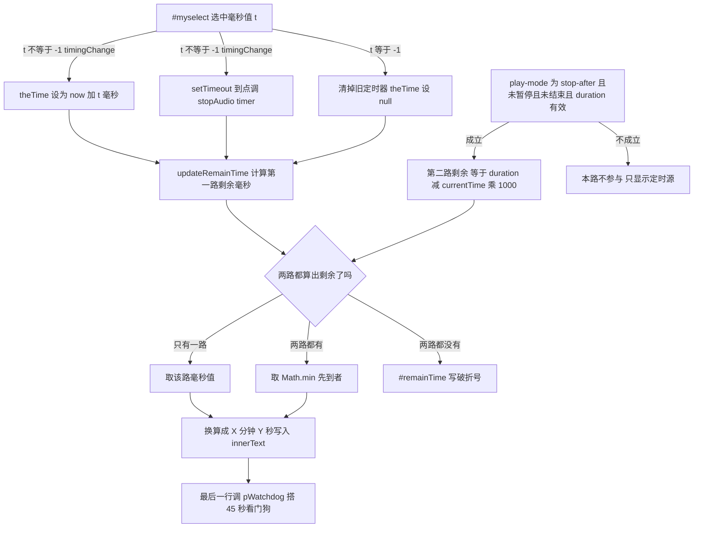

# 定时关闭与「剩余」时间显示

界面上那行「剩余 `#remainTime`」在 [js/musicplayer.js](../../js/musicplayer.js) 里由**一个函数**负责渲染：`updateRemainTime()`（L190–L224）。它要回答的其实是两个来源里更早到期的那个：

1. **定时关闭**——`#myselect` 下拉框选中的毫秒数，换算成绝对停止时刻 `theTime`，并排一个 `setTimeout` 到点调 `stopAudio('timer')`；
2. **「播放完停止」模式**（`#play-mode` 取 `stop-after`）——当前曲目还剩 `duration - currentTime` 秒，播完就停。

两者合成一个读数，取 `Math.min`；没有在倒计时的事情时显示「—」。停止本身则由 `stopAudio(reason)` 实现成一个**终态**：撤销播放意图、取消全部自愈定时器、复位 `#myselect` 与「剩余」。

状态变量（`theTime`、`isLoopMode`、`pPlayIntent`）在整台播放器状态机里的位置见 [播放器状态机](../concepts/player-state-machine.md)；`updateRemainTime()` 同时是 45 秒看门狗唯一的调用者，这一层含义见 [连续播放转场全流程](./continuous-playback-transition.md)；`stopAudio` 如何切断全部救援通道见 [失败恢复与自愈路径](./playback-recovery-and-selfhealing.md)。

## 两个停止源与显示取值的合成逻辑



上图是「剩余」这一个读数如何由两个停止源合成：定时源走 `theTime` 绝对时刻差，曲目源走 `duration - currentTime`，两路都成立时取先到者，都不成立时显示「—」。图尾那一步 `pWatchdog()` 是搭在同一个函数上的 45 秒看门狗，本页在末尾单独说明。

## 停止源一：定时关闭（`#myselect` → `timingChange`）

布局把定时下拉框的选项值直接写成**毫秒数**（[_layouts/music.html](../../_layouts/music.html) L73–L80：`-1` / `300000` / `600000` / `1800000` / `3600000` / `7200000`），`timingChange()` 把它当毫秒用：

```js
function timingChange() {
  window.clearTimeout(stopAudioTimeOut);
  var t = parseInt(document.getElementById("myselect").value);
  if (t != -1) {
    stopAudioTimeOut = window.setTimeout(function () { stopAudio('timer'); }, t);
    var d = new Date();
    theTime = Date.dateAdd(d, t / 1000, "s");
    plog('timer-set', (t / 60000) + 'min');
  } else {
    theTime = null;
    plog('timer-set', 'off');
  }
}
```

（[js/musicplayer.js](../../js/musicplayer.js) L267–L279。）绑定方式是**顶层直接赋 `onchange`**：`document.getElementById("myselect").onchange = timingChange;`（L282），所以这条路径在脚本载入时就接线完成。

四个要点：

- **两个并行的停止机制，不是一条。** ① `setTimeout`（`stopAudioTimeOut`）到点调用 `stopAudio('timer')`；② `theTime` 这个**绝对停止时刻**（`Date` 对象）供「剩余」显示和若干守卫读取。前者负责真的停，后者负责算读数与判断「定时是否还在生效」——`visibilitychange` 续播、`pZeroDur` 看门狗都读 `theTime`，不读 `stopAudioTimeOut`。两者由同一次 `change` 一起建立、由 `stopAudio` 一起拆掉。
- **`theTime` 用 `Date.dateAdd` 从「现在」加 `t / 1000` 秒算出来**（`Date.dateAdd` 定义在 L251–L264，按 `w/d/h/m/s` 查毫秒乘数）。它存的是**到期时刻戳而不是剩余毫秒**，所以刷新页面、任何一刻重新读它都能直接算差值。
- **重复选同一项不会叠加。** `timingChange` 第一件事就是 `clearTimeout(stopAudioTimeOut)`，然后重设：既有定时器被替换、`theTime` 被覆盖。所以改选意味着「从现在重新计时」，而不是延长原定时。
- **`-1`（不开启）是显式关闭分支。** 它只把 `theTime` 置 `null`，不清 `stopAudioTimeOut`——因为此时那个 `setTimeout` 早已被开头的 `clearTimeout` 取消掉了。

### local-test.html 的 15 秒选项

布局里的最短定时是 5 分钟，[local-test.html](../../local-test.html) L50 额外加了一个 `<option value="15000">15 秒(测试)</option>`。这是本仓库**观察定时关闭与「剩余」走字最快的窗口**，且验证不需要真机（见 [验证与复现手册](../testing/verification-playbook.md)）。它只在测试页存在，布局里没有对应选项。

## 停止源二：`stop-after` 模式的曲目剩余

```js
if (playModeSelect && playModeSelect.value === 'stop-after'
  && !musicPlayer.paused && !musicPlayer.ended
  && isFinite(musicPlayer.duration) && musicPlayer.duration > 0) {
  var trackMs = (musicPlayer.duration - musicPlayer.currentTime) * 1000;
  if (trackMs < 0) trackMs = 0;
  remainMs = (remainMs === null) ? trackMs : Math.min(remainMs, trackMs);
}
```

（[js/musicplayer.js](../../js/musicplayer.js) L206–L212。）这一路的守卫有五个，缺一不算：

| # | 守卫 | 缺了会怎样 |
|---|---|---|
| ① | `playModeSelect && playModeSelect.value === 'stop-after'` | 其它模式不显示「本曲还剩多久」——那是这行读数的语义边界 |
| ② | `!musicPlayer.paused` | 暂停/已停之后曲目不再倒计时，显示「—」比冻结一个数字更诚实（源码注释 L203–L205） |
| ③ | `!musicPlayer.ended` | `ended` 是另一条路径（换曲或停播），不在这里倒计时 |
| ④ | `isFinite(musicPlayer.duration)` | `duration` 为 `NaN`/`Infinity`（元数据还没到）时先不显示 |
| ⑤ | `musicPlayer.duration > 0` | 同上的「时长 0」形态，排除掉 |

②④⑤ 的组合意味着：**这一路是「此刻在播且拿到了有效元数据」才成立的即时读数**，不依赖任何持久时间戳。它没有任何「停止定时器」——真正停止它的是 `ended` 事件（见下节）。

## `updateRemainTime()`：一个读数、四处驱动

```js
function updateRemainTime() {
  var remainMs = null;   // 距停止还有多少毫秒;null = 当前没有在倒计时的事
  // ① 定时关闭
  if (theTime) {
    var x = theTime - new Date();
    if (x < 0) x = 0;
    remainMs = x;
    // 兜底:后台节流导致 setTimeout 没按时触发,由本函数补刀
    if (x <= 0) {
      window.clearTimeout(stopAudioTimeOut);
      stopAudio('timer-sweep');
    }
  }
  // ② 播完停止。只在「确实在播」时算 …（上节）
  ...
  var remainEl = document.getElementById("remainTime");
  if (remainEl) {
    if (remainMs === null) {
      remainEl.innerText = '—';
    } else {
      var min = Math.floor(remainMs / 60000);
      var sec = Math.floor((remainMs - min * 60000) / 1000);
      remainEl.innerText = min + "分钟" + sec + "秒";
    }
  }
  pWatchdog();
}
```

（[js/musicplayer.js](../../js/musicplayer.js) L190–L224。）它是**只写不读的纯渲染 + 副作用函数**，没有返回值。三处值得拆开看：

- **`remainMs === null` 就是「当前没有在倒计时的事」**，渲染成半角破折号「—」；非空则格式化成 `X分钟Y秒`。这是这条读数唯一的两种形态。
- **`x < 0` 被夹到 `0`，且 `x <= 0` 会触发 `stopAudio('timer-sweep')`。** 定时源在这里自我补刀：后台标签页被节流时 `setTimeout` 可能迟到甚至漏触发，于是这个由 `timeupdate` 与 10 秒 interval 驱动的函数会替它执行停止。源码注释把它写成「由本函数补刀」（L197）。
- **最后一行 `pWatchdog()`。** 45 秒看门狗没有自己的定时器，完全搭在这个函数上。因此「剩余」和「看门狗」是同一个调用点上的两件事：正常播放时它每 250ms 左右被叫一次，播放完全卡死时只剩 10 秒 interval 这条命脉。别把这个调用拆开——见 [连续播放转场全流程](./continuous-playback-transition.md)。

### 四个驱动点

| 驱动 | 位置 | 干什么 | 为什么需要它 |
|---|---|---|---|
| `timeupdate` | L66–L73 | 实时走字 | 播放期间每秒数次，让读数连续变化，无需等 10 秒 |
| `pause` 事件处理器 | L598–L599 | 立刻复位 | 一暂停就不再倒计时，`stop-after` 那一路会退出、显示随即变「—」；不等 10 秒 interval |
| 10 秒 `setInterval` | L182 | 兜底刷新 + 定时补刀 | 播放卡死 / 后台 `timeupdate` 不再派发时的命脉，也是 `timer-sweep` 的主要来源 |
| 播放模式 `change` | L150–L155 | 切模式立刻重算 | `#remainTime` 的语义随模式改变，必须马上重算 |

`change` 处理器这第四处是**历史修复的产物**：

```js
playModeSelect.addEventListener('change', (e) => {
  isLoopMode = e.target.value === 'loop';
  plog('mode-change', e.target.value);
  // 立刻重算剩余:切到「播放完停止」应马上显示曲目剩余,切走则复位成「—」
  updateRemainTime();
});
```

（[js/musicplayer.js](../../js/musicplayer.js) L150–L155。）

## 历史修复：`stop-after` 模式下「剩余」永远是「—」

2026-09-27 之前，`updateRemainTime()` **只认定时源**（当时的注释见 L188–L189）。后果是：选「播放完停止」时 `theTime` 恒为 `null`，函数直接走 `remainMs === null` 分支，`#remainTime` 就一直挂着初始的「—」（[_layouts/music.html](../../_layouts/music.html) L93），用户看不出还剩多久会停。

修法有两步，缺一步都不成立：

1. **加入第二个停止源**（L206–L212），让 `duration - currentTime` 参与 `Math.min`；
2. **在播放模式 `change` 里加一次 `updateRemainTime()`**（L154）。否则切到 `stop-after` 的那一刻不会重算——而如果用户此刻没有在播（`paused` 为真、或元数据未到），`timeupdate` 也不会来救场，读数就会一直停在旧值，直到某个 `timeupdate` 或 10 秒 interval 才更新。**「切模式时立刻重算，而不是等 10 秒」是这次修复的显式结论**，也写进了 [验证与复现手册](../testing/verification-playbook.md) 的陷阱表。

顺带一条同源的纪律：[local-test.html](../../local-test.html) 与布局同用 `#remainTime` 初始文本「—」，因此「读数一直没变」与「没有停止源」在视觉上完全一样——排查时先看 `paused` / `mode` / `theTime` 三处，而不是先怀疑渲染。

## `stopAudio(reason)`：停止是一个终态

定时到点、`stop-after`、`timer-sweep` 三条路径最后都收敛到同一个函数：

```js
function stopAudio(reason) {
  reason = reason || 'unknown';
  var pRemain = theTime ? Math.round((theTime - new Date()) / 1000) : null;
  plog('stop-audio', reason + (pRemain !== null ? ' 剩余' + pRemain + 's' : ''));
  // 定时器提前 60 秒以上触发 = 定时异常,单独计数
  if (reason === 'timer' && pRemain !== null && pRemain > 60) {
    pstats.earlyTimer++;
    psave();
  }
  // 停止是终态:撤销播放意图,取消一切自愈重试
  pPlayIntent = false;
  window.clearTimeout(pRetry.timer);
  pRetry.deadline = 0;
  window.clearTimeout(pZeroDur.timer);   // 定时到点停播,不该再被「时长 0」看门狗复活
  pZeroDur.idx = -1;
  if (ptrans) pDiscardTransition('stopped-by-' + reason);
  pExpectedPause = reason;
  musicPlayer.pause();
  theTime = null
  document.getElementById("myselect").value = -1;
  updateRemainTime();   // 停止即无倒计时,把「剩余」复位成「—」,别挂着旧数字
};
```

（[js/musicplayer.js](../../js/musicplayer.js) L226–L248。）它的职责不止「暂停」——**它是所有自愈通道的总闸门**，收尾顺序本身就是契约：

| 步骤 | 做了什么 | 为什么必须在这一步 |
|---|---|---|
| 记 `stop-audio` 日志 | `d` 里附当前剩余秒数（`theTime` 非空时） | 把「还剩多久时被停的」留在时间线上，供比对 `earlyTimer` |
| `earlyTimer` 计数 | 只在 `reason === 'timer'` 且剩余 `> 60s` 时 `pstats.earlyTimer++` | 定时器提前 60 秒以上触发 = 异常，是排障时唯一能看出的定时异常信号 |
| `pPlayIntent = false` | 撤销播放意图 | 所有自愈通道的第一步守卫都是它，置假等于一次断电 |
| 清 `pRetry.timer`、`pRetry.deadline = 0` | 取消排队中的重试阶梯 | 已排上队但还没跑的回调必须消失 |
| 清 `pZeroDur.timer`、`pZeroDur.idx = -1` | 关掉「时长 0」看门狗 | 定时到点停播**不该再被它复活**（源码注释 L240） |
| `pDiscardTransition('stopped-by-' + reason)` | 进行中的转场不计成败 | 用户/定时主动停不是转场失败，`pstats.trans--` 但 `ok`/`fail` 都不动 |
| `pExpectedPause = reason` | 给紧随的 `pause` 事件归因 | 让 `pause` 处理器认出「这是预期内的暂停」，不布 8 秒宽限 |
| `musicPlayer.pause()` | 真的停 | 放在意图与定时器都拆干净之后 |
| `theTime = null` | 拆掉定时源 | 让「剩余」的计算与所有读 `theTime` 的守卫（`visible-resume`、`pZeroDur`）立刻失效 |
| `#myselect.value = -1` | 下拉框复位成「不开启」 | 界面与实际状态一致 |
| `updateRemainTime()` | 立刻重算「剩余」 | 停止即无倒计时，把读数复位成「—」，别挂着旧数字 |

三点必须一起读的语义：

1. **`theTime = null` 与 `updateRemainTime()` 是配套的。** 若只置 `null` 不重算，`#remainTime` 会挂着停止前那一刻的旧数字，直到下一次 `timeupdate`（此时已暂停，`timeupdate` 不会派发）或 10 秒 interval——也就是说界面会有 10 秒的谎。**停止路径必须自己重算，不能等 interval**，这与「切模式要立刻重算」是同一条纪律。
2. **`reason` 不只是标签。** 它是 `plog('stop-audio', …)` 的内容、`pExpectedPause` 的值、以及 `pDiscardTransition` 的原因串（`stopped-by-<reason>`）；`earlyTimer` 也只在 `reason === 'timer'` 时统计。已有取值：`timer`（`timingChange` 的 `setTimeout`）、`timer-sweep`（`updateRemainTime` 兜底补刀）、`stop-after`（`playNext` 末尾）。
3. **`pZeroDur` 的清理是必须的。** 那个 10 秒元数据看门狗自己还会查 `pPlayIntent` 与 `theTime`，但显式 `clearTimeout` 加 `idx = -1` 是让「已排上队」的回调彻底消失的第一道。**这也是 `pZeroDur` 对象必须在任何可能调用 `stopAudio()` 的路径之前就初始化好的原因**——`var` 提升但值为 `undefined`，`pZeroDur.timer` 会抛 `TypeError`，从而**打断 `stopAudio` 本身**（暂停、`theTime` 复位、`#myselect` 复位全部不执行），见 L332–L335 的注释与 [播放器状态机](../concepts/player-state-machine.md)。

## `stop-after` 在 `playNext` 末尾的特殊分支

「播放完停止」的正常终态**不是**由 `ended` 直接实现的，而是由 `playNext()` 的末尾分支：

```js
if (playModeSelect.value === 'stop-after') {
  stopAudio('stop-after');
  return;
}
```

（[js/musicplayer.js](../../js/musicplayer.js) L138–L142，位于 `playNext` 的末尾。）`playNext` 的前半段已经做了六件事（推进下标、置 `pPlayIntent = true`、换 `src`、`tryPlay('next')`、`pSetSessionMeta`、`pArmZeroDur`、写两个记忆键），**然后才**被这条分支停掉。所以这个模式的终态是：

| 维度 | `stop-after` 播完后的取值 |
|---|---|
| `src` | 已经指向**下一首** |
| 播放头 | 在开头（`playNext` 把 `_currentTime` 写 `0`） |
| `pPlayIntent` | 假（被 `stopAudio` 撤销） |
| `#myselect` | `-1`（被 `stopAudio` 复位） |
| `#remainTime` | 「—」（被 `stopAudio` 末尾的 `updateRemainTime` 复位） |
| 转场 | 无（`ended` 里 `value !== 'stop-after'` 才开转场） |

两个后果：

- **用户下一次按播放，接到的是下一首，而不是刚播完的那一首。** 这是有意的（等同于「继续往下听」），但任何人重排 `playNext` 的顺序——例如把 `stop-after` 分支提前到换 `src` 之前——都会把它改成「回到当前曲目重播」。
- **这段窗口里 `pPlayIntent` 先为真再为假。** `playNext` 中途会真的发起一次 `play()`（`tryPlay('next')`，L126），随后 `stopAudio` 撤意图并 `pause()`。若 `play()` 的 Promise 在这两步之后才 resolve 或 reject，`pPlayIntent` 已为假，重试阶梯的第一步守卫（`if (!pPlayIntent) return`）会直接把它挡下——这正是「先拆意图再暂停」能干净收场的原因。

### 与 `loop` 模式的分支差异

三种模式在 `ended` 上走三条不同的路（`ended` 处理器 L157–L173）：

| 模式 | `ended` 时的分支 | 是否换曲 | 是否是「停止」 |
|---|---|---|---|
| `continuous` | `isLoopMode` 假、`value !== 'stop-after'` → 先 `pOpenTransition` 再 `playNext()` | 是（回绕到 0） | 否，转场继续播 |
| `loop` | `isLoopMode` 真 → `currentTime = 0` + `pPlayIntent = true` + `tryPlay('loop')` | **否**（同一首重播） | 否 |
| `stop-after` | 直接 `playNext()`（不起转场），随后被 `playNext` 末尾的 `stopAudio('stop-after')` 停掉 | 是（但立刻停） | **是** |

对「剩余」的影响只有 `stop-after` 有：它让第二路停止源生效（L206–L212），并让 `#remainTime` 有意义。`loop` 与 `continuous` 都只有定时源一路，`theTime` 为空时读数就是「—」。

还有一个必须记住的守卫差异：`loop` 不换曲，所以它的「剩余」永远不会因曲目末尾而变化；`stop-after` 换曲**但立刻停**，于是它连「下一首还剩多久」都不会显示——因为 `stopAudio` 已经把 `updateRemainTime()` 复位成「—」，而暂停状态又让第二路守卫（`!musicPlayer.paused`）不成立。

## `isLoopMode` 与模式真值

`isLoopMode`（L147）只是 `playModeSelect.value === 'loop'` 的**缓存位**，只在 `change` 处理器里同步（L151），初值是 `false`。模式真值始终是 `playModeSelect.value`。因此 [_layouts/music.html](../../_layouts/music.html) L66 的 `selected` **必须留在 `continuous`**：改成 `loop` 会导致载入后既无 `change` 事件、`isLoopMode` 又为 `false`，`ended` 就走进连续播放分支，表现为「单曲循环模式下它自己换曲了」。详见 [播放器状态机](../concepts/player-state-machine.md)。

## `timer-sweep`：后台节流的兜底

定时关闭有两层触发：`timingChange` 里那个 `setTimeout`（前台准确），以及 `updateRemainTime()` 里 `x <= 0` 时的 `clearTimeout + stopAudio('timer-sweep')`（兜底）。第二层存在的理由很具体：**浏览器对后台标签页的定时器会节流**，`setTimeout` 可能显著迟到甚至不触发，而 `updateRemainTime()` 由 10 秒 interval 与 `timeupdate` 驱动，只要页面还在跑就终会执行一次。

因此两条日志事件的组合值得记住：

- `stop-audio timer` —— 正常路径，`d` 里会带停止时的剩余秒数（通常接近 0）；
- `stop-audio timer-sweep` —— 兜底补刀，说明到点时那次 `setTimeout` 没排在前面（典型是后台/息屏）。

`sweep` 这一层也是「剩余」读数不会停在 0 秒不动的原因：`x <= 0` 立即收口，而不是继续显示 0。

## `earlyTimer`：定时异常计数

```js
if (reason === 'timer' && pRemain !== null && pRemain > 60) {
  pstats.earlyTimer++;
  psave();
}
```

（[js/musicplayer.js](../../js/musicplayer.js) L232–L235。）判据是**定时器在剩余超过 60 秒时触发**。`reason === 'timer'` 这条限定很重要：`timer-sweep` 不参与统计（它本来就是在到点之后才跑的，`pRemain` 已经是负值被夹住）。这个计数器只在 `?debug` 面板的 `【转场】` 头部一行显示（`定时提前 N`，L713–L715），是「定时关闭被系统时钟/节流搞乱」这件事**唯一可观测的出口**——它不写独立日志事件，因此单看日志是看不到它的，必须读 `stats`。

排障时的读法：`earlyTimer > 0` 且 `stop-audio` 的 `d` 里剩余确实大于 60 秒，说明那次 `setTimeout` 提前烧掉了；`earlyTimer` 为 0 而停止时间不对，则更可能是页面被节流后的 `timer-sweep` 补刀（对照 `vis` 字段与 `stop-audio` 的 reason）。

## 观测与验证

| 手段 | 用法 | 能确认什么 |
|---|---|---|
| [local-test.html](../../local-test.html) 的 15 秒选项 | `jekyll serve` 后打开该页，选「15 秒(测试)」 | 最快的定时关闭观察窗口：`#remainTime` 应从「15 秒」走字到「—」，下拉框自动跳回「不开启」 |
| `?debug` 面板 | `?debug` 打开 | `【转场】… 定时提前 N` 一行给出 `earlyTimer`；`stop-audio` 日志带剩余秒数与 reason |
| `plogCopy()` 的原始 JSON | 面板「复制日志」 | `stats.earlyTimer` 与 `log` 里 `timer-set` / `stop-audio` 的时间线，用来区分 `timer` 与 `timer-sweep` |
| 切模式立刻观察 | 在 `continuous` / `stop-after` 之间切换 | `#remainTime` 应**立即**变成曲目剩余或「—」，不用等 10 秒——这是历史修复的回归判据 |

通过判据（[验证与复现手册](../testing/verification-playbook.md) 的陷阱表）：`#remainTime` 正常走字、到点归「—」、`stats.earlyTimer` 不增长；切模式要立刻重算而不是等 10 秒。`plogReset()` **不清播放记忆**（只删 `_plog` / `_pstats` / `_ptrans`），而 `pstats` 是跨会话累计的——读 `earlyTimer` 前先清零。

## 改这一层的检查清单

1. **两个停止源必须都保留。** 只认 `theTime` 会让 `stop-after` 永远显示「—」（2026-09-27 的原始故障）；只认曲目剩余会让定时关闭不显示。
2. **任何影响读数的状态变化都要立刻重算「剩余」。** 已有的四处是 `timeupdate`、`pause`、10 秒 interval、播放模式 `change`。新增一处改变 `#remainTime` 语义的地方（例如新增播放模式）时，必须在它的 `change` 里补一次 `updateRemainTime()`，而不是指望 10 秒 interval。
3. **新增停止路径要照抄 `stopAudio` 的收尾顺序**：先清意图与所有定时器（`pRetry`、`pZeroDur`），再设 `pExpectedPause`，最后 `pause()`，并且**以 `theTime = null` + `#myselect.value = -1` + `updateRemainTime()` 收尾**。漏掉最后一步会让界面挂着旧数字。
4. **别把 `pWatchdog()` 从 `updateRemainTime()` 里摘出来**，也别删 10 秒 interval——那是播放完全卡死时 45 秒看门狗唯一的触发机会，同时也是 `timer-sweep` 的主要来源。
5. **`#myselect` 的选项值是毫秒数**，`timingChange` 用它同时喂 `setTimeout`（毫秒）与 `theTime`（`t / 1000` 秒）。改选项值时两处语义自动一致，但**不要改成「分钟」之类**，否则 `theTime` 会偏掉。
6. **`#myselect` 的绑定是顶层 `onchange` 赋值**（L282），位于脚本后半段。因此任何让脚本提前中断的错误（例如 `restoreMusic()` 因 `musicList` 下标失效抛 `TypeError`）都会同时干掉定时关闭——表现是「定时没反应、剩余永远是 —」，见 [讲经页内容模型](../concepts/audio-page-model.md)。
7. **`stop-after` 与 `timer` 是两条独立的停止源，不要合并。** 前者靠 `ended` → `playNext` → `stopAudio('stop-after')`；后者靠定时器与 `timer-sweep` 补刀。它们的终态相同（都由 `stopAudio` 收口），但触发条件、日志 reason 与 `earlyTimer` 归属都不同。
8. **验证走 local-test.html 的 15 秒选项最快**；这是本仓库少数不需要真机就能验的一层，方法见 [验证与复现手册](../testing/verification-playbook.md)。

## 相关页面

- [播放器状态机：播放意图、转场与暂停归因](../concepts/player-state-machine.md) —— `theTime` / `isLoopMode` / `playModeSelect.value` 的完整语义，三种模式的分支对照，以及 `stopAudio` 的收尾顺序为何是契约
- [连续播放转场全流程（含预取与时长 0 看门狗）](./continuous-playback-transition.md) —— `updateRemainTime()` 作为 45 秒看门狗唯一调用者的角色，以及 `playNext` 的顺序契约
- [失败恢复与自愈路径](./playback-recovery-and-selfhealing.md) —— `stopAudio` 如何切断全部救援通道，`visible-resume` 分支一为何要求 `theTime` 仍在生效
- [验证与复现手册](../testing/verification-playbook.md) —— 15 秒定时选项的操作方式、`plogReset` 的清零边界与「切模式要立刻重算」这条陷阱
- [布局与前端 DOM/脚本契约](../architecture/layout-and-frontend-contract.md) —— `myselect` / `remainTime` 的 id 契约、七处 DOM 依赖入口与顶层脚本中断的后果
- [遗留多音频播放器](../concepts/legacy-multi-audio-player.md) —— `default` 布局上 `yujizi.js` 的同名 `stopAudio` / `timingChange` 与那套已经在空转的定时关闭
- [讲经页内容模型](../concepts/audio-page-model.md) —— `restoreMusic()` 抛错时定时关闭与「剩余」一起失效的那条故障链
- [播放记忆与黑匣子日志](../concepts/player-persistence-and-diagnostics.md) —— `_plog` / `_pstats` 如何承载 `timer-set` / `stop-audio` / `earlyTimer`
